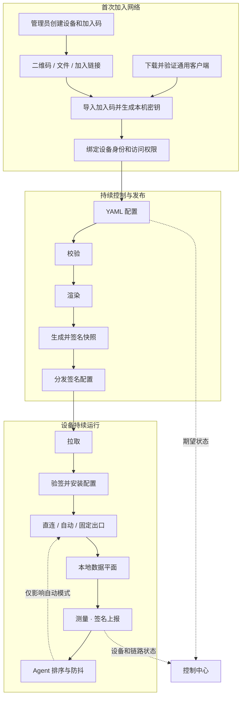

<p align="center">
  
</p>

<h1 align="center">Loom</h1>

<p align="center">
  基于 WireGuard 和 sing-box 的组网与选路工具。
</p>

Loom 用一份 YAML 配置管理设备、隧道、服务和访问规则，生成并分发各设备的运行配置。它会持续测量候选路径，根据延迟和可用性自动选路。

你可以用 Loom 连接自己的电脑和服务器，访问内网服务，或在多个代理和跨机房服务实例之间选择合适的路径。

## 界面预览

<p align="center">
  
</p>

| 动态拓扑与当前路径 | Service 与自动路由规则 |
|---|---|
|  |  |

Windows 客户端支持本地直连、自动选路和固定出口，提供安装版、便携 TUN 版和便携代理版。

<p align="center">
  
</p>

<p align="center"><sub>Windows · Portable Mixed</sub></p>

## 加入网络

管理员在控制中心的 **Devices → Create Device** 创建设备，选择平台、职责和可访问的服务，再生成一次性加入码。用户安装客户端并导入加入码，即可获取配置并连接网络。

| 平台 | 加入方式 | 用途 |
|---|---|---|
| Windows | 导入、拖入或粘贴二维码，也可导入 `.loom-invite` 文件或加入链接 | 直连、自动选路、固定出口 |
| Linux | 运行安装命令，再导入 `.loom-invite` 文件或加入链接；也可通过 SSH 执行 | 客户端、流量转发、公网出口 |

加入码短期有效且只能使用一次。设备加入后会保留本机身份，重启、重连和正常升级无需重新加入。Android 客户端尚未提供。

安装和使用步骤见 [Windows 客户端](clients/windows/README.md)和 [Linux 客户端安装](docs/linux-client-install.md)。设备职责、授权和连接方向的详细说明见 [Device 生命周期与交付架构](docs/device-lifecycle-and-delivery.md)。

## 核心能力

- **一份 SSOT**：统一描述设备、隧道、服务、访问范围和选路规则。
- **严格校验**：拒绝未知字段和不完整配置，并一次列出全部问题。
- **稳定渲染**：相同输入生成相同的 WireGuard、sing-box、systemd 和 Agent 配置。
- **按路径调度**：比较完整的转发链和目标地址，支持直连、单跳和多跳。
- **状态监测**：查看设备、链路和当前路径，记录延迟、波动和吞吐。
- **自动切换**：路径失效时立即避开；日常优化使用样本窗口和阈值防止频繁抖动。
- **签名交付**：配置自动发布，设备验签后安装；二进制升级仍需显式 `release`。
- **密钥与回滚**：按设备管理密钥，更新失败时恢复上一份完整配置。

## 工作方式



设备加入后会定期获取配置并上报状态。调度 Agent 根据测量结果在允许的候选路径中选择，使用窗口和阈值减少频繁切换。

控制平面暂时离线不会中断数据平面。设备继续使用最后一份安装成功的配置，Agent 也可以根据本地观测继续选路。

## 控制中心

控制中心由服务端直接渲染，不依赖外部前端资源。主要页面包括：

- **Devices**：创建设备、分配权限、查看在线状态；
- **Topology / Live paths**：常驻隧道、候选路径和当前选路；
- **Services**：主机规则与访问策略；
- **Deployments / Events**：配置更新进度和历史事件；
- **SSOT**：高级编辑入口。

保存配置后，Loom 会自动校验、生成、签名并分发更新。设备的安装进度和运行状态可在控制中心查看；程序升级使用 `loom release`。

设备和服务由中控统一管理，普通设备提供本机状态查看。配置格式和权限说明见[设计文档](docs/design.md)。

## 设备、职责与路径

| 概念 | 含义 |
|---|---|
| **设备（Device）** | Loom 管理的基本实体，可以是服务器、桌面或手机 |
| **职责（Responsibilities）** | 设备可以使用 Loom、参与转发、提供公网出口或承担中控职责 |
| **目的地授权（Destination grants）** | 设备获准访问的 Service、出口或具名本地网络 |
| **目标地址** | 网站、API 或内网服务；它是请求目的地，不是设备 |

一条路径写作：

```text
发起请求的设备 → [0..n 台转发设备] → 目标地址
```

转发链上最后一台访问目标的设备就是这条路径的出口。本地直连时，请求直接从当前设备发出。

## 快速开始

需要 Go 1.27 或更高版本。仓库中的[参考 SSOT](testdata/matrix/ssot.yaml)是一套可直接校验和渲染的示例拓扑，使用文档保留地址与示例域名。

```bash
# 构建
go build -o out/loom ./cmd/loom

# 校验参考拓扑
./out/loom validate testdata/matrix/ssot.yaml

# 渲染每个节点的配置包
./out/loom render testdata/matrix/ssot.yaml -o out/demo

# 查看 SSOT 变化会造成的配置差异，不写盘
./out/loom diff testdata/matrix/ssot.yaml -o out/demo

# 计算需要放行的端口
./out/loom firewall testdata/matrix/ssot.yaml
```

### 创建并验证签名快照

下面的密钥仅用于本地演示。生产签名私钥是平台信任根，不应进入版本库或分发点。

```bash
./out/loom keygen -o /tmp/loom-demo-keys

./out/loom snapshot testdata/matrix/ssot.yaml \
  -o out/snapshot \
  -key /tmp/loom-demo-keys/platform-signing.key

./out/loom verify out/snapshot \
  -pubkey /tmp/loom-demo-keys/platform-signing.pub
```

## 常用命令

| 阶段 | 命令 | 作用 |
|---|---|---|
| 建模 | `validate`, `firewall`, `rotate-tunnel` | 校验 SSOT、计算防火墙规则、给隧道换端口 |
| 渲染 | `render`, `diff`, `hydrate` | 生成配置、查看差异、在节点本地填充秘密 |
| 发布 | `snapshot`, `verify`, `release`, `publish`, `publisher` | 显式放行二进制，创建验签快照并发布到静态分发点 |
| 收敛 | `pull`, `apply`, `selfcheck`, `pin`, `rollback`, `snapshots` | 拉取或推送配置、安装验证、钉住二进制、整份退回历史快照、列出还能退到哪 |
| 调度 | `probe`, `agent` | 探测候选并带阻尼地切换 selector |
| 观测 | `report`, `status` | 上报节点健康、配置漂移与全网快照分布 |
| 凭据 | `secrets`, `backup`, `restore` | 按节点拆分、两步轮换和备份秘密层 |

运行 `./out/loom help` 可以查看完整参数。

## 安全边界

- WireGuard 私钥由设备本地生成；SSOT 只记录公钥与秘密层代次。
- 配置包、manifest 与二进制版本共同进入签名快照。
- 设备只接受通过平台公钥验证的快照，并在本机填充自己的秘密。
- 分发点只保存签名后的静态内容，不需要被信任，也看不到凭据明文。
- 真实部署配置与运维状态只保存在本机；公开仓库只提交合成测试矩阵。
- 中控网页保存 SSOT 时使用进程锁、revision 校验和原子替换，并拒绝符号链接与硬链接目标。直接编辑 SSOT 时仍需保证只有一个写入者。

## 代码结构

| 路径 | 职责 |
|---|---|
| `cmd/loom/` | CLI 入口与运维工作流 |
| `internal/model/` | SSOT 模型、严格解码与路径候选生成 |
| `internal/validate/` | 跨字段、跨节点与能力完整性校验 |
| `internal/render/` | WireGuard、sing-box、systemd 与节点配置渲染 |
| `internal/snapshot/` | 内容寻址快照与 Ed25519 签名 |
| `internal/measure/`, `internal/agent/` | 测量聚合、候选排序与调参回路 |
| `internal/report/`, `internal/events/` | 节点观测、转述与状态变化历史 |
| `internal/deploy/`, `internal/publish/` | 安装回滚、静态发布与版本钉住 |
| `internal/secret/` | 秘密占位符、按节点拆分与轮换 |
| `internal/enrollplan/` | Device 加入时生成节点、隧道与策略的事务计划 |
| `internal/ssotedit/` | 保留无关 YAML 结构的 Service 定向编辑 |
| `internal/webui/` | 节点只读界面与中控写入口 |
| `testdata/matrix/` | 合成 SSOT 与逐字节 golden 配置 |

## 开发

```bash
go test ./...
go vet ./...
gofmt -l .
```

渲染 golden 由测试维护，不要直接编辑：

```bash
go test ./internal/render/ -run TestGolden -update
```

更新 golden 后，请检查 diff，确认生成的配置符合预期。

## 许可证

Loom 自有代码采用 [Apache License 2.0](LICENSE)，版权声明见 [NOTICE](NOTICE)。第三方代码、依赖和随包组件保留各自的许可证。

Windows 发行签名说明见 [Code signing policy](docs/code-signing-policy.md)。

## 深入阅读

- [设计文档](docs/design.md)：模型、不变量、数据平面、控制平面与部署顺序。
- [Device 生命周期与交付架构](docs/device-lifecycle-and-delivery.md)：统一 Device、加入协议、授权边界、版本化对象图与分阶段迁移。
- [客户端接入设计](docs/client-access.md)：Windows、Linux Server、Android 的单入口、设备默认出口、加入网络、分发与升级边界。
- [Local Network 目标设计](docs/local-network.md)：具名局域网、重复 CIDR、显式 TCP/UDP 访问及 SSOT/授权边界；当前尚未实现。
- [Linux 客户端安装](docs/linux-client-install.md)：从中控创建 Device 和加入码、下载并校验分发包、完成首次签名拉取。
- [决策记录](docs/decisions.md)：重要设计选择、被推翻的假设及其证据。
- [参考 SSOT](testdata/matrix/ssot.yaml)：覆盖方向约束、双轴选择、服务契约与多平台接入的合成示例。
