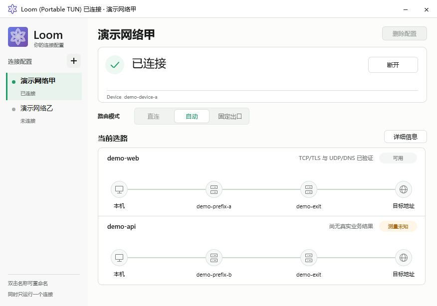

<p align="center">
  
</p>

<h1 align="center">Loom</h1>

<p align="center">基于 WireGuard 和 sing-box 的组网与选路工具。</p>

Loom 的控制、Enrollment、客户端运行和界面以[同一套设计](docs/README.md)为准。
正式业务链的实施与验收进度见[实施状态](docs/progress.md)。

## 产品模型

Loom 管理可组合承担 `access`、`forward`、`internet_egress`、`control` 职责的节点，以及不受管的目标地址。
最终出口是路径上的位置，不是节点类型。
客户端在认证的候选集合中选择 Direct、Auto 或指定最终出口；一跳直达与经中继到同一出口可以同时存在。
授权配置与当前可用性分开：实际 transport 或业务结果才产生 `available / unavailable / unknown`。
认证的 `.loom` 精确记录提供私有名称；有 `forward` 职责的节点可在 control 授权后共享等长虚拟前缀映射的局域网。

控制面用一套模型处理单个或多个 control 成员：普通签名事实最终一致，control 成员变更由旧成员多数签名。
设备通过受限 bootstrap tunnel 和私有认证通道加入、取得配置并上报；
公网 Nginx 只提供伪装网站和明确认证为公开的通用不可变制品。

## 界面

控制面 Web 包含 Overview、Devices、Topology、Services、Releases、Deployments 与 Events。
Android 和 Windows 提供原生页面、配置选择与实际路径显示。界面从认证状态和真实运行结果单向投影；
业务验收状态见[实施状态](docs/progress.md)。

<p align="center">
  
</p>

| 动态拓扑 | Service 管理 |
|---|---|
|  |  |

Windows 原生界面提供多配置侧栏、Direct/Auto/固定出口、当前路径和详细信息。三种交付形态是
Portable Mixed、Portable TUN 和 Installed；当前发行签名与实体机验收状态见[状态文档](docs/progress.md)。

<p align="center">
  
</p>

<p align="center"><sub>Windows · 同机测试 VM 的合成场景；图片不是生产连接证据。</sub></p>

## 设计与操作入口

- [设计文档与阅读顺序](docs/README.md)
- [统一契约](docs/core/current-contract.md)
- [控制权威模型](docs/core/control-model.md)
- [Enrollment 与 Endpoint 模型](docs/core/enrollment-endpoint-model.md)
- [客户端运行与选路模型](docs/clients/client-runtime-model.md)
- [Linux 客户端安装与安全暂停](docs/operations/linux-client-install.md)
- [Windows 客户端](clients/windows/README.md)和 [Android 客户端](clients/android/README.md)
- [实施状态](docs/progress.md)

模型与实现中的错误修订同一现行契约；协议或版本变更须由用户明确提出。

## 本地开发检查

需要 Go 1.27 或更高版本。修改相关功能后先运行对应测试；提交前执行：

```bash
go build ./...
go test ./...
go vet ./...
git ls-files --cached --others --exclude-standard -z -- '*.go' | xargs -0 gofmt -l
python3 scripts/check_repository_safety.py
git diff --check
```

Linux access/hybrid 的宿主初始 network namespace TUN 目前受安全门禁阻止。不要启用本机
`loom-client.service`；隔离方案和验收要求见[宿主网络事故记录](docs/incidents/2026-09-21-host-network-takeover.md)。

## 许可证

Loom 自有代码采用 [Apache License 2.0](LICENSE)，版权声明见 [NOTICE](NOTICE)。第三方组件保留各自许可。
Windows 外部签名计划见 [Code signing policy](docs/operations/code-signing-policy.md)。
