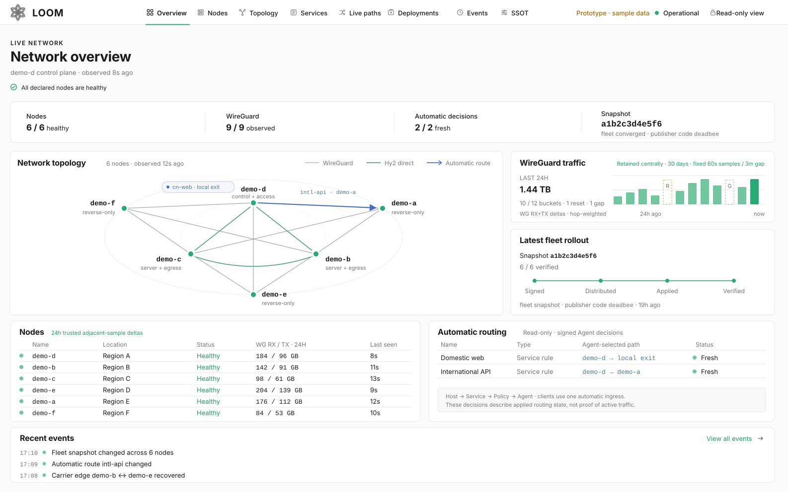
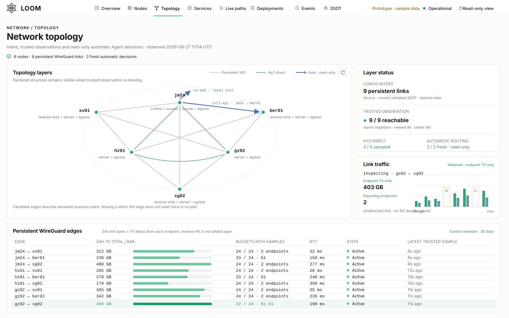
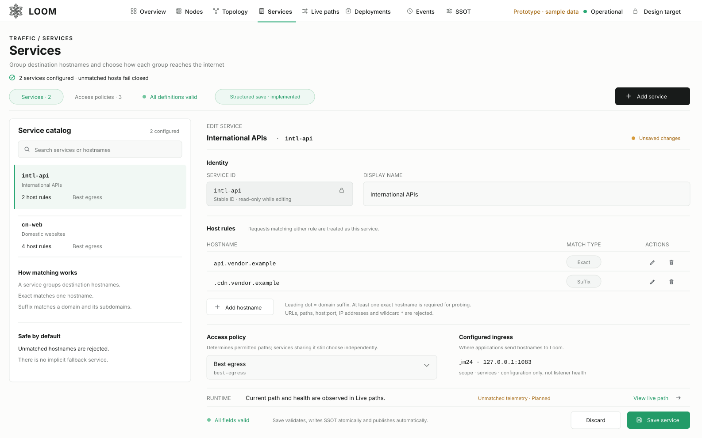
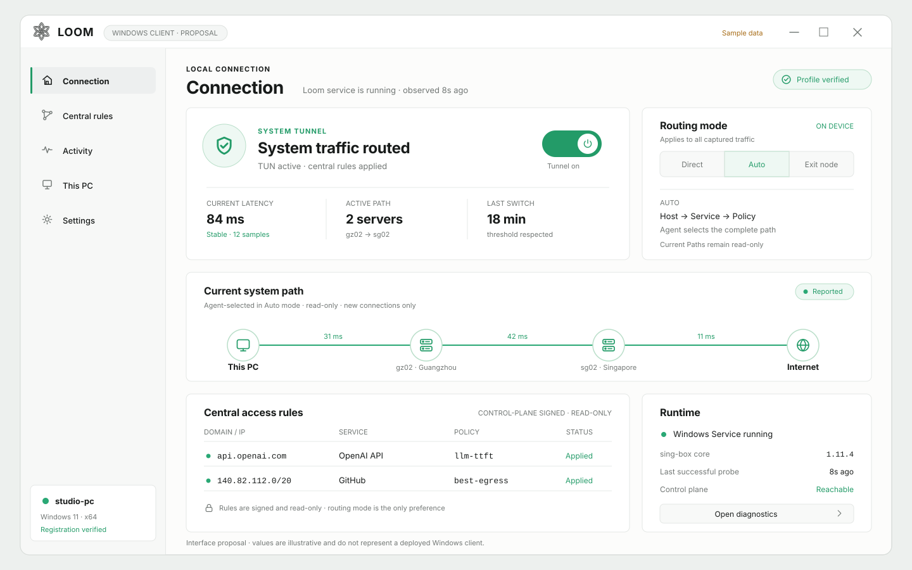
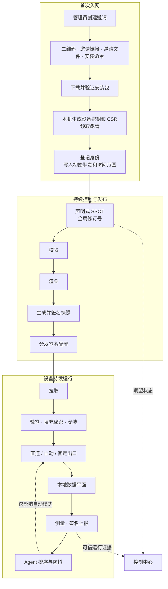

<p align="center">
  
</p>

<h1 align="center">Loom</h1>

<p align="center">
  把多条加密网络路径编织成一个可测量、可验证、可持续收敛的服务调度平面。
</p>

Loom 用一份声明式 SSOT 管理多节点网络：生成 WireGuard 与 sing-box 配置，持续
测量候选路径，并按规则选择合适的服务地址和转发链。

它既可以用于日常代理，也可以在不同机房的多个服务实例之间调度。Loom 关注的是请求
实际经过的完整路径，而不是预先给某台机器贴上“出口”标签。

> [!IMPORTANT]
> Loom 面向自建基础设施，目前还不是开箱即用的商业代理产品。跨设备 canary、
> 平台确认闭环和 L7 网关仍在完善，部署前请阅读[设计文档](docs/design.md)。

## 界面预览

控制中心分别展示期望配置、运行证据和当前选路，避免把“已经配置”和“正在生效”
混为一谈。

<p align="center">
  
</p>

| 动态拓扑与当前路径 | Service 与自动路由规则 |
|---|---|
|  |  |

桌面客户端提供三种模式：本地直连、按中控规则自动选路、固定出口。

<p align="center">
  
</p>

## 加入网络

服务器、桌面和手机在 Loom 中都是 **Device**。添加设备时，管理员在
**Devices → Add Device** 创建一次性邀请；新设备自行生成密钥、领取邀请，再安装经过
签名的配置。邀请可以通过以下方式交给设备：

| 方式 | 适用场景 | 支持情况 |
|---|---|---|
| 二维码 | 桌面或移动客户端扫码；点击二维码可直接下载邀请文件 | 中控已支持；Windows 和 Android 客户端仍在开发 |
| `.loom-invite` 文件 | Linux 或桌面设备导入 | Linux 已支持 |
| `loom://enroll#…` | 无图形界面的 Linux 主机 | Linux CLI 已支持，建议从标准输入粘贴，避免写入命令历史 |
| 一行安装命令 | Linux Server 快速安装 | Linux amd64 已支持；下载地址由实际部署配置决定 |

四种入口使用同一份邀请；邀请有效期很短，而且只能使用一次。平台由客户端报告，
不需要管理员预先填写。
邀请还可以绑定一个固定版本的入网预设，写入设备的初始职责和访问范围。设备注册后，
重启、重连、切换网络或正常升级都会继续使用原有身份。

作为转发节点或公网出口的 Linux Server，还要声明公网地址、UDP 入站端口和隧道方向。
这些字段描述服务器如何被其他设备访问，与手选路径无关。SSH 导入只用于迁移旧设备，
新设备统一使用 Enrollment。完整步骤见
[Linux 客户端安装](docs/linux-client-install.md)和
[Device 生命周期与交付架构](docs/device-lifecycle-and-delivery.md)。

## 核心能力

- **一份 SSOT**：统一描述设备、隧道、服务、访问范围和选路规则。
- **严格校验**：拒绝未知字段和不完整配置，并一次列出全部问题。
- **稳定渲染**：相同输入生成相同的 WireGuard、sing-box、systemd 和 Agent 配置。
- **按路径调度**：比较完整的转发链和目标地址，支持直连、单跳和多跳。
- **持续观测**：采集延迟、波动和吞吐，区分期望配置、签名证据与当前选路。
- **自动切换**：路径失效时立即避开；日常优化使用样本窗口和阈值防止频繁抖动。
- **签名交付**：配置自动发布，设备验签后安装；二进制升级仍需显式 `release`。
- **秘密与回滚**：秘密按设备分发，安装失败或进程中断时可以恢复到完整旧版本。

## 工作方式



入网流程只在首次注册时运行。此后设备持续拉取签名配置、安装更新并上报测量结果。
运行证据不会写回 SSOT；Agent 也只在已授权的候选中调整自动模式。

控制平面暂时离线不会中断数据平面。设备继续使用最后一份安装成功的配置，Agent
也可以根据本地观测继续选路。

## 控制中心

控制中心由服务端直接渲染，不依赖外部前端资源。主要页面包括：

- **Devices**：设备身份、职责、授权和在线证据；
- **Topology / Live paths**：常驻隧道、候选路径和当前选路；
- **Services**：主机规则与访问策略；
- **Deployments / Events**：配置收敛、状态变化和历史事件；
- **SSOT**：高级编辑入口。

保存 SSOT 后，发布器会自动校验、渲染、签名和分发，界面不再提供单独的“发布”按钮。
二进制升级仍需通过 `loom release` 明确放行。期望配置和运行状态始终分开：保存成功
只说明新配置已经进入发布流程，设备是否安装、链路是否可用，仍以签名上报为准。

只有中控开放写操作。普通设备使用自己最后安装的签名配置。旧设备可以通过 SSH
导入，但该入口只用于迁移；新设备应使用统一的 Enrollment。更完整的权限与证据边界
见[设计文档](docs/design.md)。

## 设备、职责与路径

| 概念 | 含义 |
|---|---|
| **设备（Device）** | Loom 管理的基本实体，可以是服务器、桌面或手机 |
| **职责（Responsibilities）** | 设备可以使用 Loom、参与转发、提供公网出口或承担中控职责 |
| **目的地授权（Destination grants）** | 设备获准访问的 Service、出口或具名本地网络 |
| **目标地址** | 网站、API 或内网服务；它是请求目的地，不是设备 |

一条路径写作：

```text
发起请求的设备 → [0..n 台转发设备] → 目标地址
```

经过转发链时，最后一台访问目标的设备就是出口；本地直连则没有远端出口。
**出口是路径中的位置，不是一种设备类型。**

## 快速开始

需要 Go 1.27 或更高版本。仓库中的[参考 SSOT](testdata/matrix/ssot.yaml)是一套可直接
校验和渲染的示例拓扑，使用文档保留地址与示例域名。

```bash
# 构建
go build -o out/loom ./cmd/loom

# 校验参考拓扑
./out/loom validate testdata/matrix/ssot.yaml

# 渲染每个节点的配置包
./out/loom render testdata/matrix/ssot.yaml -o out/demo

# 查看 SSOT 变化会造成的配置差异，不写盘
./out/loom diff testdata/matrix/ssot.yaml -o out/demo

# 计算需要放行的端口
./out/loom firewall testdata/matrix/ssot.yaml
```

### 创建并验证签名快照

下面的密钥仅用于本地演示。生产签名私钥是平台信任根，不应进入版本库或分发点。

```bash
./out/loom keygen -o /tmp/loom-demo-keys

./out/loom snapshot testdata/matrix/ssot.yaml \
  -o out/snapshot \
  -key /tmp/loom-demo-keys/platform-signing.key

./out/loom verify out/snapshot \
  -pubkey /tmp/loom-demo-keys/platform-signing.pub
```

## 常用命令

| 阶段 | 命令 | 作用 |
|---|---|---|
| 建模 | `validate`, `firewall`, `addnode`, `rotate-tunnel` | 校验 SSOT、计算防火墙规则、分配新节点地址与端口、给隧道换端口 |
| 渲染 | `render`, `diff`, `hydrate` | 生成配置、查看差异、在节点本地填充秘密 |
| 发布 | `snapshot`, `verify`, `release`, `publish`, `publisher` | 显式放行二进制，创建验签快照并发布到静态分发点 |
| 收敛 | `pull`, `apply`, `selfcheck`, `pin`, `rollback`, `snapshots` | 拉取或推送配置、安装验证、钉住二进制、整份退回历史快照、列出还能退到哪 |
| 调度 | `probe`, `agent` | 探测候选并带阻尼地切换 selector |
| 观测 | `report`, `status` | 上报节点健康、配置漂移与全网快照分布 |
| 凭据 | `secrets`, `backup`, `restore` | 按节点拆分、两步轮换和备份秘密层 |

运行 `./out/loom help` 可以查看完整参数。

## 安全边界

- WireGuard 私钥由设备本地生成；SSOT 只记录公钥与秘密层代次。
- 配置包、manifest 与二进制版本共同进入签名快照。
- 设备只接受通过平台公钥验证的快照，并在本机填充自己的秘密。
- 分发点只保存签名后的静态内容，不需要被信任，也看不到凭据明文。
- 真实部署配置与运维状态只保存在本机；公开仓库只提交合成测试矩阵。
- 中控网页保存 SSOT 时使用进程锁、revision 校验和原子替换，并拒绝符号链接与硬链接
  目标。直接编辑 SSOT 时仍需保证只有一个写入者。

## 代码结构

| 路径 | 职责 |
|---|---|
| `cmd/loom/` | CLI 入口与运维工作流 |
| `internal/model/` | SSOT 模型、严格解码与路径候选生成 |
| `internal/validate/` | 跨字段、跨节点与能力完整性校验 |
| `internal/render/` | WireGuard、sing-box、systemd 与节点配置渲染 |
| `internal/snapshot/` | 内容寻址快照与 Ed25519 签名 |
| `internal/measure/`, `internal/agent/` | 测量聚合、候选排序与调参回路 |
| `internal/report/`, `internal/events/` | 节点观测、转述与状态变化历史 |
| `internal/deploy/`, `internal/publish/` | 安装回滚、静态发布与版本钉住 |
| `internal/secret/` | 秘密占位符、按节点拆分与轮换 |
| `internal/enrollkey/`, `internal/enrollssh/`, `internal/enrollplan/` | 共享 bootstrap 身份、SSH 主机信任与节点/隧道接入事务计划 |
| `internal/ssotedit/` | 保留无关 YAML 结构的 Service 定向编辑 |
| `internal/webui/` | 节点只读界面与中控写入口 |
| `testdata/matrix/` | 合成 SSOT 与逐字节 golden 配置 |

## 开发

```bash
go test ./...
go vet ./...
gofmt -l .
```

渲染 golden 由测试维护，不要直接编辑：

```bash
go test ./internal/render/ -run TestGolden -update
```

更新 golden 后必须人工检查 diff。它锁定的是最终配置字节，直接接受所有变化
等于放弃这层保护。

## 深入阅读

- [设计文档](docs/design.md)：模型、不变量、数据平面、控制平面与部署顺序。
- [Device 生命周期与交付架构](docs/device-lifecycle-and-delivery.md)：统一 Device、Enrollment、授权边界、版本化对象图与分阶段迁移。
- [客户端接入设计](docs/client-access.md)：Windows、Linux Server、Android 的单入口、设备默认出口、注册、分发与升级边界。
- [Local Network 目标设计](docs/local-network.md)：具名局域网、重复 CIDR、显式 TCP/UDP 访问及 SSOT/授权边界；当前尚未实现。
- [Linux 客户端安装](docs/linux-client-install.md)：从中控创建邀请、下载并校验分发包、完成首次签名拉取。
- [决策记录](docs/decisions.md)：重要设计选择、被推翻的假设及其证据。
- [参考 SSOT](testdata/matrix/ssot.yaml)：覆盖方向约束、双轴选择、服务契约与多平台接入的合成示例。
