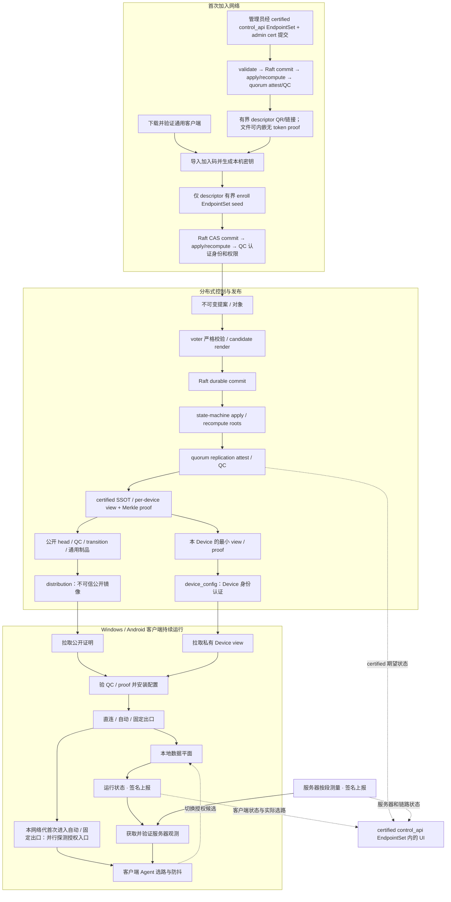

<p align="center">
  
</p>

<h1 align="center">Loom</h1>

<p align="center">
  基于 WireGuard 和 sing-box 的组网与选路工具。
</p>

Loom 用一份 YAML 配置管理设备、隧道、服务和访问规则，生成并分发各设备的运行配置。节点上报链路观测，接入端结合有效观测在授权范围内自动选路。

你可以用 Loom 连接自己的电脑和服务器，访问内网服务，或在多个代理和跨机房服务实例之间选择合适的路径。

> **架构边界：** v1 兼容契约使用指定 control、单签 current 与静态镜像；实际运行到哪一步
> 只见本机的 [当前状态](docs/status/current.md)。目标架构允许任意合格 Device
> 承担 `control`，以动态 `ControlSet`、Raft commit + post-commit QC 和 CRDT 副本消除单中控权威，并
> 管理域名、证书及公网 listener 轮换。目标协议见
> [分布式控制平面设计](docs/distributed-control-plane.md)，不能据此假定功能已经上线。

## 界面预览

以下静态图只表达信息架构和交互方向；涉及写入时，目标语义是提交 proposal，依次完成
Raft commit、apply/recompute 与 post-commit QC，并分别显示 `committed_not_certified`、
`certified`、`reconciled` 和 `applied`。它们不是现网截图，已上线页面仍以
[当前状态](docs/status/current.md)为准。

<p align="center">
  
</p>

| 动态拓扑与当前路径 | Service 与自动路由规则 |
|---|---|
|  |  |

Windows 客户端采用原生浅色界面，支持多份连接配置、本地直连、自动选路和固定出口。左侧管理连接，右侧查看连接状态、当前路径及各段测量；同一时间只运行一个连接，单击配置只切换查看，双击名称可重命名。

从 [Releases](https://github.com/Scisaga/loom/releases) 下载 Windows 预览版；是否已有正式
代码签名以对应发行说明为准，不能从构建成功推断。

<p align="center">
  
</p>

<p align="center"><sub>Windows · Portable TUN 参考界面；连接、身份与测量值均为演示数据，不表示当前发行状态。</sub></p>

Windows 交付设计包含三个 profile，并要求 x64（amd64）和 ARM64 共用同一套界面与加入流程；
实际可下载的构建与签名状态只见发行说明和[当前状态](docs/status/current.md)：

| 版本 | 流量接管 | 安装与权限 |
|---|---|---|
| 便携代理版（Portable Mixed） | 显式配置 HTTP/SOCKS 代理的应用 | 解压即用，普通用户运行 |
| 便携 TUN 版（Portable TUN） | 纳入 TUN 规则的系统 TCP、UDP 与 DNS | 无需安装；v1 profile 在没有预授权提升服务时以管理员身份重新启动 |
| 安装版（Installed） | TUN 接管，同时提供同规则代理入口 | MSI 安装时提权；日常界面和连接由普通用户操作 |

Windows 的自动模式按 Service 分流；固定出口让受管上网流量共用一条到所选出口的授权路径，中间转发仍自动选择。**当前选路**展示实际生效的路径，展开**详细信息**可查看各段观测来源、测量时间和选路说明。

## 加入网络

管理员在控制中心的 **Devices → Create Device** 创建设备，选择平台、职责和可访问的服务，再生成一次性加入码。目标 v2 中，管理请求只经已信 certified
`EndpointSet(role=control_api)` 入口的精确 transport 校验和 admin cert 认证后提交；
未加入客户端的 claim 则只能在本次邀请 descriptor 直接携带的有界
`EndpointSet(role=enroll)` seeds 中故障切换。用户安装客户端并导入加入码，
即可获取配置并连接网络。

| 平台 | 加入方式 | 用途 |
|---|---|---|
| Windows | 导入、拖入或粘贴二维码，也可导入 `.loom-invite` 文件或加入链接 | 直连、自动选路、固定出口 |
| Linux | 运行安装命令，再导入 `.loom-invite` 文件或加入链接；也可通过 SSH 执行 | 客户端、流量转发、公网出口 |
| Android | 扫描二维码或导入 `.loom-invite` 文件 | 系统 VPN、直连、自动选路、固定出口 |

加入码短期有效且只能使用一次。设备加入后会保留本机身份，重启、重连和正常升级无需重新加入。
Android 的私有 APK、固定升级签名和发行渠道状态见[当前状态](docs/status/current.md)。

安装和使用步骤见 [Windows 客户端](clients/windows/README.md)、[Linux 客户端安装](docs/linux-client-install.md)和 [Android 客户端](clients/android/README.md)。设备职责、授权和连接方向的详细说明见 [Device 生命周期与交付架构](docs/device-lifecycle-and-delivery.md)。

## 核心能力

- **一份 SSOT**：统一描述设备、隧道、服务、访问范围和选路规则。
- **严格校验**：拒绝未知字段和不完整配置，并一次列出全部问题。
- **稳定渲染**：相同输入生成相同的 WireGuard、sing-box、systemd 和 Agent 配置。
- **按路径调度**：在授权的转发链和目标地址候选中选路，支持直连、单跳和多跳。
- **状态监测**：查看设备、链路、当前路径及可用测量；缺失或过期观测保持未知。
- **自动切换**：根据有效观测避开失败候选，使用切换阈值减少频繁抖动。
- **签名交付**：配置自动发布，设备验签后安装；二进制升级仍需显式 `release`。
- **密钥与回滚**：按设备管理密钥，更新失败时恢复上一份完整配置。

## 目标工作方式



未完成 Raft commit、apply/recompute 与提交后 QC 的提案，以及仅到达 CRDT 副本的对象，都不改变
生效配置。CRDT 用于汇合不可变提案、报告与观测；成员关系、邀请消费、撤权、release head、
域名及 listener intent 等安全关键状态只有在形成 certified head 后才生效。v1 compatibility 的
YAML → 单签 snapshot 流程是迁移输入，不等同于上图已实现。

设备加入后会定期获取配置并上报状态。Windows 和 Android 为每个底层网络代保留 probe registry：Direct 不探测；该网络代第一次进入 Auto 或指定出口时冻结当时的授权入口快照，按地址与源接口去重后各探测至多一次并行完成。配置/模式/出口切换、Agent 重启和同代重连复用结果，同代新增入口只记真实拨号的被动证据。入口之后复用已验签的服务器分段观测；不逐条探测完整业务路径，也不等待观测到齐才启动。

客户端展示的入口延迟、服务器单跳测量和目标响应时间各有来源，分段估算不代表实测端到端 P50/P95 或整条业务路径健康。Linux 接入端的 `loom agent` 仍使用候选测量窗口与防抖规则。

控制平面暂时离线不会中断数据平面。设备继续使用最后一份安装成功的配置；本地选路只使用仍然有效的观测，缺失或过期数据保持未知。

## 控制中心

控制中心由服务端直接渲染，不依赖外部前端资源。目标态下每个合格 control Device 可提供
同一逻辑界面；读取显示最新 certified head、`committed_not_certified` 诊断状态与本副本新鲜度，
写入可由任一入口接收并等待 Raft commit 和 quorum attestation。v1 compatibility profile
则由指定 control 写入；实际运行 profile 只见[当前状态](docs/status/current.md)。主要页面包括：

- **Devices**：创建设备、分配权限、查看在线状态；
- **Topology / Live paths**：常驻隧道、候选路径和当前选路；
- **Services**：主机规则与访问策略；
- **Deployments / Events**：配置更新进度和历史事件；
- **SSOT**：高级编辑入口。

目标态保存后先显示 `pending`；所有 voter 在 Raft 复制前验证候选，日志 durable commit 后
再 apply/recompute 并取得 quorum attestation QC，随后才成为可发布的 `certified` 并
publish/reconcile；`committed_not_certified`、`certified` 与各节点 `applied` 是不同状态。
v1 compatibility 保存路径使用本地 revision/原子替换。设备的安装进度和运行状态可在控制中心查看；程序升级使用 `loom release`。

设备和服务由逻辑控制平面统一管理，普通设备提供本机状态查看。配置格式和权限说明见[设计文档](docs/design.md)。

## 设备、职责与路径

| 概念 | 含义 |
|---|---|
| **设备（Device）** | Loom 管理的基本实体，可以是服务器、桌面或手机 |
| **职责（Responsibilities）** | 普通数据面职责：设备可以使用 Loom、参与转发或提供公网出口；邀请不能授予 `control` |
| **Control projection** | 与普通职责正交；authority 来自 certified `FinalControlSet`，Device 映射还须同 head 绑定的 private peer directory；不能靠 Device 字段自我授权 |
| **目的地授权（Destination grants）** | 设备获准访问的 Service 和出口；具名本地网络仍处于设计阶段 |
| **目标地址** | 网站、API 或内网服务；它是请求目的地，不是设备 |

一条路径写作：

```text
发起请求的设备 → [0..n 台转发设备] → 目标地址
```

转发链上最后一台访问目标的设备就是这条路径的出口。本地直连时，请求直接从当前设备发出。

## 快速开始

需要 Go 1.27 或更高版本。仓库中的[参考 SSOT](testdata/matrix/ssot.yaml)是一套可直接校验和渲染的示例拓扑，使用文档保留地址与示例域名。

```bash
# 构建
go build -o out/loom ./cmd/loom

# 校验参考拓扑
./out/loom validate testdata/matrix/ssot.yaml

# 渲染每个节点的配置包
./out/loom render testdata/matrix/ssot.yaml -o out/demo

# 查看 SSOT 变化会造成的配置差异，不写盘
./out/loom diff testdata/matrix/ssot.yaml -o out/demo

# 计算需要放行的端口
./out/loom firewall testdata/matrix/ssot.yaml
```

### 创建并验证签名快照

下面是 v1 compatibility 的本地演示命令。演示私钥不应进入版本库或分发点；目标 v2 不再把一把在线
平台私钥同时当成配置权威与恢复权威，而是分离 ControlSet membership key、Device/CA、
公网 TLS、DNS provider credential 和离线 recovery root。

```bash
./out/loom keygen -o /tmp/loom-demo-keys

./out/loom snapshot testdata/matrix/ssot.yaml \
  -o out/snapshot \
  -key /tmp/loom-demo-keys/platform-signing.key

./out/loom verify out/snapshot \
  -pubkey /tmp/loom-demo-keys/platform-signing.pub
```

## 常用命令

| 阶段 | 命令 | 作用 |
|---|---|---|
| 建模 | `validate`, `firewall`, `rotate-tunnel` | 校验 SSOT、计算防火墙规则；v1 `rotate-tunnel` 是 WireGuard 的显式、可能中断的端口变更，不等于目标 listener 无中断轮换 |
| 渲染 | `render`, `diff`, `hydrate` | 生成配置、查看差异、在节点本地填充秘密 |
| 发布 | `snapshot`, `verify`, `release`, `publish`, `publisher` | 显式放行二进制，创建验签快照并发布到静态分发点 |
| 收敛 | `pull`, `apply`, `selfcheck`, `pin`, `rollback`, `snapshots` | 拉取或推送配置、安装验证、钉住二进制、整份退回历史快照、列出还能退到哪 |
| 调度 | `probe`, `agent` | 探测候选并带阻尼地切换 selector |
| 观测 | `report`, `status` | 上报节点健康、配置漂移与全网快照分布 |
| 凭据 | `secrets`, `backup`, `restore` | 按节点拆分、两步轮换和备份秘密层 |

运行 `./out/loom help` 可以查看完整参数。

## 安全边界

- WireGuard 私钥由设备本地生成；SSOT 只记录公钥与秘密层代次。
- v1 compatibility 将配置包、manifest 与二进制版本共同放入单签快照；目标 v2 发布内容寻址制品和 QC。
- v1 reader 通过平台公钥验签；v2 设备验证 bootstrap/recovery、ControlSet/提交后 QC、
  per-Device Merkle proof、完整单调 floor 与不可逆 v2 latch，再在本机填充自己的秘密。
- 分发点只保存签名后的静态内容，不需要被信任，也看不到凭据明文。
- 真实部署配置与运维状态只保存在本机；公开仓库只提交合成测试矩阵。
- v1 compatibility 网页保存 SSOT 时使用进程锁、revision 校验和原子替换，并拒绝符号链接与硬链接目标；
  这只是单机并发保护。目标 v2 的写入权威来自 Raft commit 后的 replication QC，
  本地文件仍可作为 cache 或导入/导出格式。

## 代码结构

| 路径 | 职责 |
|---|---|
| `cmd/loom/` | CLI 入口与运维工作流 |
| `clients/windows/`, `clients/android/` | 原生客户端界面、加入流程与本地运行宿主 |
| `mobile/loomcore/` | Android 使用的 Go 移动绑定 |
| `internal/model/` | SSOT 模型、严格解码与路径候选生成 |
| `internal/validate/` | 跨字段、跨节点与能力完整性校验 |
| `internal/render/` | WireGuard、sing-box、systemd 与节点配置渲染 |
| `internal/snapshot/` | 内容寻址快照与 Ed25519 签名 |
| `internal/measure/`, `internal/agent/` | 测量聚合、候选排序与调参回路 |
| `internal/clientroute/`, `internal/clientruntime/` | 客户端分段观测选路、授权偏好派生与运行时管理 |
| `internal/report/`, `internal/events/` | 节点观测、转述与状态变化历史 |
| `internal/deploy/`, `internal/publish/` | 安装回滚、静态发布与版本钉住 |
| `internal/secret/` | 秘密占位符、按节点拆分与轮换 |
| `internal/enrollplan/` | Device 加入时生成节点、隧道与策略的事务计划 |
| `internal/ssotedit/` | 保留无关 YAML 结构的 Service 定向编辑 |
| `internal/webui/` | v1 compatibility 节点只读界面与指定 control 写入口；目标为已信 certified `EndpointSet(role=control_api)` 内的入口经 admin cert 认证后接收、Raft commit 后取得 replication QC |
| `testdata/matrix/` | 合成 SSOT 与逐字节 golden 配置 |

## 开发

```bash
go test ./...
go vet ./...
gofmt -l .
python3 scripts/check_repository_safety.py
```

渲染 golden 由测试维护，不要直接编辑：

```bash
go test ./internal/render/ -run TestGolden -update
```

更新 golden 后，请检查 diff，确认生成的配置符合预期。

## 许可证

Loom 自有代码采用 [Apache License 2.0](LICENSE)，版权声明见 [NOTICE](NOTICE)。第三方代码、依赖和随包组件保留各自的许可证。

Windows 发行签名说明见 [Code signing policy](docs/code-signing-policy.md)。

## 深入阅读

- [设计文档](docs/design.md)：模型、不变量、数据平面、控制平面与部署顺序。
- [分布式控制平面设计](docs/distributed-control-plane.md)：动态 ControlSet、CRDT/QC、加入、域名/证书及公网端口轮换的完整目标协议。
- [Device 生命周期与交付架构](docs/device-lifecycle-and-delivery.md)：统一 Device、加入协议、授权边界、版本化对象图与分阶段迁移。
- [客户端接入设计](docs/client-access.md)：Windows、Linux Server、Android 的单入口、设备默认出口、加入网络、分发与升级边界。
- [Local Network 目标设计](docs/local-network.md)：具名局域网、重复 CIDR、显式 TCP/UDP 访问及 SSOT/授权边界；实际实现进度见忽略目录中的当前状态。
- [Linux 客户端安装](docs/linux-client-install.md)：从中控创建 Device 和加入码、下载并校验分发包、完成首次签名拉取。
- [决策记录](docs/decisions.md)：重要设计选择、被推翻的假设及其证据。
- [参考 SSOT](testdata/matrix/ssot.yaml)：覆盖方向约束、双轴选择、服务契约与多平台接入的合成示例。
