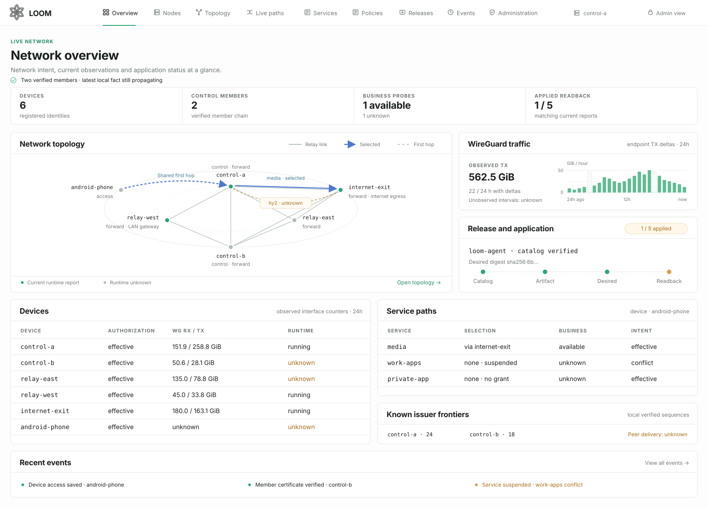
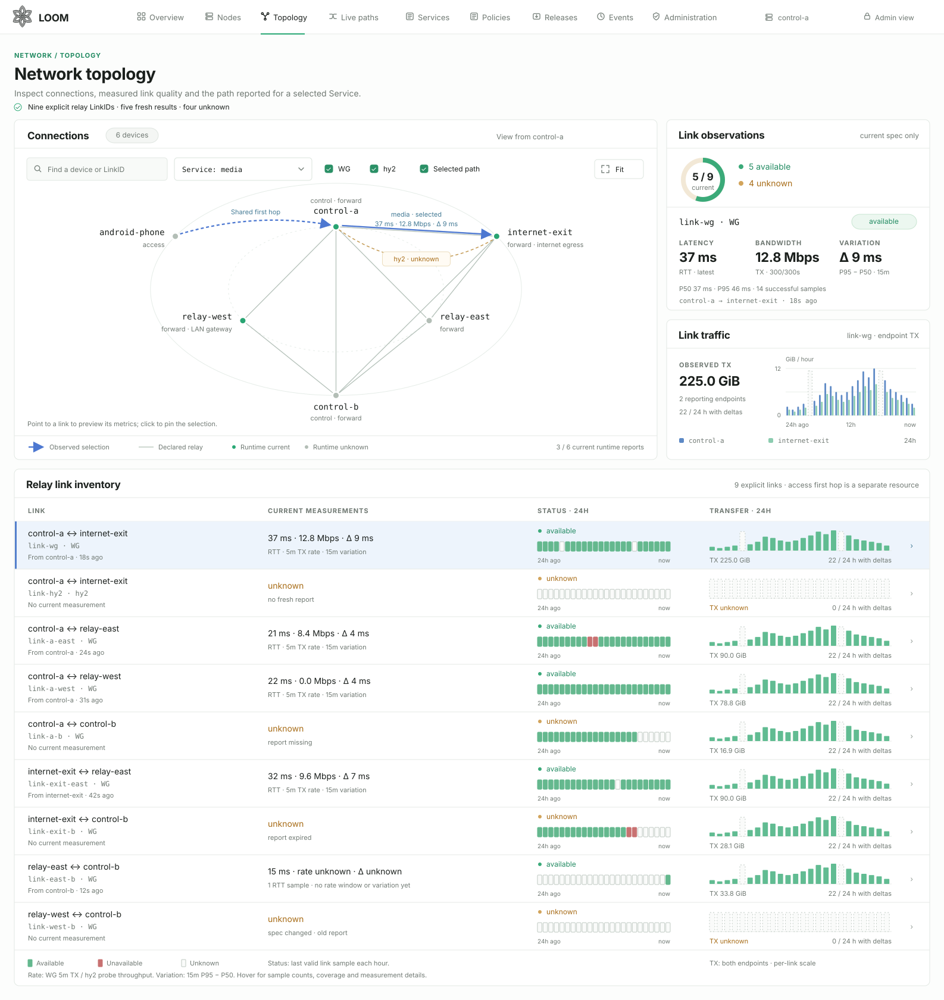
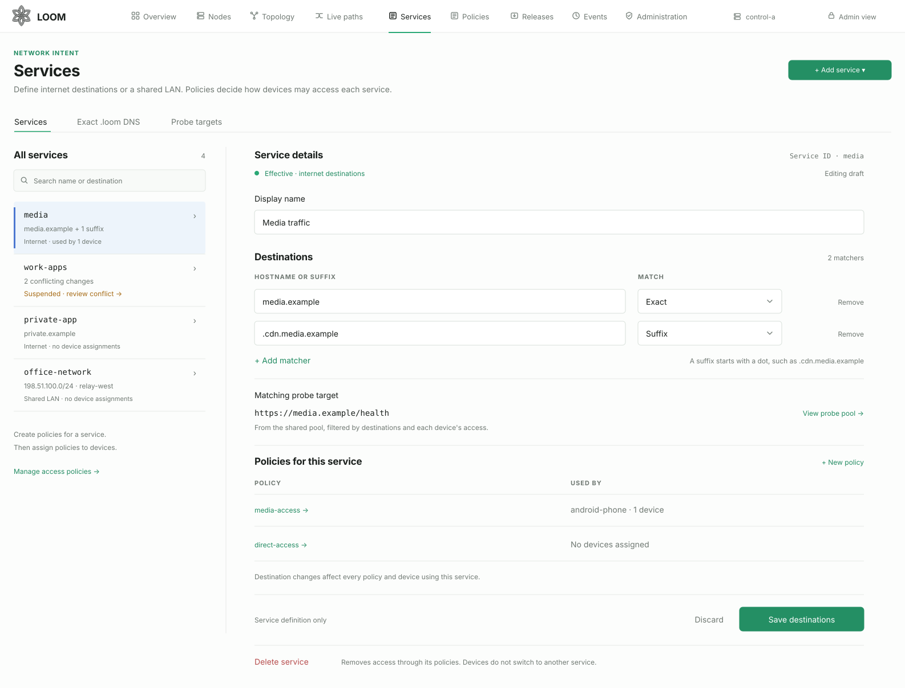
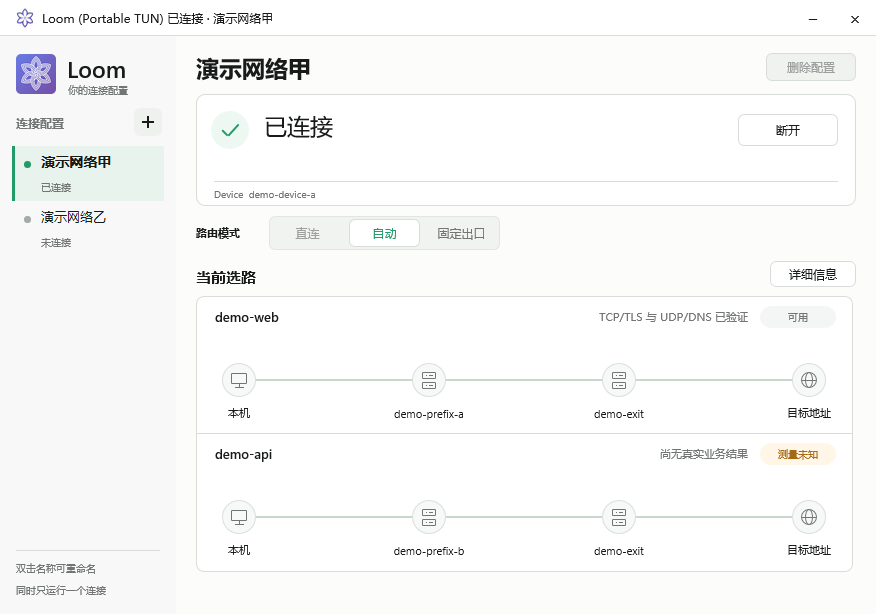

<p align="center">
  
</p>

<h1 align="center">Loom</h1>

<p align="center">基于 WireGuard 和 sing-box 的组网与选路工具。</p>

Loom 的控制、Enrollment、客户端运行和界面以[同一套设计](docs/README.md)为准。
正式业务链的实施与验收进度见[实施状态](docs/progress.md)。

## 产品模型

Loom 管理可组合承担 `access`、`forward`、`internet_egress`、`control` 职责的节点，以及不受管的目标地址。
最终出口是路径上的位置，不是节点类型。
客户端在认证的候选集合中选择 Direct、Auto 或指定最终出口；一跳直达与经中继到同一出口可以同时存在。
授权配置与当前可用性分开：实际 transport 或业务结果才产生 `available / unavailable / unknown`。
认证的 `.loom` 精确记录提供私有名称；有 `forward` 职责的节点可在 control 授权后共享等长虚拟前缀映射的局域网。

控制面用一套模型处理单个或多个 control 成员：普通签名事实最终一致，control 成员变更由旧成员多数签名。
设备通过受限 bootstrap tunnel 和私有认证通道加入、取得配置并上报；
公网 Nginx 只提供伪装网站和明确认证为公开的通用不可变制品。

## 界面

控制面 Web 包含 Overview、Nodes、Topology、Live paths、Services、Policies、Releases、Events 与 Administration。
Android 和 Windows 提供原生页面、配置选择与实际路径显示。界面从认证状态和真实运行结果单向投影；
业务验收状态见[实施状态](docs/progress.md)。下列 Web 图片是按现行模型绘制的目标原型，
与当前浏览器页面的差距见[原型对照](docs/clients/prototype-review.md)。
[服务管理](assets/control-center/05-services.svg)统一包含互联网与[局域网服务](assets/control-center/05-services-lan.svg)，
[策略管理](assets/control-center/06-policies.svg)为一个固定服务定义可复用的访问规则；
[添加设备](assets/control-center/02-nodes-add-ssh.svg)先多选角色：纯 access 使用[二维码](assets/control-center/02-nodes-add-qr.svg)，
含其他角色使用 SSH 或 [sh 脚本](assets/control-center/02-nodes-add-script.svg)；包含 access 时只选择策略，
服务及规则由策略派生。每台设备同一服务最多选择一条策略；后续可在设备详情替换，不修改共享规则。
完整规则在策略页[创建](assets/control-center/06-policies-new.svg)、复制或编辑。
[统一设备详情](assets/control-center/02-nodes-detail.svg)按组合角色展示服务权限、当前路径、转发资源、
共享 LAN 和重新添加入口，并保留独立的 RX／TX 历史；缺失观测以空档或 `unknown` 表示。
添加后分别显示 [SSH 执行结果](assets/control-center/02-nodes-add-ssh-result.svg)、
[带 URL 的安装命令](assets/control-center/02-nodes-add-script-delivery.svg)或[二维码](assets/control-center/02-nodes-add-qr-delivery.svg)；
等待执行、成员签名、加入完成及实际运行结果都在同一节点详情中回读，不另设 enrollment 进度页。
总览与拓扑保留双圈结构和 24 小时传输柱状图。
实时路径只保留两层、两张原型：[服务与设备](assets/control-center/04-live-paths.svg) →
[设备路径详情](assets/control-center/04-live-paths-detail.svg)。左侧选服务，右侧直接显示对应设备，
切换服务和筛选都在同页完成；点击设备查看路线、度量、候选与历史，异常和 LAN 沿用同一详情布局。

<p align="center">
  
</p>

| 动态拓扑 | Service 管理 |
|---|---|
|  |  |

Windows 原生界面提供多配置侧栏、Direct/Auto/固定出口、当前路径和详细信息。三种交付形态是
Portable Mixed、Portable TUN 和 Installed；当前发行签名与实体机验收状态见[状态文档](docs/progress.md)。

<p align="center">
  
</p>

<p align="center"><sub>Windows · 同机测试 VM 的合成场景；图片不是生产连接证据。</sub></p>

对应的可编辑[Windows 原型](assets/client/windows/connected.svg)与
[Android 原型](assets/client/android/connection-connected-auto.svg)按原生截图整理，Windows 外框另表达目标圆角。

## 设计与操作入口

- [设计文档与阅读顺序](docs/README.md)
- [统一契约](docs/core/current-contract.md)
- [控制权威模型](docs/core/control-model.md)
- [Enrollment 与 Endpoint 模型](docs/core/enrollment-endpoint-model.md)
- [客户端运行与选路模型](docs/clients/client-runtime-model.md)
- [Linux 客户端安装与安全暂停](docs/operations/linux-client-install.md)
- [Windows 客户端](clients/windows/README.md)和 [Android 客户端](clients/android/README.md)
- [实施状态](docs/progress.md)

模型与实现中的错误修订同一现行契约；协议或版本变更须由用户明确提出。

## 本地开发检查

需要 Go 1.27 或更高版本。修改相关功能后先运行对应测试；提交前执行：

```bash
go build ./...
go test ./...
go vet ./...
git ls-files --cached --others --exclude-standard -z -- '*.go' | xargs -0 gofmt -l
python3 scripts/check_repository_safety.py
git diff --check
```

Linux access/hybrid 的宿主初始 network namespace TUN 目前受安全门禁阻止。不要启用本机
`loom-client.service`；隔离方案和验收要求见[宿主网络事故记录](docs/incidents/2026-09-21-host-network-takeover.md)。

## 许可证

Loom 自有代码采用 [Apache License 2.0](LICENSE)，版权声明见 [NOTICE](NOTICE)。第三方组件保留各自许可。
Windows 外部签名计划见 [Code signing policy](docs/operations/code-signing-policy.md)。
