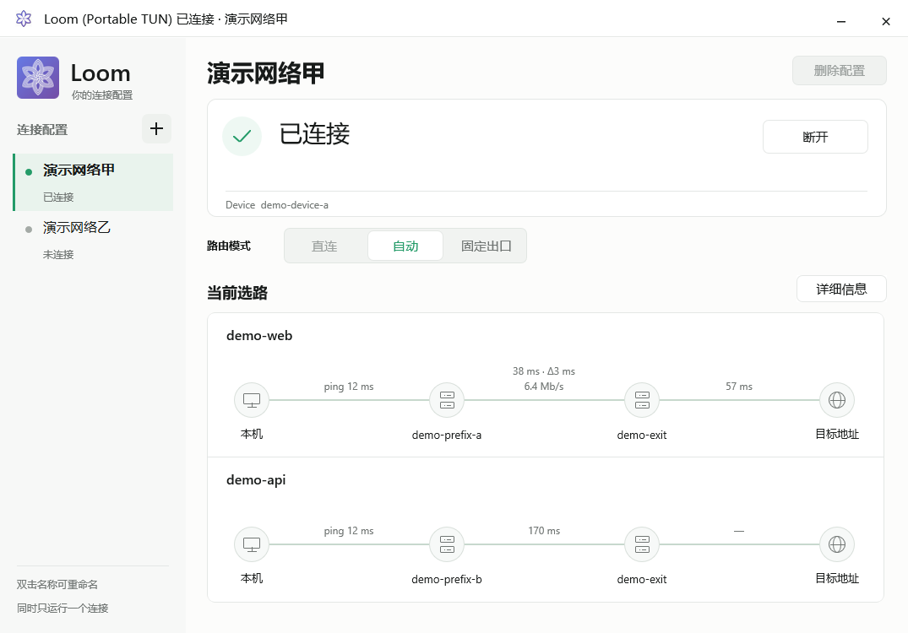

# Loom Windows client

`clients/windows` is the Windows-only client host. It does not compile the
control-plane publisher, SSH provisioning, systemd lifecycle, or other Linux
operations into the Windows executable.

## User flow

The control plane creates the Device first. All three embedded editions now use
the same native Windows GUI and join flow. The current Installed interactive
shell requires elevation and writes machine state directly; the eventual
ordinary-user desktop process must instead use an installer-created restricted
Service broker:

```text
Control: Create Device → show one-time join QR
Windows: start client → import QR → join → connect
```

The native shell uses standard Win32 list, text, and button controls in a
compact list/detail/action layout. It follows the interaction shape of the
[WireGuard for Windows tunnel page](https://git.zx2c4.com/wireguard-windows/tree/ui/tunnelspage.go?h=v0.5.3):
network selection on the left, selected-network state on the right, and the
current action inside the selected-network detail. It does not paint an SVG-like
full-window canvas or show navigation entries for features that are not implemented.
The EXE embeds native-size variants generated directly from
`internal/webui/favicon.svg` for Explorer, the Windows taskbar, the window title
bar, and the notification-area icon.

Display scaling changes and moves between monitors update the native fonts,
list/dropdown row heights, icons, and layout together through `WM_DPICHANGED`.
The window uses the position and size suggested by Windows. The Windows-native
`TestGUIDPIChanges` regression covers 100–200% scaling in both directions on
the onboarding and joined views without changing the machine's display settings.

<p align="center">
  
</p>

<p align="center"><sub>Current native UI with example-only Device, state-path, and exit labels.</sub></p>

### Icon asset invariant

The executable/program icon, Explorer icon, taskbar icon, window title-bar icon,
and notification-area base icon **must use `internal/webui/favicon.svg`**. Do not
replace, redraw, recolor, invert, or substitute that mark with `loom-logo-v4.svg`
or a Windows-specific derivative. Rendering the same SVG into multiple native
ICO sizes is allowed; changing its geometry or colors is not. The window host
must load the current-DPI `SM_CXSMICON` and `SM_CXICON` sizes separately and set
both small and big window icons; it must not load an arbitrary intermediate
size and rely on Windows to rescale it. Transparent canvas margins may be
normalized without changing the favicon geometry, colors, or proportions. Connected state
may overlay the Windows-native green shield in the lower-right corner, but the
favicon beneath it remains unchanged. `assets/loom-logo-v4.svg` is reserved for
the larger in-window brand area beside the product name.

Before join, the window uses a focused onboarding view without an empty network
pane or placeholder Device details. After join, it switches to the compact
network-list/detail layout. The notification-area tooltip includes the embedded
edition and current state. Double-click restores the window; closing the window
hides it to the tray; the tray menu provides show, the current
import/connect/disconnect action, and an explicit exit.

Importing the QR never creates a second Device. In the Windows GUI, copy
the QR image from the control page and press `Ctrl+V` (or click **粘贴二维码**),
select the downloaded QR PNG, or drag one local QR PNG or `.loom-invite` file
onto the window. Clipboard images are decoded in memory and are not written to
a temporary file. The executable does not accept join material as a command-line
argument, so its bearer token cannot enter process listings or shell history.

There is deliberately no Windows `enroll` command and no user-selected
`-component` argument. The data plane ships beside the executable as
`windows-dataplane.zip` and is selected automatically.

Internally, the QR import performs one short-lived identity handshake: the
client generates its private key locally, binds the already-created Device,
validates the returned certificate and signed bootstrap, and protects local
secrets with DPAPI. This is an implementation detail of **Join network**, not a
second Device-registration workflow. The private key and permanent credentials
are never placed in the QR code.

Reporting uses the identity created by this same join flow automatically. A
user never needs to locate or import a private key. An unjoined client starts
with a valid QR; restoring an old state directory is not a reporting-test
prerequisite. Live reporting acceptance follows the normal GUI join and connect
flow described in the [reporting contract](../../docs/windows-client-reporting.md).

Deleting a local Device clears its identity and configuration; it does not notify
the control plane. To join again, open the original Device in the control UI and
use **Rejoin Device**. For a joined access-only Device, this archives the old
identity and generates a new ID and QR with the same name and purpose. The old
access is revoked as servers apply the signed update. An unused QR can instead
be regenerated from the Device details while keeping its reserved ID.

## Editions

Portable is a delivery choice; TUN and mixed are traffic-capture choices.

| Edition | Traffic coverage | Elevation | Persistent installation |
|---|---|---|---|
| Portable Mixed | Applications explicitly using `127.0.0.1:1080` as HTTP/SOCKS proxy | None | None |
| Portable TUN | System TCP/UDP/DNS selected by the managed TUN rules | The current preview requires an administrator relaunch before TUN activation | No MSI or Service; adapter/routes exist while connected |
| Installed (administrator GUI preview; MSI not delivered) | Managed TUN plus the same-rule mixed endpoint | Current interactive preview requires elevation; target ordinary UI/join stays unprivileged | Windows Service shell and machine-scope ProgramData state |

Portable editions can open and import a join QR without TUN privileges. Portable
TUN checks elevation only after the join is safely committed and immediately
before starting its data plane; its GUI offers a Windows UAC relaunch at that
boundary. Portable Mixed never
creates an adapter or changes the route table.

Portable state is stored under `%LocalAppData%\LoomPortable` using current-user
DPAPI. Installed state is stored under `%ProgramData%\Loom` using machine-scope
DPAPI. The current administrator GUI preview does not replace the still-required
installer-created ProgramData ACL and restricted Service IPC.

## Build and run

Build all three editions for amd64 and arm64:

```sh
./scripts/build-windows-clients.sh
```

The build requires the platform-signed component packages in
`deploy/staging/loom-windows-dataplane-1.11.4-{amd64,arm64}.zip` (or the directory
selected by `LOOM_WINDOWS_COMPONENT_DIR`). For each edition it produces a full
ZIP containing the edition-specific executable, the fixed-name
`windows-dataplane.zip` sidecar, `PREVIEW-NOTICE.txt`, and the licenses/notices
for statically linked third-party modules. These are development-preview ZIPs,
not Authenticode-signed release artifacts; only Portable Mixed has completed
the native, TUN-free end-to-end run.
`out/windows-clients-SHA256SUMS` is published last as the commit marker for the
complete six-ZIP build set. Build or verification failures before publication
leave the previous set in place; consumers must verify the manifest so an
interrupted partial publication is rejected.

Release builds strip Go symbol and DWARF tables with `-s -w`. Package size is
still dominated by the signed data-plane sidecar: the amd64 sidecar is about
13.3 MB compressed and contains the 34 MB `sing-box.exe` plus Wintun. The outer
ZIP cannot materially recompress that already-compressed ZIP. The remaining
size is the statically linked Loom executable, including the Go runtime, QR
decoder, TLS, DPAPI, signature verification, update, and process supervision.

For example, extract:

```text
loom-client-windows-portable-mixed-amd64.zip
```

then start:

```powershell
.\loom-client-windows-portable-mixed-amd64.exe
```

This starts the native GUI without a console window. On first launch, select or
drag in the QR PNG generated by **Devices → Create Device** on
the control plane. Later launches reuse the protected joined state and connect
without asking for the QR again. `--build-info` reports the embedded edition,
architecture, Go/VCS coordinate, and executable hash.

New QR codes include the SHA-256 fingerprint of the deployment platform key.
The client compares it with its embedded key locally before sending the
one-time code, so joining does not depend on an extra public trust route. Older
QR codes remain usable during migration and still have to pass the ready
response and first signed-pull trust checks. See
[`docs/status/current.md`](../../docs/status/current.md) before testing.

## Security and runtime boundaries

- `internal/clientjoin` decodes only bounded QR images, join files, or Loom URIs.
- The deployment platform public key is embedded in each build as a small,
  non-secret verification key; it is not a Device credential, connection
  secret, or control address. A clean first launch does not parse it and simply
  waits for QR import. Import or recovery then loads this trust anchor. The fixed
  sidecar is read once and its signature and architecture are checked before a
  one-time join code is submitted. New invitations carry only the SHA-256
  fingerprint of that public key, allowing a local comparison before the claim
  POST without adding another network or reverse-proxy dependency.
- `internal/clientenroll` implements the private wire protocol used behind QR
  import; it binds an existing Device and is not a user registration command.
- `internal/clientsecret` protects the join identity, secret vault, and hydrated
  candidates with edition-appropriate DPAPI scope.
- `internal/clientupdate` verifies signed current state, generation floors,
  snapshot signatures, and the Device bundle before activation.
- `internal/clientcomponent` verifies the bundled component signature, hashes,
  PE architecture, sing-box identity, and Wintun Authenticode before installing
  an immutable runtime slot.
- `internal/clientruntime` derives the exact Installed, Portable TUN, or TUN-free
  Portable Mixed profile and supervises sing-box in a kill-on-close Job Object.
- `internal/clientreport` sends the existing minimal Observation with a v5
  attestation and self-check v1, using the retained DPAPI identity. After
  activation it reports the active snapshot every 60 seconds to the same-origin
  report URL derived from the validated enrollment URL; redirects are refused
  and only an empty HTTP 204 response is successful.
  Candidates do not advance `applied`, and stopping the workload stops reports.
  Existing reports then become stale after five minutes. Windows currently has
  no trusted representative end-to-end health result, so self-check reports
  `healthy=false` with that missing evidence as a problem. See the
  [reporting contract](../../docs/windows-client-reporting.md).
- `config\client.json` is written last and is the only joined-state marker
  observed by normal startup. Failed imports cannot start a partial client.
- In the current Portable preview, until the join commits, the exact QR
  credential and generated identity are current-user-DPAPI protected. The control permits only the same token, CSR,
  request ID, platform and Device facts during a one-hour recovery window. A
  validated ready response is journaled separately before local installation;
  the next launch resumes automatically, and the pending token is scrubbed
  after `config\client.json` commits.
- A global UI lock prevents two Windows client windows from running at the same
  time, and the data-plane lock prevents two joined workloads; the latter remains held while
  an update swaps child data planes, and the final joined-state commit never
  replaces an existing file.

## Current implementation boundary

Portable Mixed has a native Windows end-to-end test covering QR decoding,
current-user DPAPI, HTTPS Device binding, signed component installation, first
signed pull, listener startup, startup grace, two signed report attachments
after token cleanup, and clean shutdown without TUN or
route changes. All three editions now provide the same native first-launch and
Connection GUI; file selection, window lifecycle, and console-free PE output
have been exercised on the Windows host. Before QR import the network list is
empty; an entry appears only after a Device has been successfully bound.

The Installed binary keeps the Service-side waiting state when launched by SCM
and now opens the shared GUI when launched interactively. Its current elevated
ProgramData adapter is only a development preview. A production ordinary-user
tray process, privileged broker/IPC, MSI, ProgramData ACL setup, and
executable/installer Authenticode signing are still pending;
therefore Installed is not a distributable installer. The shared native GUI currently
implements first launch, Device QR import, Connection state, start/stop, and the
TUN UAC boundary. Unimplemented prototype navigation pages are deliberately not
present in the application. Actual Portable TUN adapter/route activation and cleanup also remain
unverified and must not be described as release-ready.
