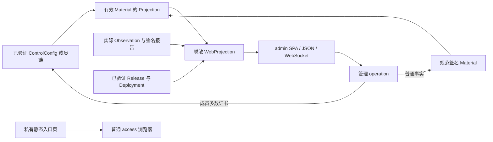
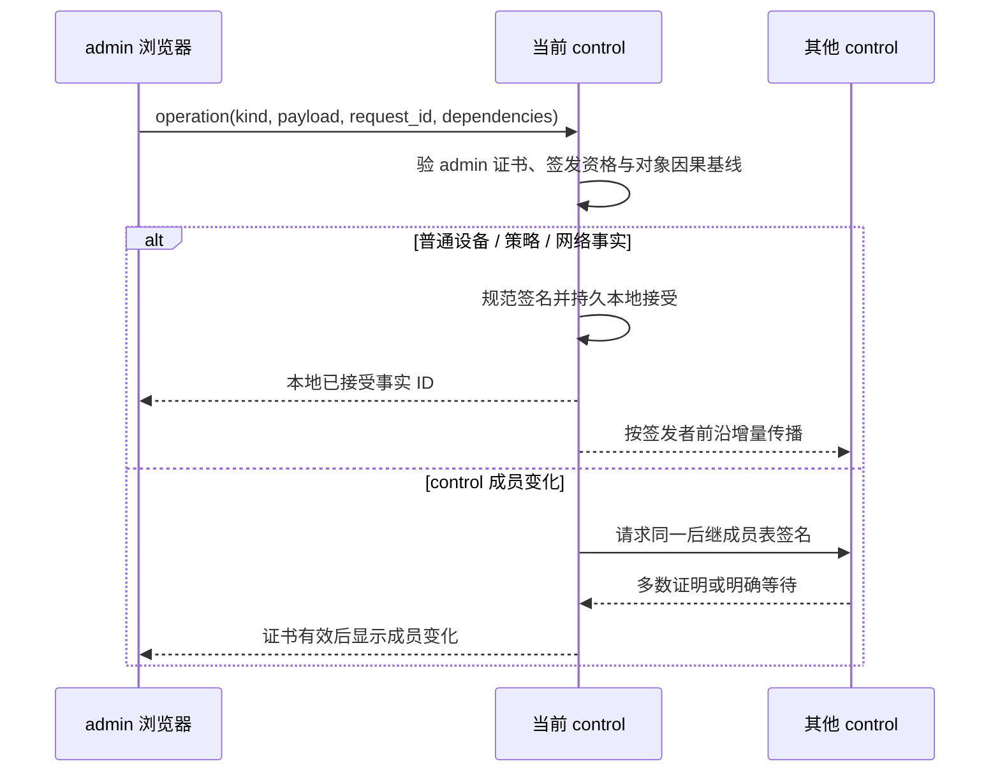

# 控制面 Web 投影

[设计入口](../README.md) · [控制权威模型](../core/control-model.md) · [实施状态](../progress.md)

控制面 Web 保留现有页面、样式、图标及有效交互。页面从已验证的成员表链、签名事实形成的
`Projection`、实际运行观测、签名发布记录和可验证事件生成；它没有另一套治理权威。
浏览器操作与本机管理 CLI 提交同一种管理 operation，由 control 按同一权限和事实规则处理。

## 私有入口与两种证书

`control.loom` 是加入 Loom 后可解析的私有 HTTPS 名称，指向已认证 control 的私有 Web listener；
多个 control 可以提供同一入口名，各自的网站证书必须覆盖 `control.loom`，设备须信任已固定的网站
证书信任根。客户端按真实连接结果选择可达入口；DNS 解析只提供地址，不证明健康、成员资格或管理权限。该名称不作为公开互联网域名使用，
公网 Nginx 永远不能反代页面或管理 API。回环入口也使用经验证的网站证书。

浏览器证书只有两类用途：

- **网站证书**由 Web listener 提供，浏览器据此验证私有 HTTPS 服务；
- **admin 客户端证书**由管理员浏览器提交，私有服务校验证书链、精确受信叶子、Origin 和管理授权，
  才开放管理快照及 operation API。

无需 admin 证书的已入网 `access` 可打开 `https://control.loom` 的静态入口页，页面只说明该私有
站点可达和如何使用管理员身份；它不返回设备列表、拓扑、成员、策略、事件、部署信息或管理 API。
TLS 允许无客户端证书握手以提供该入口页，受保护路由必须独立拒绝无有效 admin 证书的请求。
这里没有 reader 客户端证书、reader 能力或独立只读管理角色；已有相关实现是待删除的漂移。
本机 root-only admin Unix socket 可以使用本机身份认证，但进入与浏览器完全相同的 operation handler。

## 输入、映射和重启



`WebProjection = f(ValidMaterial, ControlConfig, Observation, Release, Deployment)` 是确定性单向投影。
可选 Web 缓存删掉后须能重建；签名事实缺失、成员链无效或投影冲突时不能从旧 UI 缓存、
观测或一次性导入结果补造可写状态。重启先验证网络锚、成员链、事实前沿与当前规范内容，
再重建页面。不同 control 在事实传播期间可能显示不同的**已知前沿**；页面须标明本地接受、
已传播情况和冲突，不把本地结果称为全网即时完成。

| 层 | 表达 | 权威性及可逆边界 |
|---|---|---|
| domain | 有效 `Material`、`ControlConfig` 与运行 `Observation` | 前两者是治理权威；Observation 只是限时事实 |
| wire | 一个现行 Web snapshot / event envelope | 只对展示语义 encode/decode 往返，不反推治理状态 |
| persistent | 无专用 UI authority | 仅可丢弃的投影缓存、草稿或浏览器偏好 |
| runtime | `WebProjection` | 从已验证输入重建，不能倒写事实 |
| UI | 页面、列表、表单和状态提示 | 只显示投影，写入只能提交最小 operation |

```text
decode_ui(encode_ui(WebProjection)) = WebProjection
rebuild_ui(verified_inputs)         = WebProjection
core_state != inverse(WebProjection)
```

## 页面和状态

Overview、Devices、Device detail、Topology、Live paths、Services、Releases/Deployments、Events、
原 SSOT 页面及 Add Device 保留原有有效交互；原 SSOT 页面只展示当前签名事实与投影，不读取旧 SSOT
文件。一个稳定设备只出现一次，不并列 Client/Node 身份。

| 页面值 | 唯一输入 | 显示重点 |
|---|---|---|
| `UIState` | 当前成员链、本 control 已验证的签发者前沿和冲突 | 网络锚、成员、已知前沿、局部可写性及传播状态；不显示不存在的全局 head |
| `Device` | 当前设备授权与签名 View、presence/runtime 观测 | 四项职责、policy grants、在线与实际运行状态 |
| `Link` | `NetworkLink` 的 LinkID、资源及其独立 Observation | 同一节点对 WG/hy2 分行，旧规范摘要失效为 unknown |
| `Path` | Service 范围、首跳资源、有序 LinkID、最终出口及选择 | Direct、Auto、指定出口及真实可用性；不以一个 Service 探测代替另一个 |
| `Service` | 有效 `NetworkIntent`、matcher、Policy、DNS 与局域网映射 | 精确目标、授权范围、虚拟前缀及网关 |
| `Release/Deployment` | 签名 catalog、publisher 与设备回读 | 精确制品、应用快照、真实一致性，不显示未回读的 current |
| `Event` | 不可变签名 Material 与有效设备报告 | 普通事实、成员变更、冲突、撤权和运行变化，不另建事件权威 |

邀请发出、设备密钥绑定、授权完成及运行 Ready 分开展示。普通加入不出现
`awaiting_approval`：签发 Invite 即批准；`control` 入网在多数证书形成前显示“等待成员签名”，
绝不显示为有效 control。事务 `completed` 只表示授权事实有效，不等于服务已部署或可用；
Ready 要求设备自身及所选路径涉及的 forward/出网节点以当前 View 摘要报告新鲜、匹配的运行回读。
授权、传输连通、业务探测和部署一致性分别展示；缺失、过期或不匹配统一呈现 `unknown`，
不因 presence、组件匹配、链路数量或 UI 颜色补成健康。

Topology 由有效连接事实生成；当前路径和健康状态只作颜色叠加，不能改变拓扑权威。
同一 control 集的成员通过私有认证通道交换有效报告的必要摘要；短暂未见报告时本地显示
`unknown`，不能把其他成员的陈旧绿色推断为本地可用。WebSocket 首帧是当前脱敏快照，后续只因
已验证输入变化发送，不触发额外网络测量，也不把原始报告、本机诊断、密钥或私有路径泄露给浏览器。

## 正常写入与具体界面



表单仅提交操作种类、必要 payload、稳定 request ID，以及当前对象事实的因果基线/摘要；
不提交完整 `Projection`、Web snapshot 或全局 `base_head`。过期对象基线返回冲突并保留草稿，
管理员可回读冲突事实后明确重新提交；并发撤权按控制模型优先，其他不兼容更新暂停该对象生效。
普通操作在签发 control 持久接受时返回**本地已接受**，并展示其后增量传播；不能将该响应写成
“全网已完成”。control 成员操作必须等旧成员多数签同一后继表后才显示资格生效。
本机 CLI 通过 root-only socket 提交同一 envelope 和事实校验，不能从旁路更改成员或授权。

- **Add Device**：管理员选择 SSH 直接添加、bootstrap 脚本或扫码。扫码仅可签 `access`；
  SSH/脚本可在目标平台已支持的范围内选择四项职责组合。Invite 明示唯一签发 control、入口、期限和准确 grants；
  签发后不出现二次批准按钮。申请 control 时展示自动多数签名进度及成员表结果。
- **Devices**：普通设备的职责、policy grants 和撤权可由任一有效 control 修改；control 卸任、
  强制撤销及整个 control 节点删除进入多数签名成员操作，不能靠普通设备删除绕过。仅卸任保留该节点其他职责；
  整体删除须在同一多数证书中绑定该节点墓碑，并从页面、授权和依赖投影中原子退出。
- **Topology/Services**：可复用 WG、hy2、私有 TLS `TransportResource`；显式中继才配置
  `NetworkLink`，增加节点不自动形成全互联。共享 HTTPS 探测目标按 Service 和设备授权过滤，
  没有目标显示 `unknown`。
- **DNS overlay**：仅编辑精确 `.loom` A/AAAA 记录，`control.loom` 为保留名，指向有效 control
  的私有 Web 入口。DNS 答案不授予管理或业务权限；不提供任意公网域名劫持编辑。
- **共享局域网**：在具有 `forward` 职责的节点详情选择它已认证报告的本地 IPv4 前缀，
  创建等长虚拟前缀映射。界面显示自动分配的前缀、固定网关和所绑 Policy；默认创建只服务此
  映射的 Policy，选用既有 Policy 时明确展示它同时授权的目标。管理员通过新 Invite 或现有
  access 的授权编辑页授予 Policy；access 自身不能填写 CIDR。并发虚拟地址冲突时显示禁用
  与最多三次签名重分配结果。删除映射使路由、候选和关联 DNS 投影收口，不更改 LAN 路由器。

## 失败、测试与验收

- 无 admin 证书只能取得私有入口页；管理快照、WebSocket、API 和原始事实均拒绝。错误证书、
  跨源请求与非规范 operation 同样拒绝；公网 Nginx 不可达管理页面。
- 签名事实尚缺依赖或同一对象发生不可兼容冲突时，页面显示待定/冲突，不提前展示新授权；
  撤权传播到达后及时收缩页面和运行投影。一个 control 离线不阻止其他有效 control 本地接受
  普通操作，但会影响成员变更是否能取得多数。
- 测试网站证书覆盖 `control.loom` 且浏览器可验证；无客户端证书的 access 仅见入口页；
  admin 证书可读管理快照并提交 operation。reader 证书和 reader 能力路径必须不存在。
- 测试同一设备只出现一次、同节点对两条链路各自观测、Direct/Auto/指定出口保留、不同 Service
  分别探测；unknown 不被 UI 补绿。成员表签名进度与普通事实本地接受的文案不能互换。
- 测试已有 access 授予或撤销局域网 Policy 后的页面、签名事实及客户端 View 回读；
  无授权设备不能得到虚拟前缀。WebSocket 更新不得清除正在编辑的表单草稿，陈旧基线应返回冲突。
- 使用正式 Web handler、静态资源和真实浏览器验收既有页面的视觉及交互；真实 TLS、admin 证书、
  私有入口和正式 operation 的验收不能由 HTTP fixture 或截图替代。

## 禁止恢复

- 旧 SSOT 文件、registry、report 拼接层或页面缓存作为 UI 权威；
- `CertifiedHead`、Raft commit、普通写入 QC、全局 `base_head` 或 leader 提交作为 Web 正常写入；
- reader 证书、reader 能力、无 admin 证书可读取的管理快照；
- 每个按钮独立的 manager、store、receipt 或与 SPA 重复的页面专用状态机；
- 用页面颜色、DNS 解析、传输握手或公开网站可达性推导授权与健康。
