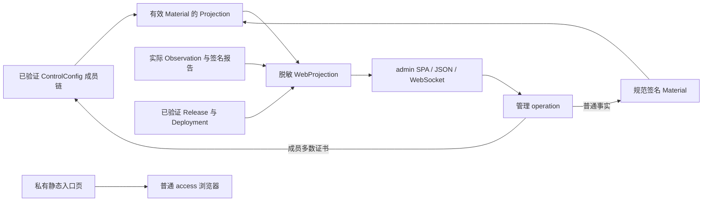
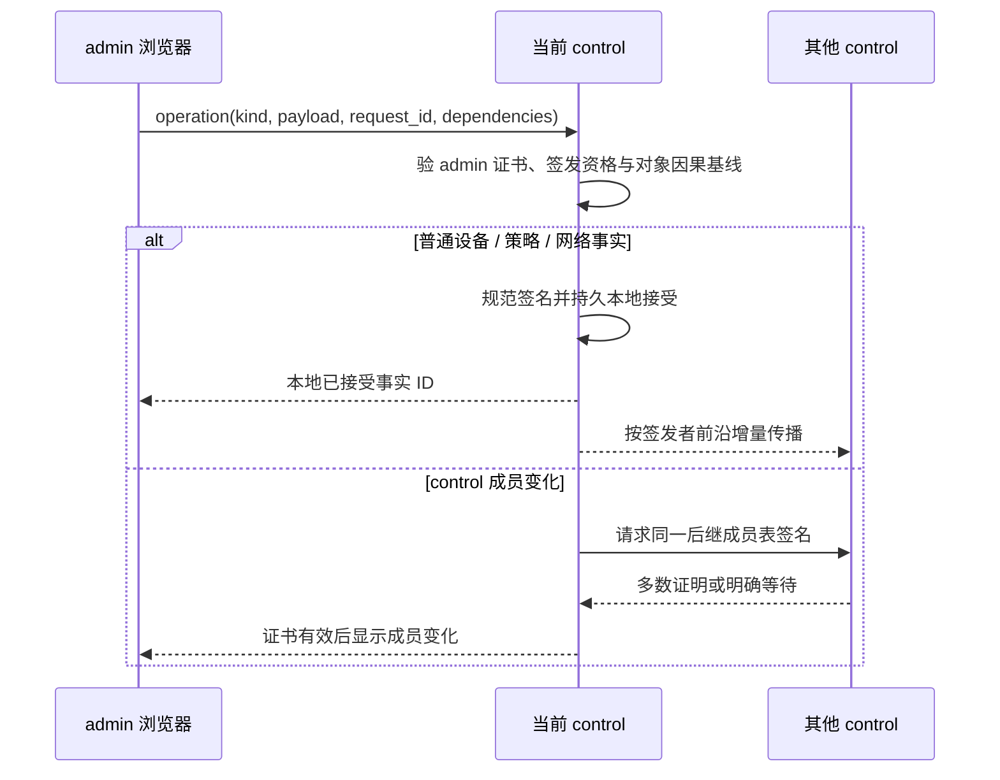

# 控制面 Web 投影

[设计入口](../README.md) · [控制权威模型](../core/control-model.md) · [实施状态](../progress.md)

控制面 Web 保留现有页面、样式、图标及有效交互。页面从已验证的成员表链、签名事实形成的
`Projection`、实际运行观测、签名发布记录和可验证事件生成；它没有另一套治理权威。
浏览器操作与本机管理 CLI 提交同一种管理 operation，由 control 按同一权限和事实规则处理。
现行页面的目标 SVG 与当前浏览器截图差距记录在[原型与验收图对照](prototype-review.md)；
SVG 只作界面沟通稿，不是新的业务输入或完成证据。

## 私有入口与两种证书

浏览器有两条入口，SSH 端口转发不提供 `.loom` DNS：

| 场景 | 浏览器入口 | 地址来源 |
|---|---|---|
| 离网笔记本上的开发调试 | 同端口 SSH 转发后访问 `https://127.0.0.1:<本地端口>/` | SSH 将笔记本回环端口转发到选定 control 的回环 Web listener；笔记本无需解析 `control.loom` |
| 已加入 Loom 的设备 | `https://control.loom/`（或入口声明的端口） | Loom DNS 从处于 serving 的 web 入口返回有效 control 的私有地址；浏览器连接其中可达的入口 |

第一条是旧部署文档记载且操作者确定采用的开发调试办法，第二条是本模型的目标入网办法；本轮未单独
重做 SSH 回环登录回读。当前重建源码及生产切换
是否已实现目标，以[实施状态](../progress.md)和正式入口验收为准。管理员证书包的现有交付操作与目标
CLI 补齐范围见[管理员访问与证书交付](../operations/admin-access.md)。

`control.loom` 是加入 Loom 后可解析的私有 HTTPS 名称，指向已认证 control 的私有 Web listener，
地址来自各 control 处于 serving 的 web 模式 `EndpointGeneration`；多个 control 可以提供同一入口名，
各自的网站证书必须覆盖 `control.loom`。已入网客户端从已验证的 DeviceView 取得
`NetworkIntent` 中的网站证书信任根；独立浏览器不能直接读取 DeviceView，须经受保护安装输入或已认证
客户端的受信本机交付取得并核对同一公开根。导入浏览器前须验证根证书带 critical NameConstraints、
允许 dNSName 仅限 `.loom`，且以 excluded IP 子树 `0.0.0.0/0`、`::/0` 排除所有 IP SAN；
拒绝无约束根，只有目标浏览器经实际验证执行 DNS 与 IP 约束才可导入该根。
正式入网 Web 入口的网站根私钥不得在 control 上；该入口仅使用 SAN 恰为 `control.loom` 的网站叶证书及对应私钥，不含其他 DNS、IP、URI 或 email 名称，且 control 不能签发其他网站证书。
操作者在与所有 control 隔离的离线签发介质保管根私钥，在管理页或本机 CLI 的到期前提醒出现后手工续签。
每台 control 本机生成并保留叶私钥，只交出经成员身份认证、绑定节点及入口的 CSR；操作者核对 CSR 签名、
成员证明、公钥、名称和用途后按固定模板签发，通过受保护渠道把证书链交回。新叶证书先经本机私钥匹配和验链，
在 prepared 阶段以候选地址和 SNI `control.loom` 预检 TLS 与 Web；新代 serving 后再从目标浏览器回读，
成功才让旧代退出。根不变时无需重导入；若续签未完成且旧叶已过期，
页面入口 TLS 失败关闭，管理员从受保护的本机状态或 CLI 得到到期诊断，不能点击证书警告继续访问。
admin 页面与本机 `control inspect` 对每个已知 serving web 入口显示叶证书的到期 UTC 时间和剩余有效期，
进入 30 天窗口时显著提醒续签；本机 CLI 在 Web TLS 过期后仍可诊断。页面长开跨阈值时更新提示。
其他 control 的有效期须由认证运行回读提供，缺失或陈旧时显示 `unknown`。提示仅对 admin 可见，
不进入普通 access 入口页，也不改变 `Material`、`EndpointGeneration` 或 DNS。
未建立该信任时 TLS 失败关闭；不能从待访问网站、DNS 答案或证书警告页临时接受根。客户端按真实连接结果选择可达入口；DNS 解析只提供地址，
不证明健康、成员资格或管理权限。该名称不作为公开互联网域名使用，
公网 Nginx 永远不能反代页面或管理 API。目标 `.loom` 网站根排除所有 IP，且目标网站叶只含
`control.loom`；它不能验证浏览器访问的 `https://127.0.0.1:<端口>/`。保留回环调试入口时，
在替换现有可用证书之前，须给该入口明确独立于 `.loom` 网站根的受信回环网站证书边界，
以目标浏览器实测 IP SAN `127.0.0.1`、证书链及管理登录，并证明它不能为 `.loom` 以外的
远端网站签发证书。SSH 只转发 TCP，不改变浏览器的 TLS 校验名，也不提供 DNS 解析；
不能以忽略证书错误或把不合格旧网站根继续用作目标根来通过切换验收。

浏览器证书只有两类用途：

- **网站证书**由 Web listener 提供，浏览器据此验证私有 HTTPS 服务；
- **admin 客户端证书**由管理员浏览器提交，私有服务校验证书链、精确受信叶子、Origin 和管理授权，
  才开放管理快照及 operation API。受信叶子名单是 `Projection` 中由普通事实维护的值，所有 control
  使用同一份，增删管理员经正常 operation 提交。

无需 admin 证书的已入网 `access` 可打开 `https://control.loom` 的静态入口页，页面只说明该私有
站点可达和如何使用管理员身份；它不返回设备列表、拓扑、成员、策略、事件、部署信息或管理 API。
TLS 允许无客户端证书握手以提供该入口页，受保护路由必须独立拒绝无有效 admin 证书的请求。
这里没有 reader 客户端证书、reader 能力或独立只读管理角色；已有相关实现是待删除的漂移。
本机 root-only admin Unix socket 可以使用本机身份认证，但进入与浏览器完全相同的 operation handler。
首节点 bootstrap 在 control 端生成首位管理员私钥、客户端证书、`admin.p12` 与独立密码文件，
首位管理员的受信叶子及验证所需公开材料进入 genesis；操作者手动把交付包取到管理设备并导入浏览器。
后续补发仍由 control 本机 root CLI 生成并交付新包；签发者、验链锚及多 control 的签发能力尚待确定。
任一有效 control 可通过同一 operation handler 对已验链的新叶签发加入受信叶子的普通事实；
旧叶撤权另签普通事实，不依赖旧管理员私钥，也不按 control 数量分支。交付包与签名事实
分别验收：生成包不等于已授权，事实本地接受不等于其他 control 已收到；具体回读见
[管理员访问与证书交付](../operations/admin-access.md)。此段是目标操作链，不声称当前重建命令已实现。

## 输入、映射和重启


```mermaid
flowchart LR
    C["已验证 ControlConfig 成员链"] --> P["有效 Material 的 Projection"]
    M["规范签名 Material"] --> P
    P --> W["脱敏 WebProjection"]
    O["实际 Observation 与签名报告"] --> W
    R["已验证 Release 与 Deployment"] --> W
    W --> A["admin SPA / JSON / WebSocket"]
    L["私有静态入口页"] --> X["普通 access 浏览器"]
    A --> Q["管理 operation"]
    Q -->|普通事实| M
    Q -->|成员多数证书| C
```

`WebProjection = f(ValidMaterial, ControlConfig, Observation, Release, Deployment, NowUTC)` 是确定性单向投影；
`NowUTC` 由调用方注入，只用于证书剩余时间等展示计算，不进入控制事实。
可选 Web 缓存删掉后须能重建；签名事实缺失、成员链无效或投影冲突时不能从旧 UI 缓存、
观测或一次性导入结果补造可写状态。重启先验证网络锚、成员链、事实前沿与当前规范内容，
再重建页面。不同 control 在事实传播期间可能显示不同的**已知前沿**；页面须标明本地接受、
已传播情况、冲突，以及因成员移除或换键而作废的事实，不把本地结果称为全网即时完成。

| 层 | 表达 | 权威性及可逆边界 |
|---|---|---|
| domain | 有效 `Material`、`ControlConfig` 与运行 `Observation` | 前两者是治理权威；Observation 只是限时事实 |
| wire | 一个现行 Web snapshot / event envelope | 只对展示语义 encode/decode 往返，不反推治理状态 |
| persistent | 无专用 UI authority | 仅可丢弃的投影缓存、草稿或浏览器偏好 |
| runtime | `WebProjection` | 从已验证输入重建，不能倒写事实 |
| UI | 页面、列表、表单和状态提示 | 只显示投影，写入只能提交最小 operation |

```text
decode_ui(encode_ui(WebProjection)) = WebProjection
rebuild_ui(verified_inputs, now_utc) = WebProjection
core_state != inverse(WebProjection)
```

## 页面和状态

Overview、Devices、Device detail、Topology、Live paths、Services、Releases/Deployments、Events、
原 SSOT 页面及 Add Device 保留原有有效交互；原 SSOT 页面只展示当前签名事实与投影，不读取旧 SSOT
文件。一个稳定设备只出现一次，不并列 Client/Node 身份。

| 页面值 | 唯一输入 | 显示重点 |
|---|---|---|
| `UIState` | 当前成员链、本 control 已验证的签发者前沿和冲突 | 网络锚、成员、已知前沿、局部可写性及传播状态；不显示不存在的全局 head |
| 网站叶有效期 | serving web 入口的已验证叶证书 `NotAfter`、认证的远端运行回读与注入的当前 UTC 时间 | admin 显示每个入口的到期时间、剩余有效期、30 天提醒或 `unknown`；不改变签名入口阶段 |
| `Device` | 当前设备授权与签名 View、presence/runtime 观测 | 四项职责、policy grants、在线与实际运行状态 |
| `Link` | `NetworkLink` 的 LinkID、资源及其独立 Observation | 同一节点对 WG/hy2 分行，旧规范摘要失效为 unknown |
| 接口与链路流量 | 有效签名报告中同设备、LinkID、接口与 epoch 的相邻计数器增量 | Overview 的网络 TX、Topology 的所选 LinkID 两端 TX、设备详情的 RX／TX 历史；缺少增量的小时留空 |
| `Path` | Service 范围、首跳资源、有序 LinkID、最终出口及选择 | Direct、Auto、指定出口及真实可用性；不以一个 Service 探测代替另一个 |
| `Service` | 有效 `NetworkIntent`、matcher、Policy、DNS 与局域网映射 | 精确目标、授权范围、虚拟前缀及网关 |
| `Release/Deployment` | 验签 catalog、`Projection` 期望摘要、publisher 与设备回读 | 精确制品、应用快照、真实一致性，不显示未回读的已应用版本 |
| `Event` | 不可变签名 Material 与有效设备报告 | 普通事实、成员变更、冲突、撤权和运行变化，脱敏后显示、不含 `RuntimeKey` 等秘密，不另建事件权威 |

传输柱状图保留最近 24 小时的有效计数器增量。设备页分列 RX 与 TX；链路及网络汇总按发送端 TX
累计，对端 RX 不再重复计入。计数下降、epoch 变化及超过三分钟的相邻报告间隔不产生增量，
旧范围报告不能填入已变更规范的新范围。没有有效增量的时段留位并表示 `unknown`，不能画成零值；
覆盖小时数仅表示该小时至少有有效增量，不能承诺所有端点或每分钟均已观测。图和列表只累计已观测部分，
历史流量与当前可用性、运行状态、实际应用回读分别呈现。以上是现有报告的派生展示，不新增流量权威或存储。

Web 服务端以受保护安装信任输入中的发布验签公钥核验签名 catalog 与制品，页面只消费核验后的结果；
可变 `current` 指针只选择待验 catalog，不授予信任，也不决定 `Projection` 的期望组件。只有精确摘要、
平台及组件相符，且设备或节点报告实际应用坐标后，页面才显示已应用。最低版本仅在签名发布记录明确
提供同组件、同平台的可核验约束时判断；未声明时此项不适用，已声明而实际版本不可比较时显示
`unknown`，不按版本字符串或文件名推断。

邀请发出、设备密钥绑定、授权完成及运行 Ready 分开展示。普通加入不出现
`awaiting_approval`：签发 Invite 即批准；`control` 入网在多数证书形成前显示“等待成员签名”，
绝不显示为有效 control。事务 `completed` 表示加入所需授权事实与成员证书（如需）已验证；
当前授权仍受撤权和冲突投影约束，不等于服务已部署或可用；
Ready 要求设备自身及所选路径涉及的 forward/出网节点以当前 View 摘要报告新鲜、匹配的运行回读。
授权、传输连通、业务探测和部署一致性分别展示；缺失、过期或不匹配统一呈现 `unknown`，
不因 presence、组件匹配、链路数量或 UI 颜色补成健康。

Topology 由有效连接事实生成；当前路径和健康状态只作颜色叠加，不能改变拓扑权威。
同一 control 集的成员通过私有认证通道交换有效报告的必要摘要；短暂未见报告时本地显示
`unknown`，不能把其他成员的陈旧绿色推断为本地可用。WebSocket 首帧是当前脱敏快照，后续因
已验证输入变化或注入时间跨过证书提醒阈值而更新展示，不触发额外网络测量，也不把原始报告、
本机诊断、密钥或私有路径泄露给浏览器。每条管理 WebSocket 绑定建立连接时的管理员叶子；
本 control 验证撤销该叶子的事实并更新 `Projection` 后，先终止对应连接，再发送后续管理快照或事件。
重连重新验链并检查当前精确受信叶子；其他 control 尚未收到撤权事实时，不能声称它们的连接已经终止。

## 正常写入与具体界面


```mermaid
sequenceDiagram
    participant Browser as admin 浏览器
    participant Control as 当前 control
    participant Peers as 其他 control
    Browser->>Control: operation(kind, payload, request_id, dependencies)
    Control->>Control: 验 admin 证书、签发资格与对象因果基线
    alt 普通设备 / 策略 / 网络事实
        Control->>Control: 规范签名并持久本地接受
        Control-->>Browser: 本地已接受事实 ID
        Control-->>Peers: 按签发者前沿增量传播
    else control 成员变化
        Control->>Peers: 请求同一后继成员表签名
        Peers-->>Control: 多数证明或明确等待
        Control-->>Browser: 证书有效后显示成员变化
    end
```

表单仅提交操作种类、必要 payload、稳定 request ID，以及当前对象事实的因果基线/摘要；
不提交完整 `Projection`、Web snapshot 或全局 `base_head`。过期对象基线返回冲突并保留草稿，
管理员可回读冲突事实后明确重新提交；并发撤权按控制模型优先，其他不兼容更新使受影响目标暂停
投影，依赖它的运行授权收口；页面显示冲突并提供签发解决事实的入口。
不同目标的 Policy 改名和新增 Service 可分别投影；同一 Policy 的不兼容并发修改才暂停该目标。
普通操作在签发 control 持久接受时返回**本地已接受**，并展示其后增量传播；不能将该响应写成
“全网已完成”。control 成员操作必须等旧成员多数签同一后继表后才显示资格生效。
本机 CLI 通过 root-only socket 提交同一 envelope 和事实校验，不能从旁路更改成员或授权。

- **Add Device**：管理员选择 SSH 直接添加、bootstrap 脚本或扫码。扫码仅可签 `access`；
  SSH/脚本可在目标平台已支持的范围内选择四项职责组合。Invite 明示唯一签发 control、目标设备 ID 与平台、
  入口、期限和准确 grants；签发后不出现二次批准按钮。申请 control 时展示自动多数签名进度及成员表结果；
  取消已绑定的 control 加入须等待作废该事务的多数证书；若较高轮必须继承已投的原加入提案，
  可先完成加入再另行移除，作废证书形成前显示待决且不释放设备 ID。
- **Devices**：普通设备的职责、policy grants 和撤权可由任一有效 control 修改；control 卸任、
  强制撤销及整个 control 节点删除进入多数签名成员操作，不能靠普通设备删除绕过。仅卸任保留该节点其他职责；
  整体删除须在同一多数证书中绑定该节点墓碑，并从页面、授权和依赖投影中原子退出。
- **Topology/Services**：可复用 WG、hy2、私有 TLS `TransportResource`；显式中继才配置
  `NetworkLink`，增加节点不自动形成全互联。共享 HTTPS 探测目标按 Service 和设备授权过滤，
  没有目标显示 `unknown`。
- **DNS overlay**：仅编辑精确 `.loom` A/AAAA 记录，`control.loom` 为保留名，指向有效 control
  的私有 Web 入口。DNS 答案不授予管理或业务权限；不提供任意公网域名劫持编辑。
- **共享局域网**：在具有 `forward` 职责的节点详情选择它已认证报告的本地 IPv4 前缀，
  创建等长虚拟前缀映射。界面显示自动分配的前缀、固定网关和所绑 Policy；默认创建只服务此
  映射的 Policy，选用既有 Policy 时明确展示它同时授权的目标。管理员通过新 Invite 或现有
  access 的授权编辑页授予 Policy；access 自身不能填写 CIDR。并发虚拟地址冲突时显示禁用
  与最多三次签名重分配结果。删除映射使路由、候选和关联 DNS 投影收口，不更改 LAN 路由器。

## 失败、测试与验收

- 无 admin 证书只能取得私有入口页；管理快照、WebSocket、API 和原始事实均拒绝。错误证书、
  跨源请求与非规范 operation 同样拒绝；公网 Nginx 不可达管理页面。
- 已打开的管理 WebSocket 在本 control 接受并投影对应叶子的撤权后须关闭，不得再收到管理事件；
  重新连接以当前受信叶子名单重新鉴权，其他 control 以各自已验证的事实前沿作相同处理。
- 签名事实尚缺依赖或同一对象发生不可兼容冲突时，页面显示待定/冲突，不提前展示新授权；
  撤权传播到达后及时收缩页面和运行投影。一个 control 离线不阻止其他有效 control 本地接受
  普通操作，但会影响成员变更是否能取得多数。
- 测试正式入网网站证书 SAN 仅含 `control.loom`；根证书缺少 critical `.loom` DNS 约束或全 IPv4/IPv6
  IP 排除时禁止导入；control 不持有根私钥或其他网站签发能力；目标浏览器必须证明越界名称和 IP SAN 不会因该根被接受。
  已入网浏览器须通过 Loom DNS 的 `control.loom` 连接 serving web 入口；独立验收 SSH 回环调试
  入口的 `127.0.0.1` TLS 名称与受信证书，不以 SSH 转发或 DNS 解析代替网站身份验证。
  检查根私钥与 control、发布签名钥匙隔离；由已认证的本机 CSR 经操作者离线续签后，验证新入口代的链、私钥匹配、prepared 定向预检、serving 后真实浏览器握手和旧代退出；旧叶过期而未续签时拒绝新 TLS 连接并给出诊断。
  独立浏览器从受信输入安装合格根后可验证，未安装或拿到错误根时 TLS 失败关闭；无客户端证书的 access 仅见入口页；
  admin 证书可读管理快照并提交 operation。reader 证书和 reader 能力路径必须不存在。
- 使用固定时间验证有效期恰好 30 天、进入窗口、过期及缺证书四种回读；长开 admin 页面跨阈值更新，
  普通 access 入口页不泄露到期信息；本机 CLI 在 Web TLS 过期后仍能显示故障。
- 测试同一设备只出现一次、同节点对两条链路各自观测、Direct/Auto/指定出口保留、不同 Service
  分别探测；unknown 不被 UI 补绿。成员表签名进度与普通事实本地接受的文案不能互换。
- 测试已有 access 授予或撤销局域网 Policy 后的页面、签名事实及客户端 View 回读；
  无授权设备不能得到虚拟前缀。WebSocket 更新不得清除正在编辑的表单草稿，陈旧基线应返回冲突。
- 使用正式 Web handler、静态资源和真实浏览器验收既有页面的视觉及交互；真实 TLS、admin 证书、
  私有入口和正式 operation 的验收不能由 HTTP fixture 或截图替代。

## 禁止恢复

- 旧 SSOT 文件、registry、report 拼接层或页面缓存作为 UI 权威；
- `CertifiedHead`、Raft commit、普通写入 QC、全局 `base_head` 或 leader 提交作为 Web 正常写入；
- reader 证书、reader 能力、无 admin 证书可读取的管理快照；
- 每个按钮独立的 manager、store、receipt 或与 SPA 重复的页面专用状态机；
- 用页面颜色、DNS 解析、传输握手或公开网站可达性推导授权与健康。
