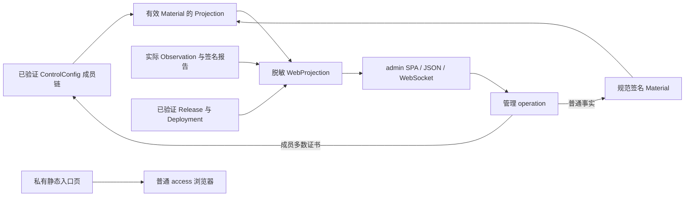
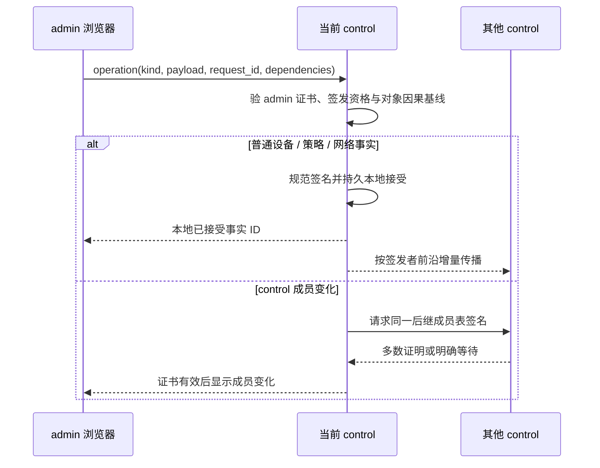

# 控制面 Web 投影

[设计入口](../README.md) · [控制权威模型](../core/control-model.md) · [实施状态](../progress.md)

控制面 Web 保留现有页面、样式、图标及有效交互。页面从已验证的成员表链、签名事实形成的
`Projection`、实际运行观测、签名发布记录和可验证事件生成；它没有另一套治理权威。
浏览器操作与本机管理 CLI 提交同一种管理 operation，由 control 按同一权限和事实规则处理。
现行页面的目标 SVG 与当前浏览器截图差距记录在[目标原型与实现对照](prototype-review.md)；
SVG 只作界面沟通稿，不是新的业务输入或完成证据。本文定义页面职责、字段来源、操作及状态语义，
控件尺寸、线宽、间距和外框等视觉规格统一见[原型布局](prototype-review.md#布局与间距)。

慢请求完成时，仅当原提交表单仍在当前页面中才执行其成功跳转；操作者已离开时只更新回读与通知，
保留当前页面和编辑草稿。异步完成不能夺回导航。

## 私有入口与两种证书

浏览器有两条入口，SSH 端口转发不提供 `.loom` DNS：

| 场景 | 浏览器入口 | 地址来源 |
|---|---|---|
| 离网笔记本上的开发调试 | 同端口 SSH 转发后访问 `https://127.0.0.1:<本地端口>/` | SSH 将笔记本回环端口转发到选定 control 的回环 Web listener；笔记本无需解析 `control.loom` |
| 已加入 Loom 的设备 | `https://control.loom/`（使用非默认端口时在 URL 中明确指定） | Loom DNS 从处于 serving 的 web 入口返回有效 control 的私有地址；浏览器连接其中可达的入口 |

第一条是旧部署文档记载且操作者确定采用的开发调试办法，第二条是本模型的目标入网办法；两条路径分别验收。
当前重建源码及生产切换
是否已实现目标，以[实施状态](../progress.md)和正式入口验收为准。管理员证书包的现有交付操作与目标
CLI 补齐范围见[管理员访问与证书交付](../operations/admin-access.md)。

`control.loom` 是加入 Loom 后可解析的私有 HTTPS 名称，指向已认证 control 的私有 Web listener，
地址来自各 control 处于 serving 的 web 模式 `EndpointGeneration`；多个 control 可以提供同一入口名，
同一浏览器 URL 对应的各地址须使用相同客户端端口，各自的网站证书必须覆盖 `control.loom`。
A/AAAA 只交付地址，不携带端口；使用非默认端口时在 URL 中明确指定。已入网客户端从已验证的 DeviceView 取得
`NetworkIntent` 中的网站证书信任根；独立浏览器不能直接读取 DeviceView，须经受保护安装输入或已认证
客户端的受信本机交付取得并核对同一公开根。导入浏览器前须验证根证书带 critical NameConstraints、
允许 dNSName 仅限 `.loom`，且以 excluded IP 子树 `0.0.0.0/0`、`::/0` 排除所有 IP SAN；
拒绝无约束根，只有目标浏览器经实际验证执行 DNS 与 IP 约束才可导入该根。
正式入网 Web 入口的网站根私钥不得在 control 上；该入口仅使用 SAN 恰为 `control.loom` 的网站叶证书及对应私钥，不含其他 DNS、IP、URI 或 email 名称，且 control 不能签发其他网站证书。
操作者在与所有 control 隔离的离线签发介质保管根私钥，在管理页或本机 CLI 的到期前提醒出现后手工续签。
每台 control 本机生成并保留叶私钥，只交出经成员身份认证、绑定节点及入口的 CSR；操作者核对 CSR 签名、
成员证明、公钥、名称和用途后按固定模板签发，通过受保护渠道把证书链交回。新叶证书先经本机私钥匹配和验链，
在 prepared 阶段以候选地址和 SNI `control.loom` 预检 TLS 与 Web；新代 serving 后再从目标浏览器回读，
成功才让旧代退出。根不变时无需重导入；若续签未完成且旧叶已过期，
页面入口 TLS 失败关闭，管理员从受保护的本机状态或 CLI 得到到期诊断，不能点击证书警告继续访问。
admin 页面与本机 `control inspect` 对每个已知 serving web 入口显示叶证书的到期 UTC 时间和剩余有效期，
进入 30 天窗口时显著提醒续签；本机 CLI 在 Web TLS 过期后仍可诊断。页面长开跨阈值时更新提示。
其他 control 的有效期须由认证运行回读提供，缺失或陈旧时显示 `unknown`。提示仅对 admin 可见，
不进入普通 access 入口页，也不改变 `Material`、`EndpointGeneration` 或 DNS。
未建立该信任时 TLS 失败关闭；不能从待访问网站、DNS 答案或证书警告页临时接受根。客户端按真实连接结果选择可达入口；DNS 解析只提供地址，
不证明健康、成员资格或管理权限。该名称不作为公开互联网域名使用，
公网 Nginx 永远不能反代页面或管理 API。目标 `.loom` 网站根排除所有 IP，且目标网站叶只含
`control.loom`；它不能验证浏览器访问的 `https://127.0.0.1:<端口>/`。保留回环调试入口时，
在替换现有可用证书之前，须给该入口明确独立于 `.loom` 网站根的受信回环网站证书边界，
以目标浏览器实测 IP SAN `127.0.0.1`、证书链及管理登录，并证明它不能为 `.loom` 以外的
远端网站签发证书。SSH 只转发 TCP，不改变浏览器的 TLS 校验名，也不提供 DNS 解析；
不能以忽略证书错误或把不合格旧网站根继续用作目标根来通过切换验收。

浏览器证书只有两类用途：

- **网站证书**由 Web listener 提供，浏览器据此验证私有 HTTPS 服务；
- **admin 客户端证书**由管理员浏览器提交，私有服务校验证书链、精确受信叶子、Origin 和管理授权，
  才开放管理快照及 operation API。受信叶子名单是 `Projection` 中由普通事实维护的值，所有 control
  使用同一份，增删管理员经正常 operation 提交。

无需 admin 证书的已入网 `access` 可打开 `https://control.loom` 的静态入口页，页面只说明该私有
站点可达和如何使用管理员身份；它不返回设备列表、拓扑、成员、策略、事件、部署信息或管理 API。
TLS 允许无客户端证书握手以提供该入口页，受保护路由必须独立拒绝无有效 admin 证书的请求。
这里没有 reader 客户端证书、reader 能力或独立只读管理角色；已有相关实现是待删除的漂移。
本机 root-only admin Unix socket 可以使用本机身份认证，但进入与浏览器完全相同的 operation handler。
首节点 bootstrap 在 control 端生成首位管理员私钥、客户端证书、`admin.p12` 与独立密码文件，
首位管理员的受信叶子及验证所需公开材料进入 genesis；操作者手动把交付包取到管理设备并导入浏览器。
后续补发由 control 本机 root CLI 沿显式的原 admin 签发引用生成新包，服务端延续已安装的独立 admin 验链锚；
有签发能力的 control 生成交付物，任一有效 control 均可对已验链叶授信，不自动复制签发私钥。
任一有效 control 可通过同一 operation handler 对已验链的新叶签发加入受信叶子的普通事实；
旧叶撤权另签普通事实，不依赖旧管理员私钥，也不按 control 数量分支。交付包与签名事实
分别验收：生成包不等于已授权，事实本地接受不等于其他 control 已收到；具体回读见
[管理员访问与证书交付](../operations/admin-access.md)。Settings 的 Administrators 只接收公开 `admin.json`，
显示证书指纹与有效期，授予和撤销沿同一普通操作入口；P12、密码和私钥不上传页面。实际验收见实施状态。

## 输入、映射和重启


```mermaid
flowchart LR
    C["已验证 ControlConfig 成员链"] --> P["有效 Material 的 Projection"]
    M["规范签名 Material"] --> P
    P --> W["脱敏 WebProjection"]
    O["实际 Observation 与签名报告"] --> W
    R["已验证 Release 与 Deployment"] --> W
    W --> A["admin SPA / JSON / WebSocket"]
    L["私有静态入口页"] --> X["普通 access 浏览器"]
    A --> Q["管理 operation"]
    Q -->|普通事实| M
    Q -->|成员多数证书| C
```

`WebProjection = f(ValidMaterial, ControlConfig, Observation, Release, Deployment, NowUTC)` 是确定性单向投影；
`NowUTC` 由调用方注入，用于证书剩余时间和报告/观测时效等展示计算，不进入控制事实。
可选 Web 缓存删掉后须能重建；签名事实缺失、成员链无效或投影冲突时不能从旧 UI 缓存、
观测或一次性导入结果补造可写状态。重启先验证网络锚、成员链、事实前沿与当前规范内容，
再重建页面。不同 control 在事实传播期间可能显示不同的**已知前沿**；页面须标明本地接受、
已传播情况、冲突，以及因成员移除或换键而作废的事实，不把本地结果称为全网即时完成。

| 层 | 表达 | 权威性及可逆边界 |
|---|---|---|
| domain | 有效 `Material`、`ControlConfig` 与运行 `Observation` | 前两者是治理权威；Observation 只是限时事实 |
| wire | 一个现行 Web snapshot / event envelope | 只对展示语义 encode/decode 往返，不反推治理状态 |
| persistent | 无专用 UI authority | 仅可丢弃的投影缓存、草稿或浏览器偏好 |
| runtime | `WebProjection` | 从已验证输入重建，不能倒写事实 |
| UI | 页面、列表、表单和状态提示 | 只显示投影，写入只能提交最小 operation |

```text
decode_ui(encode_ui(WebProjection)) = WebProjection
rebuild_ui(verified_inputs, now_utc) = WebProjection
core_state != inverse(WebProjection)
```

## 页面和状态

Overview、Devices、Device detail、Topology、Live paths、Services、Releases/Device versions、Events、
原 SSOT 页面及 Add Device 保留原有有效交互；原 SSOT 页面只展示当前签名事实与投影，不读取旧 SSOT
文件。一个稳定设备只出现一次，不并列 Client/Node 身份。

| 页面值 | 唯一输入 | 显示重点 |
|---|---|---|
| `UIState` | 当前成员链、本 control 已验证的签发者前沿和冲突 | 网络锚、成员、已知前沿、局部可写性及传播状态；不显示不存在的全局 head |
| 网站叶有效期 | serving web 入口的已验证叶证书 `NotAfter`、认证的远端运行回读与注入的当前 UTC 时间 | admin 显示每个入口的到期时间、剩余有效期、30 天提醒或 `unknown`；不改变签名入口阶段 |
| `Device` | 当前设备授权与签名 View、presence/runtime 观测 | 四项职责、所选 Policy 及其所属 Service、当前运行状态与设备列表的 24 小时状态采样条 |
| `Link` | `NetworkLink` 的 LinkID、资源及其独立 Observation | 同一节点对 WG/hy2 分行；延迟、实测速率与波动分别展示，旧规范摘要失效为 unknown |
| 接口与链路流量 | 有效签名报告中同设备、LinkID、接口与 epoch 的相邻计数器增量 | Overview 的网络 TX、Topology 的所选 LinkID 两端 TX、设备列表与详情的 RX／TX 历史；缺少增量的小时留空 |
| `Path` | Service 范围、首跳资源、有序 LinkID、最终出口及选择 | Direct、Auto、指定出口及真实可用性；不以一个 Service 探测代替另一个 |
| `Service` | 有效 `NetworkIntent`、matcher、DNS 与局域网映射，以及设备授权派生的使用者列表 | 精确目标、授权范围、虚拟前缀及网关 |
| `Release/Deployment` | 验签 catalog、`Projection` 期望摘要、publisher 与设备回读 | 精确制品、应用快照、真实一致性，不显示未回读的已应用版本 |
| `Event` | 不可变签名 Material 与有效设备报告 | 普通事实、成员变更、冲突、撤权和运行变化，脱敏后显示、不含 `RuntimeKey` 等秘密，不另建事件权威 |

传输柱状图保留最近 24 小时的有效计数器增量。设备页分列 RX 与 TX；链路及网络汇总按发送端 TX
累计，对端 RX 不再重复计入。计数下降、epoch 变化及超过三分钟的相邻报告间隔不产生增量，
旧范围报告不能填入已变更规范的新范围。没有有效增量的时段留位并表示 `unknown`，不能画成零值；
覆盖小时数仅表示该小时至少有有效增量，不能承诺所有端点或每分钟均已观测。图和列表只累计已观测部分，
历史流量与当前可用性、运行状态、实际应用回读分别呈现。以上是现有报告的派生展示，不新增流量权威或存储。

Devices 每行保留当前状态，并显示最近 24 小时的状态采样条和 RX／TX 小柱图。状态条每小时取该小时
最后一条有效 runtime 样本，绿色表示样本报告运行，红色仅表示样本明确报告失败，空心表示没有有效样本。
这不是连续在线率；不能把一个样本铺满整小时，也不能从流量、业务探测成功或无报告推断进程状态。
历史样本按其发生时的有效范围核验，不能替代当前范围的新鲜报告。流量柱按设备分别缩放，用于观察自身趋势；
跨设备比较使用旁边同单位的 RX／TX 总量。悬停可读该小时的样本时间、状态或已观测字节数，点击设备行进入统一详情。

Topology 的选中连线、详情与逐 LinkID 表格使用同一组测量，保留以下三个指标：

- 延迟是该方向最近的有效真实 transport RTT，标明报告设备和观测时间；ICMP 不能代替它。
- 带宽栏显示**实测速率**，不是线路容量。WG 使用同一发送端最近五分钟内有效计数器增量的
  `8 × Σ字节增量 / Σ有效观测秒数`，单位 Mbps；注明方向及实际覆盖秒数，不能用 24 小时总量除以五分钟。
  hy2 显示其自身真实单跳探测的 `8 × 传输字节 / 传输秒数`，标为探测吞吐，不冒充业务用量，也不复制 WG 数值。
- 波动使用最近 15 分钟成功 RTT 样本的 `Δ = P95 − P50`，同时提供 P50、P95 与样本数。
  百分位按排序后的 nearest-rank 计算，至少两个成功样本才有波动值；这是 RTT 分布范围，不是逐包 jitter。

以上输入均绑定方向、LinkID、规范摘要、资源传输与网络代；过期、范围不匹配或对应指标缺少样本时，
该项显示 `unknown`。有效的零速率或零波动显示零，不能与缺失混淆。链路 available 不保证三项指标齐全。
悬停连线预览测量，点击固定选中，列表与右侧随同一 LinkID 更新；这些交互只读取已有观测，不触发测速。
这些都是认证报告及其保留历史的单向统计，不增加权威对象、专用状态机或第二份运行协议。

连线上的度量使用无背景、无边框的文字，与线条错开。下方表格合并为链路、当前度量、状态历史、传输历史
四列：端点、LinkID、传输和报告来源归入链路；RTT、速率、波动并列放在同一个度量单元格，详细分位数、
样本数及覆盖时长由悬停或选中详情提供。每条 LinkID 显示 24 小时状态采样条，每小时取同一方向、传输及
当前规范范围内最后一条有效链路观测；可用为绿，明确不可用为红，没有有效样本为空心。这不是设备 runtime
历史，也不代表整小时连续可达。流量小柱图显示该 LinkID 两端 TX 的逐小时已观测总量，与右侧双端图使用
相同输入；不同链路分别缩放，旁列累计量和覆盖小时用于比较。当前观测过期不抹去范围仍匹配的历史采样，
旧规范或其他传输的历史也不能填入当前序列。

### 实时路径

Live paths 是服务访问情况的只读巡视与排查入口，正式页面为 `/routing`。Overview 回答网络整体情况，
Topology 展示受管节点和共享链路，Live paths 回答“设备访问服务时实际走哪里、哪些结果需要查看”。
界面只保留两层：`04-live-paths.svg` 在左侧列服务、右侧列所选服务的设备；
`04-live-paths-detail.svg` 显示该设备访问该服务的路径详情。切换服务只更新同页设备列表，
点击设备才进入详情。路径和目标结果是设备行的字段及同页筛选条件，候选与历史是详情的同页页签。
失败、Direct、等待确认、过期、未授权和 LAN 都使用同一详情布局，不再各建页面。两层属于同一个 Live paths 产品入口，
不单独建立 Observations 页面或新增权威状态。
进入页面默认选中可查看的服务并直接显示设备，示例选中 media；有明确服务上下文时恢复该服务。
左侧搜索服务，右侧搜索当前服务的设备，不平铺所有设备与服务的组合。

左侧每个 Service 一行，显示已分配设备数、当前实际路径的设备分布、目标失败和未知设备数。
关系来自设备所选 Policy 的固定 ServiceID，同设备同服务只计一次；没有分配的服务保留零状态，
服务冲突/暂停单独说明，无法确认的分配数量显示未知，不伪造零。汇总只统计符合当前授权范围的观测。
目标失败计数是至少有一个新鲜、范围匹配的实际目标失败的设备数，不是请求失败数；目标未知与
选择报告缺失、过期、等待新配置确认分别说明，不把它们都称为网络故障。授权 deny 也不能当作网络故障。
汇总只引用该设备当前实际路径上的目标结果，不借用其他候选的成功。多个目标结果并存时，摘要按
“存在当前目标失败 → 有当前目标成功 → 没有有效目标结果”依次分类，每台设备只进一个目标结果类别，
具体目标仍在详情区分。此分类不表示整个服务健康，不计算跨设备的平均延迟或叠加共享 LinkID 速率。

服务行按设备**实际选中的路径**汇总设备数：Direct 单独统计；其他路径必须具有相同的共享首跳资源与
传输、有序节点及 LinkID/当前规范范围、最终出口或固定 LAN 网关，才能归为一组。仅出口相同、
Policy 相同或节点对相同不能合并 WG/hy2、一跳与中继路径。候选未被设备选中时不计入路径分布；
缺失、过期或不匹配的选择只进入“尚未确认路径”，旧链不能算成当前路线。分组只是单向显示投影，
不增加 Group 权威对象或持久生命周期。

左侧服务是同页导航，选中后右侧标题、设备及计数一起更新；切换服务清除旧服务的设备搜索和筛选。
右侧默认列出该服务全部已分配设备，每行显示设备、该设备所选策略、实际路径、目标结果与更新时间。
更新时间并入目标结果列，以保留设备表宽度；不放路径分组表，不要求先选路径。
设备搜索与快捷筛选置于表格上方，路径与结果查看范围互斥，当前选择明确高亮，“全部”清除筛选。
点击设备行才进入第二层详情，直接携带该设备与当前服务；服务选择、筛选及空状态都不会增加页面层级。
搜索或筛选是可选的缩小范围操作。返回保留原服务与筛选，浏览器前进后退可恢复查看位置；
详情的返回链接与候选/历史页签均携带原列表的服务和筛选；直接打开详情而无来源时，返回该服务的全部设备。
SVG 演示仅以 URL fragment 保存这份导航上下文，不保存业务状态，也不改变设备的选择或观测。
同级对象按稳定名称/ID 排列，不因每次报告到达而不断重排正在查看的清单。设备列表与筛选结果按需分页，
不因汇总全部设备而变成无限长表。

详情由所点击的记录直接携带设备、Service 和 Policy，只读显示名称及策略摘要，不再次要求两个下拉选择。
策略摘要包含允许/禁止访问、Direct、入口、中间转发及出口限制；不限须写明，不能让空白代替规则。
不能用 Service 的全局策略或另一个设备的选择代替；这里不编辑或重新绑定 Service。管理入口保留
设备、Service 和 Policy 上下文，不能跳到另一台设备的默认详情。失效的直达链接原位显示暂停/未授权
及原因，不继续显示先前服务的绿色路径。

详情主体先显示当前路线，下方以“候选路径 / 历史采样”页签共用一个区域，默认看候选。切换页签不改变
设备、Service、候选的观测范围，也不向设备下发选路操作。当前路线完整显示设备、共享首跳、受管中继/最终出口、
实际业务目标；目标不是设备，也不新增节点身份。Direct 显示设备直接到目标；一跳直达仍显示出口节点。
节点与连线使用开放式布局，度量为无背景、无边框文字。首跳、LinkID 和业务各自保留来源、范围、
最近采样及缺失原因；完整 HTTPS 请求耗时单列，不能标到出口至目标的一段上，也不能由逐段 RTT 求和。
LinkID 的速率在图上明确标为共享链路速率，不能冒充当前 Service 或该设备的流量。业务结果写明
具体 URL 和“该目标成功/失败/未知”，不把单个目标成功概括为整个 Service 可达。

当前路线只高亮新鲜、范围匹配的设备 selector 回读；缺失或过期时显示“当前路线未知”，旧路线只能
标为历史。模式显示设备报告的 Direct、Auto 或指定出口，不在控制中心增设第二套选路开关。
设备 runtime、路径选择和业务探测分别显示；当前业务成功不能填绿缺失的设备运行报告。
控制端已接受策略替换但尚未收到设备对新范围的回读时，明确显示“等待设备确认”。当前路线与当前
业务结果保持未知；新候选只按新权限派生，旧路线如需展示只能使用灰色历史预览，注明旧策略。
收到范围匹配的新鲜回读后才恢复当前路线；没有报告与报告过期分别给出原因。未分配策略、deny 或
服务暂停时展示各自原因，不保留可用候选或绿色业务结论，也不回退 Direct。

LAN Service 同样使用设备、服务及所选策略的查询结构，摘要显示固定 LAN 网关以及入口/转发限制，
不提供互联网 Direct 或最终出口字段。路径图终止于“固定网关 → 特定 LAN 目标”，地址转换属于网关，
不是额外节点。没有设备选择回读时，可将一条获授权候选画为虚线路径预览，但不能称为当前路线。
缺少适用 HTTPS 目标或实际业务观测时，目标结果和历史保持未知，不复制互联网服务的采样，也不从
共享链路可用推断整个 LAN 网段可用。

历史图限定设备、Service、目标及当前查看候选的匹配观测，默认查看设备当前选中的候选。
选择报告过期时仍可查看原候选的历史，但必须写明历史窗口及最后报告时间，不能把旧成功标成当前成功。
每小时取最后一条有效业务结果；状态条区分
成功、明确失败与未知，响应时间柱只使用成功请求的实测耗时。失败没有成功耗时，不能画成零；缺失时
保留空位。图和计数使用同组样本，不把一个样本当作整小时在线。悬停给出采样时间、结果及范围；
更换 Service/候选后按新范围重建，不混入其他链路或旧规范的样本。

候选表合并为路线、最近结果、设备选择三列；保留 Direct、一跳直达、同出口 WG/hy2 中继的区别。
真实失败、报告过期和没有报告分别说明，不用 unknown 猜测故障原因。展开行给出已有采样、失效原因
及设备资源/拓扑的相关入口，切换查看候选不会切换设备流量。选中来源和可核实的候选差异可以展示；
无可比较的测量时不得宣称“最快”或编造未选原因。部署一致性仍从设备详情和 Releases 回读，不混入
该 Service 的路径排查。该设计复用现有认证报告与历史，不新增权威实体、存储或报告协议。

#### 实时路径的读取边界

现行部署曾把 `service:` 范围按已删除的 `Service.policy` 解释，且把存在 selector 报告直接标为
Fresh。修正只恢复上述服务与设备的查询关系，补齐候选在已有 Web 投影中丢失的公开字段；不改变
Service、Policy、DeviceView 或 Report 的签名字节，也不增加页面专用授权表。

| 原始输入 | Web 与页面对应 | 保持的边界 |
|---|---|---|
| 设备 PolicyIDs → 有效 Policy.ServiceID | 左侧服务分配数量、右侧设备及只读策略摘要 | deny 仍是分配，未分配不是 Direct；缺失引用不能猜所属服务 |
| 当前 View 的 RouteCandidate 与资源 | Path 的服务、规范摘要、首跳资源/传输、有序节点/LinkID、最终出口和目标 | 同出口不同资源或链路仍为不同候选；不投影私有凭据 |
| 与当前 View 匹配的签名 Report | 设备执行回读、reported selection、逐目标原样本及网络代 | reported 不等于当前健康；未应用新 View 时不沿用旧选择 |
| 原始签名报告历史、当前授权与候选规范 | 指定设备/服务/候选/目标的最近 24 小时采样 | 排除分叉、错签名、旧规范及不适用目标；过期样本仅作历史 |
| URL 中的服务、设备、搜索、筛选、页码与页签 | 两层页面的返回和前进/后退 | 只保留导航，不改变授权、偏好或报告 |

[接收端的限时观测投影](../core/current-contract.md#接收端的限时观测投影)规定三分钟运行报告窗口、
各层样本上限及五秒正向 UTC 容忍；签名原件与历史时间不变。`DeviceEvidence` 保存原 reported 内容，
另给出派生报告时效与截止；逐条 `WebObservation` 保留原 Observation 字段并附上派生的当前截止，
不形成另一份可签名或可持久化的业务对象。Path 的原 reported selection 与当前可用性分别保留，
只有报告时效成立才高亮为当前选择；路径和 Link 的当前状态同时给出其证据截止。
到期后页面显示未知，原路径、目标结果和组件匹配仍可作为带原始时间的历史回读查看。不能信任任意
未来 `valid_until`、按接收时间续期或从业务样本寿命推断 selector 的寿命。没有报告、
已有旧 View 报告等待设备确认、deny 和缺少授权须分别说明。签名报告的可选 preference 只表示采样时
读取的本机设置，页面展示 Direct、Auto 或指定出口及报告原时间；它与实际路径分别显示，不能远程写回。
报告没有携带偏好模式时，页面显示未报告，不能从当前候选反推 Auto 或指定出口，也不能用旧报告补齐。
此只读字段补足已有模式显示需求，复用原始 Report 的签名、持久和同步，不改变选路或增加操作者步骤。

当前截止只用于显示。浏览器在截止后降级现有投影，不能自行提升被服务端排除的样本；长开页面或
实时连接断开时仍执行到期更新。它复用正常的 DOM 更新和草稿保留，不增加后台测量、页面状态机或
另一份运行权威。当前业务结果的归约复用同一候选的授权目标集合，国内与国际 Service 不混合；
缺项/部分失败继续显示具体目标与未知的集合结果，不把一个目标成功扩成整服务或整机健康。

历史查询先验证当前设备身份与 Service 权限，再匹配候选规范及适用目标，仅在所选范围内使用原始
签名报告中的样本。每小时取采样时间最后的有效值；相同时间的矛盾样本保持未知，不按数组次序选赢家。
未来采样不填入历史，重复报告携带同一原样本不增加计数；显式失败不产生成功耗时。查询、重启和
删除显示缓存都不写报告或控制事实。设备时钟可能在采样与报告间回调；现行契约未规定两者时间的大小关系，
历史查询不能据此丢弃原签名样本或改写采样时间。最小测试覆盖正式浏览器两层导航及返回、零分配/deny/失效直达链接、
同出口不同候选、等待新 View、时效未知与历史范围过滤，以及真实认证入口的部署后回读。

Web 服务端以受保护安装信任输入中的发布验签公钥核验签名 catalog 与制品，页面只消费核验后的结果；
可变 `current` 指针只选择待验 catalog，不授予信任，也不决定 `Projection` 的期望组件。只有精确摘要、
平台及组件相符，且设备或节点报告实际应用坐标后，页面才显示已应用。最低版本仅在签名发布记录明确
提供同组件、同平台的可核验约束时判断；未声明时此项不适用，已声明而实际版本不可比较时显示
`unknown`，不按版本字符串或文件名推断。

实际组件表使用报告中的 `component_id,platform,version,artifact_digest`，按组件与平台匹配，
没有期望时仍展示已报告版本、完整摘要和报告时间，并明确“未设置期望”；不能把下载 current 自动当作
节点期望。没有新鲜性契约或足够证据时，历史回读仅标为 reported，不宣称当前已应用。
最小回归覆盖无期望仍可读、同名异平台不匹配、磁盘文件替换但旧进程仍在运行，以及缺项不制造一致性。

节点详情的 Expected components 仅列出已独立验签且与设备 OS 相符的发布组件，管理员明确选择组件和
执行平台后，经同一普通操作入口保存精确 catalog/manifest 引用。表单保留已审阅依赖及同请求重试，
目录刷新不替换正在编辑的选择；清除只撤销该期望。详情和 Device versions 的对照均使用现行事实引用，
材料缺失或冲突明确显示不可用，不显示“未设置”或旧的成功比较。

### 服务、发布与管理记录的阅读顺序

Services、DNS、Policies、三平台 Releases、Device versions、Events 与 Administration
沿用实时路径的组织方式：先选范围，再看对象和结果，异常在所属记录下展开。说明放在相关输入或
操作旁，不以独立规则卡、重复筛选器或全局步骤进度挤占主体。原型表达目标交互，不表示当前 SPA
已实现；这些改动只调整 `WebProjection` 的展示，不增加领域、wire、持久或运行时状态。

- Services 与 Policies 先选对象，再在同页编辑。Service 编辑目标并只读列出相关策略；
  Policy 创建时选择唯一 Service，保存后所属服务只读，规则与引用节点可在同页查看。
  节点页面仅选择 Policy，服务和规则摘要由选择派生。共享保存明确影响全部引用节点及有效邀请；
  只改单节点时选择另一策略或复制后替换。范围“不限”与“仅所选节点”必须可辨认，空标签不表示不限。
  冲突对象先展示暂停原因及解决入口，不以编辑旧值绕过冲突。
- DNS 使用精确名称、答案/来源、可编辑性三列。`control.loom` 的两个入口答案归入同名记录展示，
  仍保留各自承载节点；它不是可写记录。选中普通记录后原位展开编辑区，并列当前生效值与草稿、
  所属 LAN 服务和解析观测；保存后的本地接受、传播、DNS 及业务观测各自回读。
- 三平台发布页依次展示验签目录摘要、三个精确制品、选中制品的设备应用结果。版本与摘要归入文件列，
  受众与分发范围归入同一列，核验结果单列，文件详情原位展开。目录验签不能点亮部署结果；Linux 的匹配、Android
  的缺失回报、Windows 的无部署目标分别表达。最低版本约束未声明时不适用。
  每个文件行直接展示英文 `Download` 和 `Copy link`；APK、Windows 安装包及 portable 的下载动作明确命名。
  两个动作都使用已核验发布目录中该精确文件的地址。受限文件仍要求认证，复制链接不携带凭据或改变受众；
  没有已入网设备不影响下载软件，下载也不代表安装或加入完成。
- Device versions（原 Deployments）以设备为行，对照同组件/平台的期望摘要与实际摘要，合并展示结果和依据。摘要不同、
  缺少摘要、没有新鲜报告及报告过期分别解释；异常行展开已有证据并链接设备或制品。取消跨设备的
  汇总步骤进度，避免把某一设备的成功当成其他设备已交付或已应用。
- Events 提供搜索、类型、来源、对象、时间范围、分桶间隔及 Apply/Clear，导出入口使用同一筛选条件。
  列表随页面连续滚动，接近底部自动追加更早的记录，保留当前位置与
  已展开详情，不使用页码或 Previous/Next。底部显示已加载数量和加载状态；失败保留现有记录并提供 Retry，
  加载完显示 All events loaded。切换筛选后重置已加载范围；继续加载沿用同一次查询的时间窗口。
  列表上方展示最近 72 小时的事件堆叠柱状图，默认每 10 分钟一桶，共 432 个区间；按本 control 的
  接收时间落入左闭右开区间，事件类型使用固定颜色，图例、柱段和列表类型标记一致，颜色不代替结果状态。
  悬停显示区间起止、各类型数量及总数。图表、总数、列表和导出共用筛选条件；图表统计完整筛选结果，
  不只统计已加载的列表记录。调整分桶间隔只改变聚合粒度，不改变筛选范围或总数。重复投递按已有事件身份去重，
  刷新页面或异常持续存在不生成新历史事件；只统计已形成的历史记录，不把每次采集都算作一条新事件。
  保留期不足或数据缺失的区间明确标为未覆盖，不能补零；已完整覆盖且没有事件才表示 0。
  按本机接收顺序列出记录，把来源放在事件旁；展开冲突记录说明当时影响，并链接当前 Configuration state，
  历史结果不能冒充当前状态。柱状图是既有事件的单向聚合，不新增事件权威或独立持久统计表。
- Administration 统一控制节点、管理员、网站证书和当前配置状态，按下节的左侧导航切换；
  原 Signed state 的签发序号降为配置来源详情，冲突不再独立成一层页面。

### Administration 的对象与操作

一级导航第九项为 **Administration**。左侧固定四项 `Control nodes`、`Administrators`、
`Web certificates`、`Configuration state`，右侧显示对应对象列表和行内操作。每项只有一个内容视图；
导入、替换、撤权、冲突解决及结果均在同一视图展开，原型用同一 SVG 的 fragment 表示固定场景，
不增加业务页面层级、持久流程记录或新的权威。页面上的状态来自以下已有输入：

| UI 内容 | 领域、wire 与持久来源 | 运行结果与 UI 边界 |
|---|---|---|
| Control nodes | 已验证的 `ControlConfig` 成员链；已有 Invite/绑定/成员签名证据 | 成员资格与同步回读分别显示；待加入节点不计入有效成员。节点运行与加入详情复用 Nodes |
| Administrators | 普通 `Material` 中已验链的精确管理员受信叶子加入/撤销；公开证书元数据 | 授权本地生效、其他 control 接受情况、实际浏览器登录分别回读；P12 和密码不进入 Web |
| Web certificates | `NetworkIntent` 的公开网站根；既有 `EndpointGeneration` 与本机受保护证书引用 | 当前入口证书及认证远端回读；CSR/签回文件是交付物，预检、切换、正式浏览器验证不是一个状态 |
| Configuration state | 已验证的普通 `Material`、成员链及其 `Projection` | 按对象显示本地当前结果；来源详情只展示脱敏差异、事实引用及每个签发者的独立序号，不输出秘密载荷 |

这些 UI 值都是单向投影，不能据按钮点击、文件选择或页面访问倒写成功。新增操作仍进入已有管理
operation 或所属 control 的本机证书处理入口；原型不定义新的规范字段、第二份 store 或运行时状态机。

- **Control nodes**：默认显示有效成员与待加入节点、当前查看的 control、同步未知原因。
  成员变更显示当前成员中已取得的有效签名数量及所需多数，不合并不同提案或轮次的票；
  只链接已有加入/设备详情，不引入第二个审批流程。序号仅可比较同一签发者，不能拿两台 control
  各自的序号判定落后。失去新鲜报告不自动移除成员，也不宣称已同步或离线。
- **Administrators**：列表显示公开身份、有效期、当前会话标记与本地受信/撤销结果。
  `Add certificate` 只导入已签发的公开叶和验链材料；先验证证书链、用途和有效期，再提交加入精确叶的
  普通事实。验链失败不授予权限；本地接受后仍分别显示对端未知与尚未验证的浏览器登录。
  补发入口解释 control 本机生成新 `admin.p12` 与独立密码、操作者手动取回并导入的过程，不提供
  P12/密码网页下载或虚构当前可执行 CLI。签发者、信任锚、多 control 签发能力仍待
  [管理员交付模型](../operations/admin-access.md#首证补发和撤权的目标操作链)补齐，绘图不能代替实现。
  正常替换先验证新身份的登录、管理写入和回读，再另行撤销旧叶；丢失或泄露时可独立撤销旧叶。
  撤销确认绑定精确叶，清楚显示本地会话终止及各 control 接收范围，不声称全网即时断开。
- **Web certificates**：显示承载 control、名称、到期 UTC、剩余时间、公开指纹及回读来源。
  已认证管理入口可提供当前公开叶、证书链和网站信任根的下载；下载不含私钥、不修改受信名单，
  首次浏览器信任仍从独立受保护渠道建立。CSR 下载须携带节点/入口绑定与成员证明，不只给裸 CSR。
  续签在当前入口下展开：由承载 control 生成本机密钥与绑定 CSR，下载交给离线签发者，导入签回链，
  校验名称/用途/链/有效期/私钥匹配，以新入口预检后切换，最后回读正式浏览器结果再让旧入口退休。
  每步由真实回读推进；导入失败保留文件错误和旧入口，切换后浏览器验证失败只关闭新入口，
  原证书仍有效时继续用旧入口。根不变不要求重新安装；根更换不混入普通续签。
  远端缺失或陈旧显示 `unknown`，不计算剩余时间。Web TLS 过期后从仍有效的其他入口或受保护本机
  CLI 诊断，不画成“点击警告继续”的恢复方式，也不推断 SSH 回环证书已满足正式 `.loom` 约束。
- **Configuration state**：列表先显示对象、当前结果、业务影响和操作；冲突筛选是同页视图。
  冲突展开两份修改的实际差异、全部事实引用及影响范围。采用任一修改后填入可编辑的最终值草稿；
  保存前逐项列出当前 control 已验证的引用节点、对应 Policy 和仍有效的 Invite；邀请同时显示目标设备、
  职责、绑定状态与期限。冲突暂停的设备访问和邀请 claim 分别说明，未取得的引用范围显示未知，不能由
  暂停后的空授权投影推断无人受影响。本地清单标明来源与回读时间，不声称已穷尽其他 control 的引用。
  操作者可继续调整为所需的新值，提交前仍须通过对应对象校验。提交的是引用
  全部冲突事实的新 operation，不编辑旧签名字节、不按时间或序号自动选赢家。新冲突在提交前到达时
  要求刷新差异并重新审阅，不能漏掉依赖或覆盖。接受后本地恢复投影、对端接收及设备应用分别回读，
  `Effective here` 不等于业务可达。Events 留历史，配置页留当前结果；技术序号放在来源详情中。

正常链示例：配置冲突行 → 对比并选定最终 Service 值 → 引用两条已知事实提交 → 本地接受并恢复投影 →
其他 control 与设备应用另行回读。证书链示例：到期行 → 下载绑定 CSR → 离线签回 → 验证并预检 →
新入口 serving → 正式浏览器验证 → 旧入口退休；两个链均不因原型按钮或生成文件就视为业务完成。
最小核对覆盖四个导航入口、相同签发者的同步比较、成员待加入、公开下载与私钥边界、管理员验链拒绝及
本地撤权、证书导入失败/切换失败/成功回读、冲突最终值/并发变化拒绝，以及图形边界与链接完整性。

最小原型核对覆盖：服务与策略职责和影响范围；保留名不可写；三平台应用状态区别；五个部署目标的
匹配、不同及三种未知原因；历史与当前投影分离；两个签发者前沿和完整冲突引用；本机到期提醒及远端
证书未知。另核对相关页面的文字边界、控件与行展开位置、生成确定性和其他原型主体不变。

邀请发出、设备密钥绑定、授权完成及运行 Ready 分开展示。普通加入不出现
`awaiting_approval`：签发 Invite 即批准；`control` 入网在多数证书形成前显示“等待成员签名”，
绝不显示为有效 control。事务 `completed` 表示加入所需授权事实与成员证书（如需）已验证；
当前授权仍受撤权和冲突投影约束，不等于服务已部署或可用；
Ready 要求设备自身及所选路径涉及的 forward/出网节点以当前 View 摘要报告新鲜、匹配的运行回读。
授权、传输连通、业务探测和部署一致性分别展示；缺失、过期或不匹配统一呈现 `unknown`，
不因 presence、组件匹配、链路数量或 UI 颜色补成健康。

Topology 由有效连接事实生成；当前路径和健康状态只作颜色叠加，不能改变拓扑权威。
同一 control 集的成员通过私有认证通道交换有效报告的必要摘要；短暂未见报告时本地显示
`unknown`，不能把其他成员的陈旧绿色推断为本地可用。WebSocket 首帧是当前脱敏快照，后续因
已验证输入变化或注入时间跨过证书提醒阈值而更新展示，不触发额外网络测量，也不把原始报告、
本机诊断、密钥或私有路径泄露给浏览器。每条管理 WebSocket 绑定建立连接时的管理员叶子；
本 control 验证撤销该叶子的事实并更新 `Projection` 后，先终止对应连接，再发送后续管理快照或事件。
重连重新验链并检查当前精确受信叶子；其他 control 尚未收到撤权事实时，不能声称它们的连接已经终止。

实时只读连接的读取计算必须随浏览器连接结束而停止。仅在投影变化时写 WebSocket、却不消费关闭
帧或 EOF，会让已经关闭的页面继续刷新和校验发布文件，争用设备报告与成员同步资源。现沿原连接
消费控制帧，并把连接取消传给快照读取和发送；正常关闭、断网和撤权均终止该连接的计算。没有
新持久状态、连接注册表或操作者配置；页面及消息内容保持。最小验证为静止投影下正常关闭和
直接断开后 handler 退出，以及原管理员过期和撤权仍关闭连接。

## 正常写入与具体界面


```mermaid
sequenceDiagram
    participant Browser as admin 浏览器
    participant Control as 当前 control
    participant Peers as 其他 control
    Browser->>Control: operation(kind, payload, request_id, dependencies)
    Control->>Control: 验 admin 证书、签发资格与对象因果基线
    alt 普通设备 / 策略 / 网络事实
        Control->>Control: 规范签名并持久本地接受
        Control-->>Browser: 本地已接受事实 ID
        Control-->>Peers: 按签发者前沿增量传播
    else control 成员变化
        Control->>Peers: 请求同一后继成员表签名
        Peers-->>Control: 多数证明或明确等待
        Control-->>Browser: 证书有效后显示成员变化
    end
```

表单仅提交操作种类、必要 payload、稳定 request ID，以及当前对象事实的因果基线/摘要；
不提交完整 `Projection`、Web snapshot 或全局 `base_head`。过期对象基线返回冲突并保留草稿，
管理员可回读冲突事实后明确重新提交；并发撤权按控制模型优先，其他不兼容更新使受影响目标暂停
投影，依赖它的运行授权收口；页面显示冲突并提供签发解决事实的入口。
同一未修改草稿重试时复用完整规范请求字节，包括 request ID、依赖与首次提交确定的 Invite 到期时间；
响应丢失或接受后的刷新失败不能重算这些值。编辑草稿后是新请求，使用新 request ID，但仍保留原对象/
事务 ID 及已审阅的因果基线：若上一请求其实已接受，新请求须按现有重复创建或陈旧基线规则拒绝，
不能覆盖它。浏览器仅在表单内暂存请求，导航或关闭后可丢弃，已接受结果从正常设备/对象入口回读；
不新增持久操作记录或完成权威。反例验收覆盖接受后响应丢失、未改重试与已改草稿，不增加操作者配置。
不同目标的 Policy 改名和新增 Service 可分别投影；同一 Policy 的不兼容并发修改才暂停该目标。
普通操作在签发 control 持久接受时返回**本地已接受**，并展示其后增量传播；不能将该响应写成
“全网已完成”。control 成员操作必须等旧成员多数签同一后继表后才显示资格生效。
本机 CLI 通过 root-only socket 提交同一 envelope 和事实校验，不能从旁路更改成员或授权。

- **Add Device**：管理员先多选职责。只有 access 时使用二维码；包含其他职责时选择 SSH 或 sh 脚本。
  目标执行与 claim 校验实际平台支持全部职责。Invite 明示唯一签发 control、目标设备 ID、
  入口、期限和准确 PolicyIDs；签发后不出现二次批准按钮。申请 control 时展示自动多数签名进度及成员表结果；
  取消已绑定的 control 加入须等待作废该事务的多数证书；若较高轮必须继承已投的原加入提案，
  可先完成加入，再通过现有“删除节点”移除整台节点，不能仅卸任 control 而留下其他职责。
- **Devices**：普通设备的职责、PolicyIDs 和撤权可由任一有效 control 修改；control 卸任、
  强制撤销及整个 control 节点删除进入多数签名成员操作，不能靠普通设备删除绕过。仅卸任保留该节点其他职责；
  整体删除须在同一多数证书中绑定该节点墓碑，并从页面、授权和依赖投影中原子退出。
  普通撤权后，同一授权表单从当前目标的 `device_for_review` 显示经因果历史验证的公开配置，按钮明确为
  Grant ordinary authorization；历史字段不代表当前权限。管理员审阅后提交原 `device.put`，引用当前撤权
  和所选 Policy/Service 的已审阅依赖，不重新扫码或生成身份。缺少唯一历史、目标冲突或永久删除时
  不提供此恢复入口；不得从 Invite 初值、旧报告或浏览器缓存猜测最后配置。操作重试及陈旧草稿遵守同一规则。
  control 的普通职责被撤销时，当前职责只显示仍由成员表授予的 control，历史普通职责只放在重新授权表单。
  原邀请的只读详情可在身份冲突时继续显示唯一原件和多数取消入口，但不重新交付邀请或恢复设备认证。
- **Topology/Services**：可复用 WG、hy2、私有 TLS `TransportResource`；显式中继才配置
  `NetworkLink`，增加节点不自动形成全互联。共享 HTTPS 探测目标按 Service 和设备授权过滤，
  没有目标显示 `unknown`。
- **DNS overlay**：仅编辑精确 `.loom` A/AAAA 记录，`control.loom` 为保留名，指向有效 control
  的私有 Web 入口。DNS 答案不授予管理或业务权限；不提供任意公网域名劫持编辑。
- **共享局域网**：在 Services 中选择具有 `forward` 职责的网关，或从该节点详情预选网关，选择它已认证报告的本地 IPv4 前缀，
  创建等长虚拟前缀的局域网 Service。界面显示自动分配的前缀和固定网关，不绑定全局 Policy。
  管理员先为此 Service 创建 Policy，再通过新 Invite 或现有 access 详情选择该 Policy；
  策略只授权其固定的 Service。access 自身不能填写 CIDR。并发虚拟地址冲突时显示禁用
  与最多三次签名重分配结果。删除映射使路由、候选和关联 DNS 投影收口，不更改 LAN 路由器。

### 管理页面的分工

以“Service 定义目标、Policy 固定属于一个 Service、节点只选择 Policy”为唯一编辑关系，见
[节点选择策略与跨层对应](../core/control-model.md#节点选择策略与跨层对应)。同一服务可有多条策略，
同一设备最多选其中一条；不同设备可以选不同策略。没有选策略就没有该服务的业务授权，
策略中的“不限”只放开其路径条件，不代表所有服务都可访问。

| 页面/入口 | 操作者填写什么 | 提交对象与影响 | 提交后怎样回读 |
|---|---|---|---|
| Services `/services` | 名称、种类、目标 matcher；LAN 选择网关已报告前缀 | 该 Service 的网络意图事实；不保存全局 Policy 字段 | 目标、固定网关、所属策略及经策略引用的节点；创建策略可预选本 Service |
| Policies `/policies` | 创建时选择 Service、名称、允许/拒绝及路径限制；编辑时 Service 只读 | 一个 Policy 事实，规则修改影响所有引用节点及有效邀请 | 所属 Service、完整规则、引用节点和邀请；新建/复制/共享保存/删除分别有明确动作 |
| 添加设备 `/devices?new=1` | 职责、交付方式、名称及所需目标；含 access 时只多选 Policy | 签发固定 PolicyIDs 的 Invite；平台由目标识别 | 派生服务/规则摘要，随后回读邀请、授权与实际应用 |
| 设备详情 `/devices/{id}` | 查看本次添加；已加入后增加、移除或替换所选策略 | 未加入时只投影已有 Invite；策略修改仅更新该设备 PolicyIDs | 从待加入到已加入共用入口；执行、绑定、授权、成员签名、配置与运行分别回读 |
| 添加交付 `/devices/invites/{id}` | SSH 执行结果，或复制本次安装命令/取得二维码 | 复用 Invite 生命周期；只有纯 access 可有 QR | 目标与本次交付明确，直接进入同一 DeviceID 的详情查看后续结果 |
| 纯 access 设备详情 → 重新添加 | 丢失本机身份后确认新旧身份及重新选择的策略 | 删除旧身份后为新 ID 签发 Invite，不复用已消费二维码 | 删除与传播、新邀请、加入分别回读；所需新策略须在删除前保存 |

**策略页是完整规则编辑的唯一入口。** 创建先选择 Service；互联网服务显示域名/地址范围，LAN 显示
虚拟前缀与固定网关。保存后 ServiceID 固定，不提供换服务的下拉框；换服务须新建策略。
名称、allow/deny、入口与中间转发范围直接展示；互联网另有出口范围和普通 Direct 许可，
设备限定本地出网许可保留在高级项；本地出网须满足出口范围，没有网络入口，
不受入口范围限制，也不要求回拨本机或提供入站资源。LAN 不显示也不提交互联网 Direct、出口或本地出网字段。
allow/deny 是规则值，deny 可分配但不产生业务权限；页面不得把它画成删除或未选择。

每个节点范围直接并列展示“不限 / 指定节点 / 不允许”，不把三种模式藏在下拉菜单里。不限是新草稿默认，
只考虑符合职责、资源及 Service 约束的当前和未来节点；指定节点显示可搜索、多选、可删除标签的
tag selector，下拉列表逐个勾选，勾选后保持展开以便连续选择；不允许对应 none。多个标签表示允许的
节点集合，不表示必经节点或经过顺序；搜索只筛选选项，不清除已选节点。选择全部当前节点仍为 only，
不会自动变为包含未来节点的 any。
删除“指定节点”的最后一个标签时显示必填错误，不能悄悄切换为不限。已有所选节点失效保留标签和
原因，不能自动替换。none 或资源不足可导致没有候选，界面明确显示，但不把未知实时观测当作规则错误。
中间转发 none 仍可允许一跳；入口 none 不允许经网络进入受管节点，不阻止普通 Direct 或已授权的本地出网。入口指业务首跳，不是 Invite 引导入口。
普通 Direct 默认允许，独立于受管出口限制；“仅经某出口”须同时关闭 Direct。
LAN 的终点始终是所属服务网关，不提供换出口或互联网 Direct 选项。

规则预览仅表达允许范围，不标为当前路径或可用。共享保存显示准确使用节点数和有效邀请引用，
不因名称相同自动合并策略。复制创建一个新 Policy，初始保留相同 Service 与规则；保存后只更新发起
节点草稿中的选择，节点授权仍待提交，其他节点保持原引用。未分配 Policy 可保留、复用或删除；新建 Service/Policy 不自动授权。
Service 目标变更也须展示经其策略引用的全部节点与有效邀请。

节点中的“新建策略”或“复制策略”进入上述同一编辑入口，保留节点的本地草稿；取消返回原选择。
策略保存成功后返回节点并选中它，节点授权仍待单独提交。策略保存成功但分配或邀请失败时，分别显示
结果并只重试失败步骤，不能重复创建对象或自动删除已保存策略。因果基线冲突保留草稿并重新审阅。
完整失败及重启语义见[策略创建、分配与复用](../core/control-model.md#策略创建分配与复用)。

`policy_invites` 是上述有效邀请的只读、可重建列表；与当前有效设备的 PolicyIDs 合并形成引用提示，
不使用旧报告、已终结 Invite 或撤权历史制造使用者。复制和新建共用 `/policies` 表单，只有新 ID 可保存；
节点草稿返回后保留原目标基线，只补入刚保存策略与服务的已审阅依赖。保存策略的反馈与待提交分配分别显示。


LAN mapping 作为 `local_network` Service 统一进入 Services。节点详情“提供的 LAN 服务”只是按
固定网关过滤同一目录；创建入口预选网关，仍创建 Service，不维护独立 mapping 权威。
创建和详情显示网关 NodeID、本地前缀与虚拟前缀；不能把虚拟前缀的 `.1` 默认显示为网关地址。
虚拟地址按主机位映射到 LAN 目标，网关节点身份与这些目标地址不是同一值。
创建后的正常操作为“为此服务创建策略 → 给访问节点分配策略”。共享 HTTPS 探测池仍单独管理，
服务详情的探测目标仅为授权过滤结果，不能在服务或策略中另建探测授权。

添加设备的操作顺序为：**角色 → 添加方式/目标 → 策略 → 邀请设置 → 提交**。
四项职责可多选且始终可修改；空角色不可提交。职责恰好 `{access}` 时仅二维码，包含任何其他职责
时仅 SSH/sh，须明确选择可用方式。切换职责保留适用的名称与策略草稿，不自动签发或安装。
移除 access 时提示将移除的策略，确认后才清空；非 access 不显示策略区域且 PolicyIDs 必须为空。
含 control 才说明自动成员多数签名。平台不是下拉框：SSH 检查目标后只读显示，脚本/扫码在执行时
识别，claim 校验全部职责；未知显示待识别。详见[平台识别与职责选择](../core/enrollment-endpoint-model.md#平台识别与职责选择)。

access 的策略区域仅包含一个可搜索的多选 tag selector 和所选项的只读摘要，不再有 Service Tab、
Service 选择器或规则来源模式。标签同时显示策略名和所属服务；LAN 摘要显示固定网关及虚拟前缀。
搜索可按策略名、服务名或网关，候选只包含现有、引用有效的 Policy。已选 Policy 不可重复添加；
若另一策略属于已选服务，明确提示“替换此服务的策略”，确认后在同一草稿中替换，不能叠加。
移除标签只改变节点草稿；移除最后一项显示“仅加入，无业务权限”。deny 显示“拒绝此服务”，
失效引用保留原名/ID及原因并阻止新提交，不自动换策略。

搜索 Enter 选中、Esc 关闭；焦点可到达标签移除与规则查看入口。
页面不要求再选一次 Service，不允许在摘要里修改共享规则。“新建策略”放在区域标题旁，所有规则编辑
进入策略页；已有策略的规则查看链接也到相同页面。节点草稿只保存选择，不复制可独立修改的规则。
页底显示选择的策略数与对应服务数，一个主动作统一提交 PolicyIDs；错误定位到对应标签并保留输入。

二维码方式由职责派生并只读显示。SSH 检查关联当前目标：修改目标后检查失效，修改职责后重新核对支持；已有身份
进入设备管理或原事务继续，不覆盖身份。邀请设置默认收起，期限与签发 control 摘要始终可见。
非 access 整个策略区域不渲染。保留数量摘要、取消和主动作，视觉排列见[原型布局](prototype-review.md#布局与间距)。
提交成功后才进入对应执行结果或交付内容，不预先勾选未发生的阶段。

#### 单设备的交付与加入结果

添加后按媒介进入 `/devices/invites/{id}`，它是交付或执行结果视图，不是长期的加入管理页。
后续统一进入 `/devices/{DeviceID}`；不再设置 `/devices/invites/{id}/progress`，也不设独立加入成功页。
邀请签发时预留的 DeviceID 足以定位待加入详情，其内容从 Invite 单向投影；尚无绑定身份和有效授权时
明确显示“待加入”，不计入已加入设备或有效 control 数量，不创建 pending-device store。
节点列表可展示带“待加入”标记的邀请条目，点击同一详情；没有观测时不填造流量、平台或在线状态。
名称、DeviceID、媒介、职责与 PolicyIDs 从添加、交付到详情保持一致。关闭网页不停止另一个主体执行
脚本、扫码或已发起的 SSH 安装；重开后回读已有事实，不依赖浏览器保存流程状态。
原交付 URL 按事务 ID 回读同一邀请。邀请终结、待加入条目消失或未绑定 DeviceID 被新邀请复用后，
仍须显示原终态及原交付记录，不能用当前设备列表反查代替事务查询，也不能链接到另一事务的设备详情。
历史回读复用可删除重建的邀请缓存，认证目标事实变化时失效；它不产生额外历史库或页面生命周期。

| 添加方式 | 提交后的主要内容 | 后续查看位置 |
|---|---|---|
| SSH | 执行期间显示实际进展；结束后显示目标与本次成功、失败或结果未确认，失败附实际原因，未知先检查目标再继续原邀请 | 节点详情的概览显示当前加入/运行状态，“身份与操作”保留本次执行与加入记录 |
| sh 脚本 | 一条含 HTTPS 安装器 URL 和本次邀请输入的完整命令，“复制命令”后直接粘贴到目标机器的 root shell；显示目标与有效期，无需先手动下载/传送脚本 | 节点详情持续回读目标机器发起的加入及运行结果；复制命令不等于执行 |
| 纯 access 二维码 | 本次邀请的二维码、扫码/导入说明、有效期与等待加入状态 | 节点详情持续回读客户端加入及运行结果；扫码图片展示不等于已领取 |

脚本安装由节点管理员在目标机器的 root shell 中执行。交付的主区域是一次完整粘贴的 shell 块及“复制命令”按钮，不以脚本正文、下载文件和 `sh ./文件名`
分步说明代替直接粘贴。显示与复制使用同一命令，保留真实换行、引号和完整 Invite，无省略号。
受保护的管理页面先验证发布 manifest，再把其中固定的安装器 SHA-256 摘要与通用不可变 HTTPS URL
写入命令；不能从同一个未经认证的公开下载端临时获取摘要来建立信任。命令在子 shell 中启用 `set -eu`，
以 `umask 077` 和 `mktemp -d` 建立私有临时目录 `loom_install_dir`，下载后先用 `sha256sum` 核对摘要，
成功才启动安装器；下载或校验失败均不执行。退出与信号路径通过 trap 精确清理该临时目录，不用 `exec`
绕过清理。公开请求只取得通用安装器，不包含 Invite 或设备专属脚本。

完整 Invite 通过 quoted heredoc 交给已验证安装器的 `--invite-stdin`；不进入 argv、环境变量或公开 URL，
不进行 shell 展开，生成的 heredoc 结束标记不得与 payload 中任何完整一行相同。一次粘贴保留完整邀请输入，
页面在复制区域明确提示“命令包含邀请，可能被保存在终端历史中”，不承诺自动清除或无痕。
既有身份、同事务继续与平台检查仍由安装器完成。安装命令与二维码只在受保护的管理交付页提供，
不进入节点列表或事件导出。原型使用 example URL、固定的合成摘要和明确的 demo 邀请占位值，
不嵌入真实 capability，不表示该示例对应真正签名制品或安装器、命令生成接口已经实现。

| 已回读的事实 | 页面显示与操作 |
|---|---|
| 已签发、尚无 claim | 节点详情显示“待加入 / 尚未授权”；按媒介提示等待脚本执行或扫码，并可重新打开有效交付物。平台未识别就是“等待识别”。 |
| SSH 中断、未取得完成回执 | 执行结果与节点详情均显示安装情况 unknown；先重连检查身份、安装与加入事实，再继续同一邀请。不能重建 Policy、Invite 或设备 ID。 |
| 已收到明确执行失败 | 显示实际报告来源与原因；失败不自行取消 Invite。排除原因并检查现有身份后可继续原邀请；签发者尚无 claim 不等于已知脚本失败。 |
| 已绑定、普通授权未完成 | 显示已绑定与待授权，客户端以同一事务、request ID、密钥继续；不重新交付一个供新身份领取的 QR。 |
| 已绑定、包含 control | 在节点详情显示当前成员签名进度，证书前所有申请职责未生效。取消按钮只提交请求，终结须按成员门禁回读；不要求第二次人工批准。 |
| completed | 留在同一 DeviceID 的详情，显示“已加入”，停止提供已消费交付物；授权、配置取得、runtime 与业务结果分别回读。运行失败或缺失报告不倒退加入完成。 |
| expired / cancelled | 节点详情保留终结原因，停止提供旧交付物；新邀请沿既有终结与 ID 释放规则重新进入添加页，不把等待多数确认的取消请求显示成已取消。 |

二维码、脚本交付与 SSH 结果稿各自引用对应添加请求签发的同一 Invite，三种媒介共用同一邀请事实模型，
媒介在签发后不可编辑。脚本下载成功不等于执行成功；
签发成功也不等于授权已完成。当前 control 明确尚未签发授权时不能写成 unknown；unknown 只用于未取得或已失效的观测。
脚本/客户端在联系 control 前失败，控制端没有可信执行结果时只显示“尚未收到加入请求”；不能补出远端错误、
日志或百分比进度。收到加入事实也不倒推缺失的安装日志；设备运行失败须标明对应的真实报告来源。
如果新规则保存成功而 Invite/设备授权保存失败，原表单保留草稿并逐项显示结果，只重试未完成步骤；
陈旧基线须重新审阅。不能展示整体“已保存”，也不因重试生成另一条策略。

设备访问编辑、保存结果与返回的设备详情必须保持同一 DeviceID、ServiceID 和保存后的 PolicyID。
所选策略是否已存在、设备授权、其他 control 回读、设备配置、runtime、Service 业务各自显示结果；配置/业务 unknown
不改变已经接受的保存结果，历史流量也不被清空或当作新规则已应用的证据。

设备权限编辑、重新添加、添加交付、执行结果、保存反馈、LAN 服务创建及私有入口保留各自连续的操作上下文。
统一设备详情按基本状态、服务访问、流量、转发资源、共享 LAN 和身份操作分区导航。
草稿编辑聚焦正在修改的授权，不把无关设备操作放在旁边争抢注意力。
Services、Policies 和 DNS 保留目录/记录查询与对象编辑，身份只读显示，删除与保存分开。策略影响列表、旧身份删除后不能复活、Invite 期限，以及本地接受
和真实应用的区别均须在有关操作附近可见，不能因为视觉精简而省略。
Overview、Topology 和设备列表的状态图表及流量能力保留；管理记录与发布页的调整遵循
[服务、发布与管理记录的阅读顺序](#服务发布与管理记录的阅读顺序)。

主动作跟随方式变化：SSH 为“通过 SSH 安装”，先检查目标再签发和执行；脚本为“生成安装脚本”，
签发后由操作者在目标运行；二维码为“生成二维码”，签发后在客户端扫描。生成交付物不表示设备已加入。

添加交付提供与签名媒介相符的二维码、受保护脚本或 SSH 执行结果；SSH 由已授权操作者工具
从受保护连接输入解析目标，不要求浏览器上传 SSH 私钥。页面必须能回读执行目标、交付失败
原因和同一事务的重试结果，不能把“签发 Invite”显示为“SSH 安装完成”。
二维码不能出现在公开页面或事件导出中；重新打开未使用的有效码不算新签发。
重新添加、重连和原事务 resume 的区别以
[二维码的使用场景](../core/enrollment-endpoint-model.md#二维码的使用场景)为准。

设备详情只保留一张 `02-nodes-detail.svg` 原型，以 access + forward 组合展示按职责出现的功能区。
沿用 Policies 的轻量左栏与开放内容区：左侧为“概览 / 访问策略 / 转发与 LAN / 身份与操作”，
右侧一次只展示一个分区，不把长表单机械分成两列，也不把每段重新包成卡片。
默认“概览”在加入期间突出等待扫码、脚本执行、已绑定或成员签名的实际进展；缺失观测不画全零流量。
加入后保留授权、配置、runtime 的独立状态和当前设备 24 小时 RX/TX 分组柱图；
“访问策略”显示所选 Policy、所属 Service、业务结果和当前路径，修改选择仍进入设备权限编辑；
“转发与 LAN”显示资源、LinkID、各自观测以及该设备提供的 LAN Service，关联对象仍进入原管理入口；
“身份与操作”集中显示预留或持久身份、职责、本次执行和加入记录；尚未绑定时不伪称已有设备密钥。
这里可重新取得尚未使用且有效的交付物，或检查目标后继续同次安装；已加入后提供撤权与删除。
纯 access 设备丢失本机身份时保留“重新添加”快捷入口。
破坏性操作各自说明影响并确认，申请 control 的取消和删除仍遵守成员门禁。
页面标题中的设备身份与平台不随切换变化；角色只决定分区适用性，不生成另一种设备详情页。
无 access 不显示访问策略分区，无转发能力不显示转发与 LAN 分区；角色变化后当前分区不再适用时返回概览。
切换只改变可重建的页面选择，不发起授权、测量、重新加入或写入；浏览器前进/后退恢复分区，未知分区回到概览。
导航可用键盘到达，当前项须有可辨认的选中样式。窄屏将分区导航移到内容上方，不混合多个分区。
SVG 在同一文件内保留分区及各设备的加入状态稿，默认仍显示已有设备概览；交付稿的详情链接打开其
对应 DeviceID 的状态。每次只显示一个设备和一个分区，不在产品界面添加人为切换成功/失败的状态控件。
状态稿由审查文档中的 fragment 链接独立预览；同设备的分区切换不改变身份或加入结果。
该演示仅改变可见内容，不执行管理操作，也不表示正式 SPA 已完成相应交互。
正式入口统一为 `/devices/{id}`。名称、身份、平台、职责、授权、运行观测、流量和设备操作使用
同一页面骨架，未知数据按观测规则展示。角色只控制相关功能区是否出现，不选择另一套设备页面。
同一设备同时具有 access 和 forward 时，在同一详情中组合下面两类功能；不重复设备身份，
也不要求操作者在两种设备类型之间切换。组合职责节点丢失身份时复用现有“删除节点”和“添加设备”，
重新选择职责并按 SSH/sh 交付，不增设组合职责的重新添加流程。角色修改后，旧配置
的运行报告和业务结果不能确认新授权已应用；历史流量保留其原有观测范围，不能补成当前健康。
access 场景包含所选策略及其所属服务、当前路径、最新配置应用与观测；
forward 场景保留资源、链路、流量和共享 LAN。管理员在设备详情替换所选 Policy，只改变这台设备。
需要改共享策略规则时跳转 Policies，先列出其他受影响的设备；两种操作不能共用含糊的“保存策略”。

`02-nodes-access-result.svg` 是设备详情保存后的反馈状态，不是独立通用操作台。它显示具体设备、服务、
旧策略和新策略，以及本地接受、传播和应用的实际结果；不让操作者填写任意 operation 字符串、
request ID 或因果基线。并发冲突在原编辑区域保留草稿和冲突提示，不把冲突期间的草稿画成当前授权。
设备离线不阻止有效 control 接受授权修改，但配置应用继续显示 unknown。草稿、反馈和计时器不拥有
新的持久生命周期，重启后以签名事实及真实报告重建。

最小原型/实现检查：纯 access 仅二维码，其他职责仅 SSH/sh；无 access 无策略选择器；换角色不自动执行；
平台识别失败保留草稿。节点仅选 Policy，服务只读派生；同服务第二条策略须替换，未知/重复/冲突引用拒绝，
空选择无业务权限，deny 保留选择；共享修改与单节点替换分开。策略固定服务、any/only/none 明示，
删除最后一个限定节点不能变成不限；限定出口不能由 Direct 绕过；LAN 终点固定。创建/复制后返回选择、
部分成功重试保持同一对象；邀请/设备/保存反馈的身份和 PolicyIDs 连贯；删除/冲突收口，重启恢复。
有效未用 QR 重显、同密钥 resume、过期重签及丢失身份重新添加分别处理。静态 SVG 只验证目标表达，
不能替代正式 handler 的持久化、运行消费与业务验收。

## 失败、测试与验收

- 无 admin 证书只能取得私有入口页；管理快照、WebSocket、API 和原始事实均拒绝。错误证书、
  跨源请求与非规范 operation 同样拒绝；公网 Nginx 不可达管理页面。
- 已打开的管理 WebSocket 在本 control 接受并投影对应叶子的撤权后须关闭，不得再收到管理事件；
  重新连接以当前受信叶子名单重新鉴权，其他 control 以各自已验证的事实前沿作相同处理。
- 签名事实尚缺依赖或同一对象发生不可兼容冲突时，页面显示待定/冲突，不提前展示新授权；
  撤权传播到达后及时收缩页面和运行投影。一个 control 离线不阻止其他有效 control 本地接受
  普通操作，但会影响成员变更是否能取得多数。
- 测试正式入网网站证书 SAN 仅含 `control.loom`；根证书缺少 critical `.loom` DNS 约束或全 IPv4/IPv6
  IP 排除时禁止导入；control 不持有根私钥或其他网站签发能力；目标浏览器必须证明越界名称和 IP SAN 不会因该根被接受。
  已入网浏览器须通过 Loom DNS 的 `control.loom` 连接 serving web 入口；独立验收 SSH 回环调试
  入口的 `127.0.0.1` TLS 名称与受信证书，不以 SSH 转发或 DNS 解析代替网站身份验证。
  检查根私钥与 control、发布签名钥匙隔离；由已认证的本机 CSR 经操作者离线续签后，验证新入口代的链、私钥匹配、prepared 定向预检、serving 后真实浏览器握手和旧代退出；旧叶过期而未续签时拒绝新 TLS 连接并给出诊断。
  独立浏览器从受信输入安装合格根后可验证，未安装或拿到错误根时 TLS 失败关闭；无客户端证书的 access 仅见入口页；
  admin 证书可读管理快照并提交 operation。reader 证书和 reader 能力路径必须不存在。
- 使用固定时间验证有效期恰好 30 天、进入窗口、过期及缺证书四种回读；长开 admin 页面跨阈值更新，
  普通 access 入口页不泄露到期信息；本机 CLI 在 Web TLS 过期后仍能显示故障。
- 测试同一设备只出现一次、同节点对两条链路各自观测、Direct/Auto/指定出口保留、不同 Service
  分别探测；unknown 不被 UI 补绿。成员表签名进度与普通事实本地接受的文案不能互换。
- 测试已有 access 新增、换绑或撤销局域网 Service 的策略选择后的页面、签名事实及客户端 View 回读；
  无授权设备不能得到虚拟前缀。WebSocket 更新不得清除正在编辑的表单草稿，陈旧基线应返回冲突。
- 使用正式 Web handler、静态资源和真实浏览器验收既有页面的视觉及交互；真实 TLS、admin 证书、
  私有入口和正式 operation 的验收不能由 HTTP fixture 或截图替代。

## 禁止恢复

- 旧 SSOT 文件、registry、report 拼接层或页面缓存作为 UI 权威；
- `CertifiedHead`、Raft commit、普通写入 QC、全局 `base_head` 或 leader 提交作为 Web 正常写入；
- reader 证书、reader 能力、无 admin 证书可读取的管理快照；
- 每个按钮独立的 manager、store、receipt 或与 SPA 重复的页面专用状态机；
- 用页面颜色、DNS 解析、传输握手或公开网站可达性推导授权与健康。
