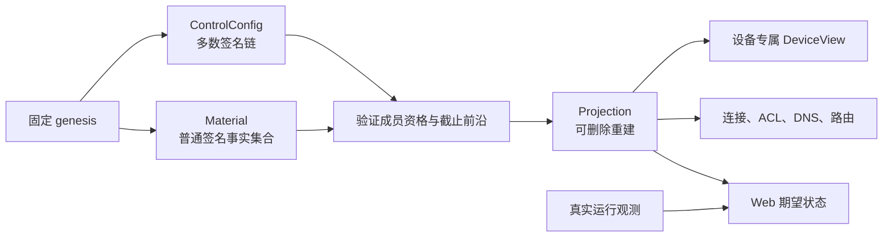
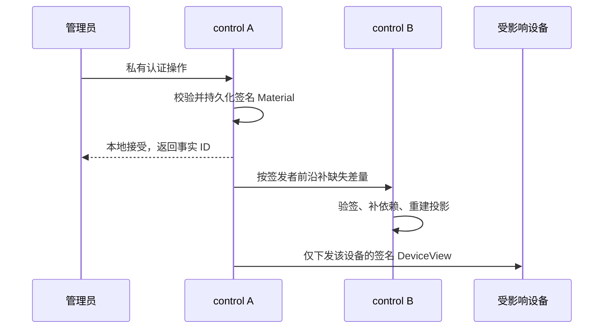
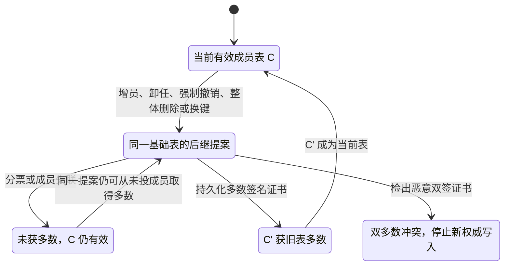
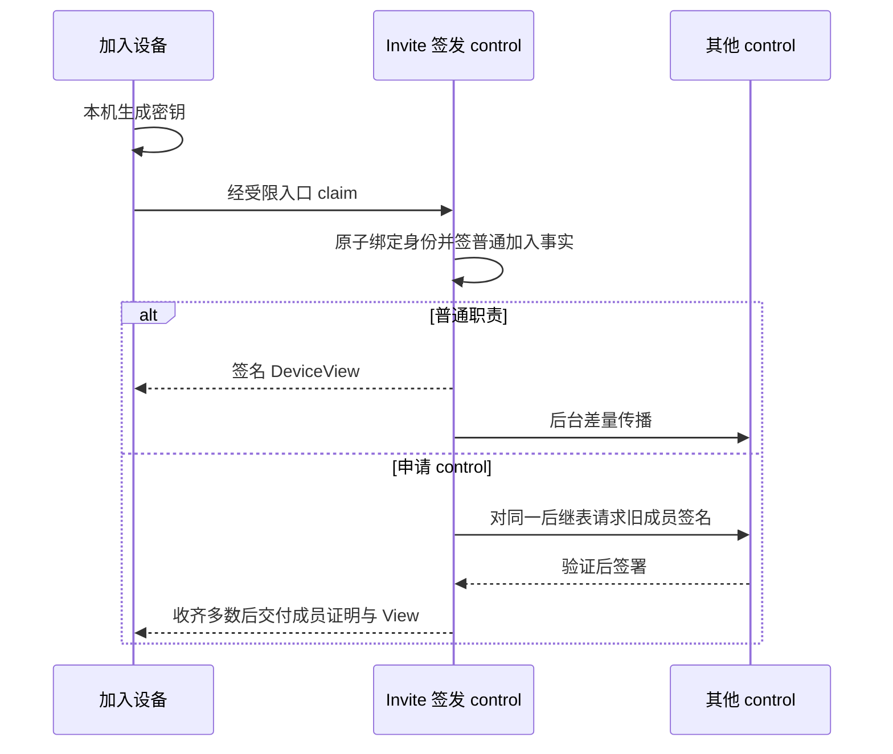
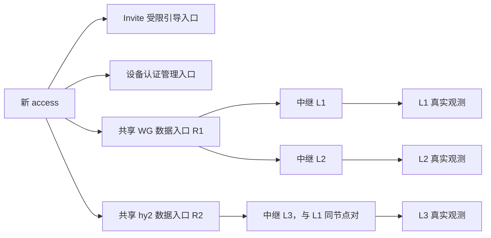
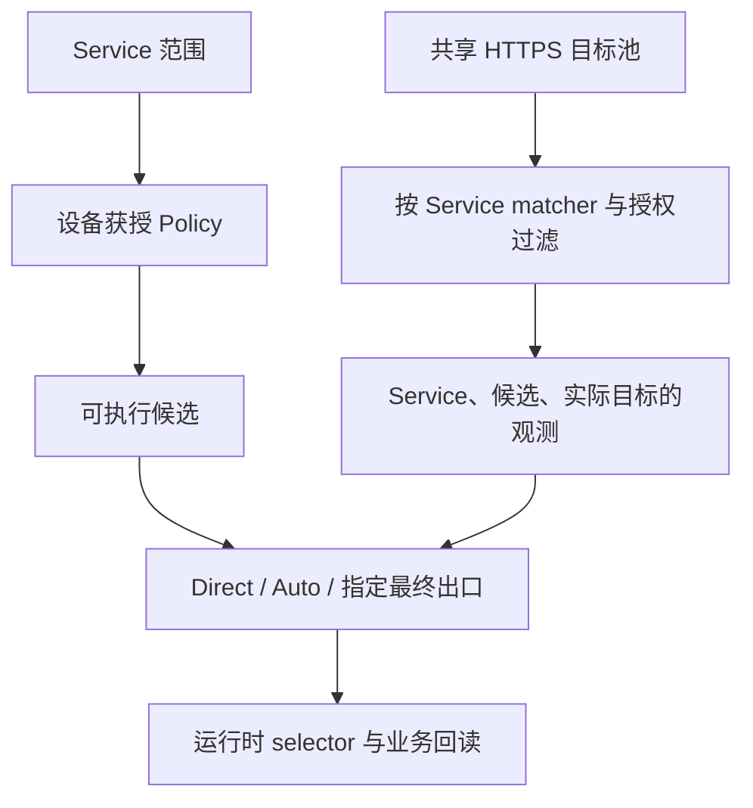
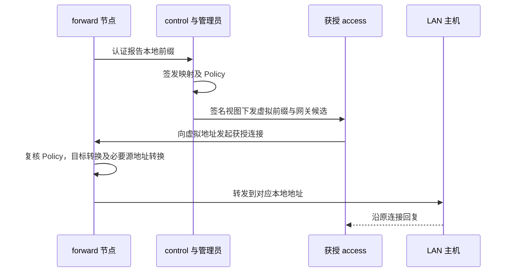

# 控制权威模型

[设计入口](../README.md) · [唯一现行契约](current-contract.md) · [实施状态](../progress.md)

本文定义 Loom 的唯一现行控制模型。一个或多个 control 使用同一套规则。普通治理由有效 control 签发不可变事实并最终一致；只有 control 资格变化需要当前成员多数签名。领域概念只有 `Material`、`ControlConfig`、`Projection`。Invite、`NetworkIntent`、`DeviceView`、连接资源与探测样本是其中的值、交付形式或运行观测，不建立平行权威。

## 1. 必须结果与边界

1. 任一有效 control 可加入、修改和删除普通节点；以后管理该节点的 control 不必是最初签发者。普通写入在接收 control 本地校验并持久化后返回**本地接受**，再增量同步；它不承诺全网即时完成或不可撤回。
2. `control` 只由成员表决定。成员数是数据，`majority(S) = floor(|S| / 2) + 1`，不保存冗余 quorum 字段。N=1、N=2、N=3 分别需要 1、2、2 票，没有单节点专用模式。
3. 节点职责为可组合的 `access`（原 use）、`forward`、`internet_egress`、`control`。`server` 不是第五项职责；转发不自动授予互联网出网。
4. 私有认证服务承载管理、Enrollment、配置和报告；公网伪装网站与公开通用制品不是写入入口。传输握手、DNS 解析和网络可达均不赋予成员资格或业务授权。
5. 普通事实以集合并集及因果依赖最终同步，没有 leader、Raft 排序、普通写入 QC 或全局 head。control 成员表多数签名是唯一需要协调的治理门禁。
6. 唯一现行 decoder 拒绝历史 Material、旧 `runtime_contract`、未知或非规范输入；不靠第二 DTO/store、双读双写或自行升级协议号处理错误。

## 2. 三个领域概念

### 2.1 Material：规范签名事实

`Material` 是不可变、内容寻址的控制事实。首份 genesis 固定网络 ID、首个 `ControlConfig`、初始 `NetworkIntent` 与信任锚。其余普通事实固定网络 ID、签发 control 和成员表摘要、签发者在该成员表内连续递增的序列与前一事实哈希、规范排序的因果依赖 ID、稳定目标 ID、操作、内容及签名：

```text
material_id = Hash(domain_separator || CanonicalEncode(Material))
```

签名覆盖全部规范业务字段；相同字节必有相同 ID。事实可表达设备身份或授权、Service、Policy、传输资源、链路、探测目标、DNS 记录与局域网映射的按 ID 修改或撤销。删除是新事实，不抹掉旧字节。普通操作不再用整份 `network.update` 或全局 `base_head` 覆盖另一 control 的写入。

接收时先验网络、规范编码、内容 ID、签名和签发者成员资格，再验序列、依赖、目标与权限。声明的因果依赖或前一序列事实**尚未到达**时暂存为待补齐，不得投影；依赖已齐而目标仍不存在、引用被撤销或权限不成立时拒绝。未知、非规范或语义无效输入也拒绝。同 ID 不同内容、同一签发者在同一成员表和序列下签出不同内容都不得择一覆盖。事实已知、已同步并不等于事实有效或生效。

### 2.2 ControlConfig：多数签名成员表链

`ControlConfig` 记录成员 ID、同一稳定节点 ID、验证键、前一成员表摘要、后继操作及目标节点 ID，以及旧成员对**包含全部这些字段**的同一提案摘要的多数签名。首表由 genesis 固定。后继操作只表达成员增员、卸任、强制撤销、节点整体删除或换键；它不承载普通设备授权。成员与节点身份、传输对端身份分别校验；地址、WG/hy2、listener、邻接、在线状态不写进成员表。新成员加入前验证其设备身份、自有公钥和事实同步能力；换键也通过后继表完成，不在同 ID 下静默改变验证键。

后继表同时封存旧表**每个签发者已接受的连续事实前沿**。旧表事实仅在封存前沿内可继续生效；超过前沿才晚到的事实，即使曾在分区中获本地接受，也不能在新表下重新扩权。新表中的签发序列重新锚定该表摘要；跨表依赖只能指向有效事实。若客户端已见事实与后继表截止边界冲突，客户端保持单调已见 floor、拒绝用遗漏该事实的较新视图覆盖 LKG，并报告冲突。

成员增员、主动卸任、强制撤销、成员节点整体删除及换键都经旧表多数签署；普通设备撤销不能绕过此门禁。卸任或强制撤销 control 仅移除其成员资格，原有非 control 职责须由普通事实另行管理；**节点整体删除**的后继证书则在移出该成员的同一多数签名载荷中写入该节点 ID 的不可复活墓碑。`Projection` 原子移除该节点的全部职责、授权、资源参与资格、链路、DNS、局域网映射和候选；普通事实不能重新启用该 ID，重入网必须换身份和密钥。签署者在签字前持久记录对同一基础表的一次投票；分票且无多数时旧表有效、成员资格变化暂停生效。只有某份**已投过票的同一提案**仍能从未投成员取得多数时，才可继续收票；不能改提案或让已投成员重投。若所有可能提案均无法达到多数，普通治理继续，但成员变更停滞；当前模型不自动覆盖票据，只能等待受保护的外部恢复决策。若恶意双签形成两个冲突多数证书，停止新权威写入，保留证据并走受保护恢复，不声称拜占庭容错。

最后一个 control 不得签成空表。交接须在仍能签名时纳入已验证的继任者，再签退出。全体 control 故障不会使普通节点超时晋升；只恢复原身份或启用**已经属于有效成员表**的受保护冷备。全部成员密钥丢失时，原网络信任不能凭存活设备自动重建。

### 2.3 Projection：事实的确定性结果

`Projection = Project(Genesis, ValidControlConfigChain, EffectiveMaterials)`。它包含 `NetworkIntent`、节点身份与非 control 职责、授权、Service 和 Policy 等当前有效值，没有独立写入口或不可删除的权威 store。设备视图、转发/出网 ACL、路由、DNS、Web 页面及发布输入由它单向生成；运行观测与期望状态分开展示，不能反写事实。

不同目标的有效事实以集合并集合并，重复、乱序与重传不改变结果。同目标操作只在因果上衔接或按该操作明确定义可交换时共同生效。并发撤权、删除优先于并发授权；其他不兼容并发使**受影响目标**暂停生效，不能靠时间戳或 control ID 选赢家。恢复该目标须由有效 control 签发显式引用全部冲突 ID 的解决事实。无关目标继续收敛。

普通节点删除保留防复活撤权事实，设备授权、资源引用、链路、局域网映射、DNS 与候选随之退出投影；同一身份/密钥不能借旧 Invite 复活，重入网使用新身份和密钥。



没有 Material 就失去操作与撤权证据；没有 ControlConfig 就无法验证签发权和成员变化；没有 Projection 这条计算关系，各消费者会各自形成矛盾状态。其他值不新增领域权威。

## 3. 编码、持久化与恢复

对每个权威领域值 D、规范 wire W 和持久值 P：

```text
decode(encode(D)) = D
load(save(D))      = D
encode(decode(W))  = W     // W 是被接受的规范字节
Project(G,C,M)     = Project(G,C,PermuteOrDeduplicate(M))
```

最后一式只针对**同一有效事实集合**及任意传输顺序。签名只覆盖规范字节；未知字段、重复项、错误排序、错误领域分隔、依赖齐全后仍悬空的权威引用和歧义字段组合必须拒绝，不能先归一化再验签。尚未收到但已由事实 ID 明确声明的依赖按前述规则待补齐。Projection、缓存、运行时和 UI 均无反向写入权威的映射。

持久权威为受保护 genesis 与本机信任锚、以 ID 为键的原始规范 Material 字节、连续成员证书和每个签署者的一次投票记录。事实存储 put-if-absent；签名前原子持久化投票，避免重启后双签。成员证书保留离线设备验证所需完整链，不假定退役成员的签名可重新取得。投影缓存须可通过事实集合摘要验证、可删除重建；游标、索引与连接退避不是业务权威。

首次创建仅允许本机管理员在全部权威为空时显式写入唯一 genesis，固定网络 ID、genesis 摘要和首成员键。非空、部分损坏或出现另一 genesis 时失败关闭，不自动重建空链。重启先核对固定信任锚、成员链与规范事实，再补依赖、重算投影；缺必要字节时仅保留最后可验证的本机视图，不签新事实。缓存不匹配直接丢弃，不修改权威迎合缓存。

| 层 | Material | ControlConfig | Projection |
|---|---|---|---|
| Domain | 不可变签名操作、因果关系与稳定目标 | 成员、验证键、旧表多数签署的后继与截止前沿 | 有效事实的确定性业务结果 |
| Wire | 唯一规范事实字节、签名和内容 ID | 唯一规范成员证书及规范排序签名 | 设备和管理读取的规范派生值，不是写协议 |
| Persistent | ID 索引的原始字节，撤权不删除旧事实 | genesis、成员证书和一次投票记录 | 默认不持久；缓存可删可重建 |
| Runtime | 验签、因果补齐、去重和按签发者同步 | 验证签发资格及后继多数 | 生成 DeviceView、ACL、连接、DNS、路由与服务配置 |
| UI | 正常管理动作生成事实，区分本地接受与传播 | 展示成员及多数门禁，提交同一提案 | 展示同一投影，另列真实运行观测 |

`NetworkIntent` 内 Service、Policy、资源、链路、DNS 和局域网值随 Material 规范编码并可往返，随投影重建。本机资源私钥、listener 细节与平台路由只单向投影，不进入公开 wire、根 `.env` 或 Web。

## 4. 普通写入与大规模增量同步



control 按成员表、签发者、连续序列和前哈希交换事实摘要与缺口，只发送缺失范围及稀疏冲突 ID。游标可丢弃，丢失后重新反熵对账；前沿是同步优化，不是全网完成凭据。成员不要求全互联，中继只转送端到端认证字节。设备领取自身 DeviceView，不接收全网事实，也不广播完整事实集到所有节点。若有重建成本证据，可增加由权威验证的缓存，不另设快照/journal/receipt 权威。

签发者须属于有效成员表且本地依赖已满足。分区中不同 control 可本地接受普通事实；恢复后并集收敛并执行冲突规则。其他 control 失联不阻止有效 control 的普通写入。成员表变化仍要求旧表多数，少数分区不能给自己增补 control 资格。

## 5. control 成员生命周期



后继提案引用当前表摘要、完整新成员集合和旧表各签发者截止前沿。签署者核验节点和键、提案、前沿及本机一次投票约束，再签完整摘要。发起者收齐旧表多数签名并持久化后传播证书。新成员在验证完整成员链、所需事实和自有私钥绑定前不签普通事实。新表由旧表授权，不能自签证明自己已是成员；离线设备逐份验证从固定信任锚到当前表的链。

N=2 一人失联时成员变化停住，在线者仍可签普通事实；N=3 的 2 票只能防止一个成员**单独**改表。局部故障、卸任请求和强制撤销不能按在线人数改多数，也不能通过普通 device revoke 绕过此门禁。
若现有票已使所有提案都无法达到多数，这一基础表无法自动解锁；旧表保持有效，
成员变更等待受保护的外部恢复决策，不能悄悄重置一次投票记录。

## 6. Invite、首次信任与 DeviceView

SSH 直接添加、bootstrap 脚本和扫码是同一 Invite/claim 协议的三种交付媒介。control 签发的 Invite 固定网络信任锚和 genesis 引用、签发者及成员证明、受限入口身份、媒介、准确职责与 Policy grant、邀请 ID、一次性约束和到期时间。签发 Invite 即批准，无第二次人工批准或站点签发规则。扫码媒介的**签名内容及 claim 服务端校验**均只允许 access，不能通过二维码重新包装其他媒介的 Invite 绕过。

设备在本机生成私钥，用 Invite 仅向**签发它的 control**完成首次 claim。签发者失联时等待恢复、取消或到期，换签发者须另签 Invite。claim 原子绑定设备公钥、身份和一次性约束；重试只恢复同一事务。普通加入事实由签发者本地持久化后传播；加入本身不建 WG 接口、NetworkLink 或全互联拓扑。

申请 control 的 Invite 在 claim 时只绑定设备密钥与待纳入资格；签发者以该准确身份提出后继 ControlConfig，并自动收集当前成员多数签名。完整成员证书形成及交付前，该设备没有临时 control 权限，不能签治理事实或投票；这仍是一次入网操作，无第二次人工审批。

首份与后续 DeviceView 由当前有效 control 针对该设备及本机已知有效事实签名，附成员证明、视图摘要和事实前沿；它不是 QC 或全网已收齐证明。设备验证网络锚、签发资格、设备绑定、授权及规范摘要，原子保存可信视图、成员链和单调已见事实/撤权 floor。缺链、回退或遗漏已见撤权时拒绝提升 LKG。签名视图不能证明没有尚未传播的撤权；晚到撤权可能收回先前显示的权限。UI 区分“本地接受”和“本节点已见”，不声称全网已确认。



新设备先凭 Invite 指定的签发者 `EndpointGeneration` 受限入口完成 claim/resume；该签发者的设备认证入口随即成为首个管理、配置和报告入口，设备自动尝试连接，无须先创建 NetworkLink。其他 control 同步到设备授权事实后也可提供相同的端到端认证服务。端点代际细节见[Enrollment 与 Endpoint 模型](enrollment-endpoint-model.md)。

## 7. NetworkIntent、传输资源和显式中继

`NetworkIntent` 是 Projection 中的规范值，保存节点、Service、Policy、TransportResource、NetworkLink、共享 HTTPS 探测目标、overlay DNS、局域网映射、公开数据面信任材料及必要组件期望。每项按稳定 ID 签发修改或撤销事实，先整体验证该目标规范值和引用，再投影；不得以网络全量替换覆盖并发写入。

`TransportResource` 有稳定 ID、种类、固定承载节点及 interface/listener 身份、拨号坐标和公开认证参数。当前接受已定义的 `wireguard`、`hysteria2` 和 `tls_tunnel`；新加密隧道需在同一模型写清身份、用途和回读规则。多个 access 首跳和中继 LinkID 可复用同一 WG interface 或 hy2 listener。普通设备参与资格由其身份、授权和实际数据面 ACL 投影，**不追加到共享资源的规范参与者列表**；新增 WG peer 只改变该设备对应的受保护执行投影，不改变其他设备的资源身份或观测摘要。资源自身规范参数变化只使引用它的观测失效。私钥、凭据、证书私有部分及本机 listener 参数只在节点受保护执行输入中保存；不为每设备建立新接口。

`NetworkLink` 有独立 LinkID，记录需显式固定的**中继邻接**两端、资源引用、发起方向、用途和真实探测动作。同一节点对可并存 WG 与 hy2 LinkID，各自观测。首次引导、加入后的认证管理/配置/报告、control 事实同步可以使用已有认证连接及共享资源，无须先为每对节点建 NetworkLink。删除 LinkID 只撤销引用它的候选，不连带删除共享资源；撤销资源时所有引用它的首跳与中继候选都立即退出投影，残留 Link 不再生效并须清理。节点、control 资格或公钥出现都不自动创建中继链路。



资源握手、首跳与中继连通仅证明被实测层级。链路观测绑定 `link_spec_digest = Hash(CanonicalEncode(NetworkLink, TransportResource))`；资源或链路参数变化使旧观测回到 unknown。WG/hy2/TLS 分别用自身真实认证连接测试，不伪造 WG 地址或接口。新链路未验证成功前不能因声明存在而删除旧可信连接。即便 control 流经非 control 中继，也逐请求验证成员身份和签名；设备服务验证设备授权，数据面验证 ACL。中继不投票、不自动取得管理权。

## 8. Service、Policy、偏好与业务探测

Service 定义目标地址的业务范围和 matcher；NetworkPolicy 定义允许的路径及最终出口；`DeviceAuthorization.DestinationGrants` 引用获授 Policy ID。设备不能自填 CIDR 或用 Preference 扩大授权。普通访问、forward 和 internet_egress 分别核验职责与 Policy。Policy 的 `allow_direct` 授权该 Policy 下所有获授 access 的普通 Direct；`local_egress_devices` 只允许列出的、同时承担 access 与 internet_egress 的节点在本机直出，不会把本机许可扩大到整个 Policy。候选从 Service、Policy、设备授权、有效首跳资源及显式中继链确定性投影；稳定身份至少包含 Service 范围、首跳资源 ID、有序 LinkID 和最终出口。另计算只覆盖该候选实际引用的 Service、Policy、资源、链路与授权规范内容的摘要；不相关事实变化不改变该候选身份或摘要。Direct 的受管节点链为空；一跳直达某出网节点有最终出口，不是 Direct。

- **Direct**：只选 Policy 允许且不经过受管节点的目标路径。
- **Auto**：在当前 Service 范围内选全部获授权、平台可执行的候选，以真实观测决定当前路径。无探测的 unknown 候选可尝试，已知失败暂不新选。
- **指定最终出口**：只保留通往该出口的路径；一跳直达与经 forward 中继抵达同一出口可以并存，一条失败不伪造另一条失败。

NetworkIntent 保存**一份**规范 HTTPS 业务探测目标池，按设备已获授 Policy 的 Service matcher 派生每个 Service 的目标集合；不新增独立权威 ProbeGroup，也不因探测扩大 ACL。同一 Policy 的两个 Service 可以选不同路径。业务观测绑定 Service、候选、底层网络代、该候选及实际目标的规范摘要、实际目标和有效期，只证明实测范围；不相关网络意图事实不会使全网观测失效。入口/中继成功不等于业务成功。无匹配目标仍可入网，主动完整业务健康为 unknown；真实业务结果可按实际范围形成观测。按当前业务需要做最少真实探测，复用首跳和链路观测，不做 Service×候选全量扫描；ICMP、接口 UP 和 UI 颜色不能制造健康事实。



运行时 capture 仅接受正向声明的业务源；SSH、LAN、默认网关、已有 WG、宿主 DNS/代理、control/bootstrap/report/tunnel endpoint 和 Loom underlay 不因默认路由或补集规则进入 TUN。开发机 Linux access/hybrid 的 TUN、DNS、策略路由和测试 workload 全在专用 network namespace；宿主安全回读与回滚遵守[事故记录](../incidents/2026-09-21-host-network-takeover.md)。候选及 Observation 细节见[客户端运行时模型](../clients/client-runtime-model.md)。

## 9. DNS overlay

control 只签发精确 `.loom` 名称的 A/AAAA 地址记录；拒绝通配符、其他域名、同名冲突、显式占用保留名 `control.loom` 和覆盖公网 DNS。DNS resolver 地址是运行配置，和 overlay 权威记录不同。记录从有效 NetworkIntent 投影到设备；解析结果不授予 Service 或 Policy 权限。引导及 underlay/control 端点不能依赖尚未取得的 overlay DNS，避免自举循环；不能接管开发宿主初始 namespace 的 DNS。

`control.loom` 是保留的私有 HTTPS 别名，指向有效 control 的私有 Web 入口。网站证书受信名称覆盖该域名，入网时交付对应信任根；可返回多个入口地址，设备按真实连接选择可达端点，不能以 DNS 回答认定治理同步。普通 access 可打开无敏感管理数据的入口页；管理数据读取及操作必须验证独立 admin 证书和操作授权。目标证书只有网站证书与 admin 证书，reader 证书属于应删除的漂移；入口页不能匿名暴露管理信息。

## 10. 共享局域网映射

有 forward 职责的节点可认证报告本机实际可达的 LAN IPv4 前缀；报告本身不开放路由。管理员在 `control.loom` 的该节点详情选择已报告前缀，由有效 control 签发稳定 ID 的 `local_network` Service 值，包含网关 ID、本地前缀、**等长**虚拟 IPv4 前缀及 Policy ID。它归入 NetworkIntent，不设映射 store。默认建立只用于该映射的 Policy；选择已有 Policy 时 UI 明示它已开放的其他目标。管理员在新设备 Invite 或现有 access 授权页授予 Policy，access 无法自填或扩大 CIDR。

control 从私有 IPv4 候选空间按网络 ID、映射 ID、尝试序数确定性选择同长度前缀，排除已认证 overlay、已知 LAN 和已有虚拟前缀；不要求手工地址池。签名事实保存**精确分配结果**，设备不得各自重算。分区并发分配冲突时受影响映射停止投影；最多三次签名重分配尝试，仍冲突则禁用并等待明确人工处理，不按时间戳或先见者择胜。未知外部网络冲突由运行回读发现并进入相同禁用/重分配流程。

DeviceView 只向获授 access 下发虚拟前缀、固定网关和到网关的获授权候选。客户端仅在平台隔离业务边界安装精确路由；网关再次验证设备与 Policy，按主机位一对一转换目标地址，LAN 缺回程路由时按需转换源地址。首阶段仅允许 **overlay 设备主动访问 LAN 主机**；LAN 主机可回复该连接，不能仅凭映射主动新建到 overlay 设备的连接。不登录或修改路由器。局域网是独立 Service 范围，可在到固定网关的获授路径中自动选路；网关不因此成为互联网出口。用户互联网 Direct、Auto、指定出口仍按原语义工作。无适用 HTTPS 目标时局域网业务状态是 unknown。删除、禁用映射或撤销网关身份时，相关路由、DNS、ACL 与候选退出投影。



## 11. 失败与恢复

| 事件 | 行为 |
|---|---|
| Material 非规范、错误网络、无效签名或未知操作 | 拒绝，不进入权威集合 |
| 缺前项、依赖或成员证书 | 待补齐且不投影；重连按前沿补差量 |
| 同签发序列双签或同目标不兼容并发 | 受影响事实/目标失败关闭，不按时钟择胜 |
| 并发撤权或节点删除 | 撤权优先，留下防复活事实；设备已见撤权 floor 不回退 |
| 普通写入时其他 control 失联 | 可返回本地接受并标明传播未知；恢复后按并集和冲突规则收敛 |
| 成员提案分票或无多数 | 尚有未投成员时只补同一提案的票；否则旧表继续有效、成员变化停滞，等待受保护的外部恢复决策；普通治理继续 |
| 两个冲突多数成员证书 | 停止新权威写入，受保护恢复 |
| 成员切换后旧事实晚到 | 超过封存前沿则不生效；客户端不以新视图降 floor |
| 某个资源或 LinkID 不可达 | 本路径 unavailable/unknown；不改权威或别的链路观测 |
| 无获授权业务目标 | 仍可入网；主动业务健康 unknown，不扩大 ACL |
| DNS 或局域网映射冲突 | 受影响值停止投影；映射最多三次签名重分配 |

两个自治网络将来可明确选择共享特定路由或 Service，须双方分别同意且任一方能撤销；不因此合并网络 ID、信任根或成员表，也不隐式开放转发。本轮不定义联邦 wire 或跨网络自动恢复协议。

## 12. 最小必要测试与完成判定

1. 同一现行 schema 的 domain/wire/persistent 往返，未知/非规范/旧格式拒绝；乱序、重复、缺依赖事实同步与重启得到同一投影。
2. 任一 control 加入、修改和删除普通节点，另一个 control 后续管理；并发授权与撤权、同目标冲突、分区本地接受和客户端 floor 不回退。
3. N=1/2/3 成员多数、N=2 一人失联、分票、双签分叉、旧事实截止、最后 control 交接及全员故障不自动晋升。
4. SSH、脚本、扫码共用 claim；扫码夹带非 access 拒绝；首次 claim 只找签发者；申请 control 在多数证书形成前无权；设备验证签名视图和成员链。
5. 新 access 无独立 WG 仍领取配置；WG/hy2 资源复用、同节点对多 LinkID 独立建连及回读、删链只影响引用候选；control 经任一承载仍核验成员。
6. Direct、Auto、指定出口同一候选模型；指定出口一跳失败可走同出口中继；同一 Policy 下不同 Service 分别探测和选路，空目标为 unknown。
7. 精确 `.loom` A/AAAA、`control.loom` 网站证书与 admin 门禁、reader 路径消失；重叠 LAN 获不同虚拟前缀、Policy 授权、地址冲突三次重分配、删除映射后路由/DNS/ACL 撤销。

代码完成还须经正式 UI/CLI、daemon 认证处理、权威持久化和重启恢复、真实连接与运行时消费、正常入口回读及本任务授权部署验收；文档或单元测试不能代替业务完成。DNS 和局域网路由验收遵守专用 network namespace、宿主安全回读和精确回滚，不修改开发宿主初始 netns 或 LAN 路由器。

## 13. 版本冻结与生产切换

每种权威对象只有一个当前可写规范 schema。错误、字段不足或测试失败时修订同一模型、实现和测试；不自行引入新协议号、历史 decoder、并行运行权威或 `runtime_contract` 分支。已签名材料、身份、密钥、数据、认证 floor 和不可回退 latch 不得被同版修订静默重解释。若现网字节或投影语义与本文目标冲突，停止相关生产写入，把生产切换保持为阻碍；先形成经验证的前向切换方案，待用户明确决定是否启用新协议或版本。目标运行路径不接收历史材料，也不以历史重放作为恢复算法。
