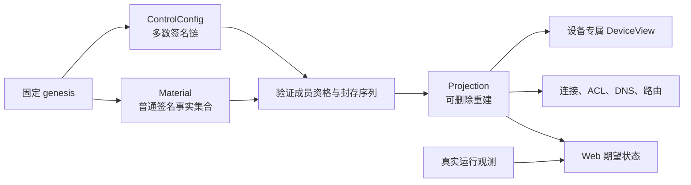
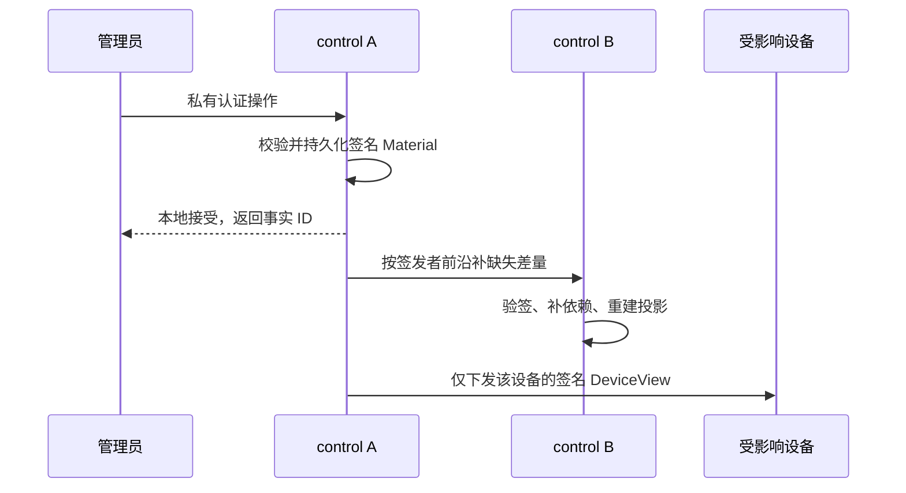
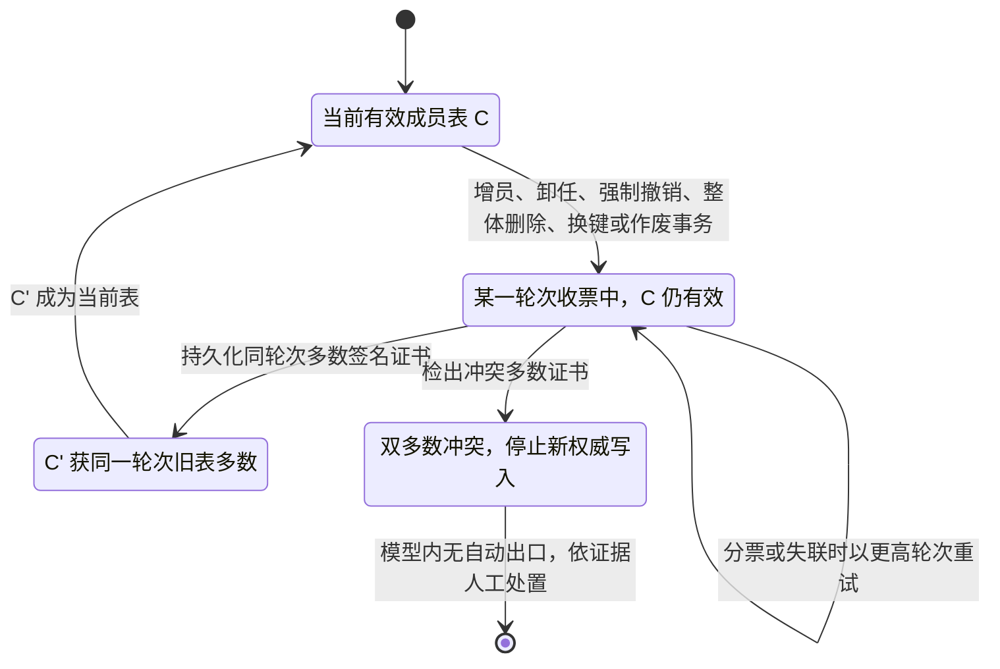
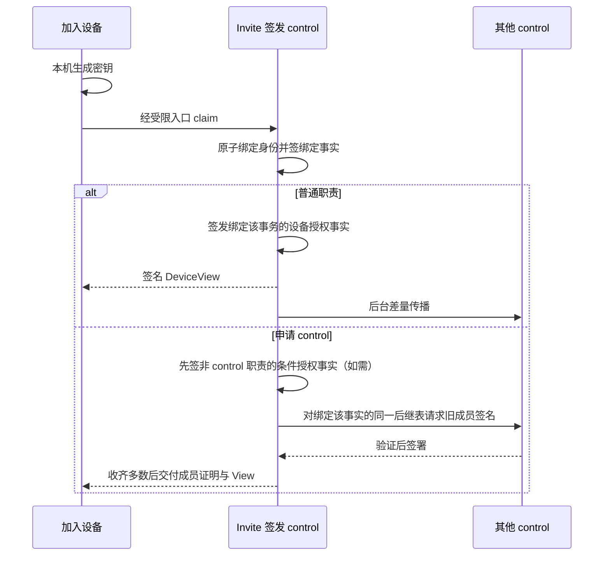
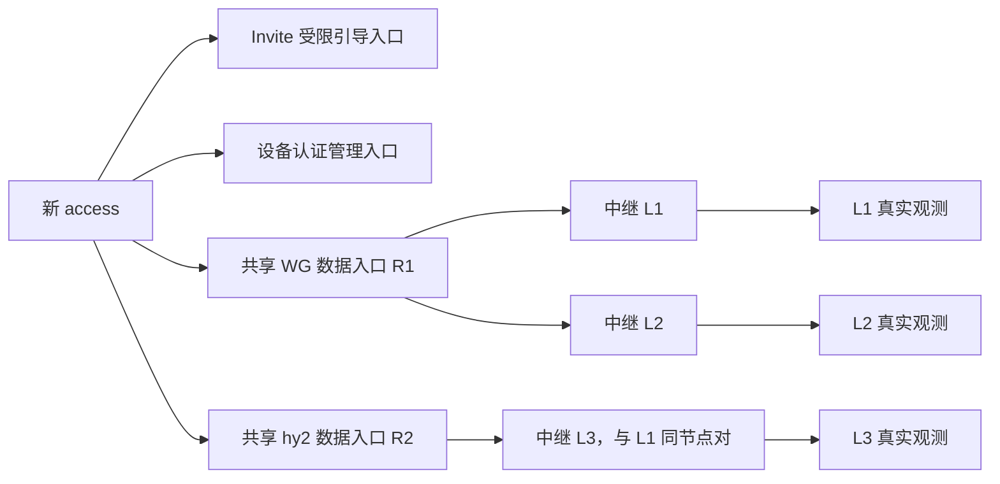
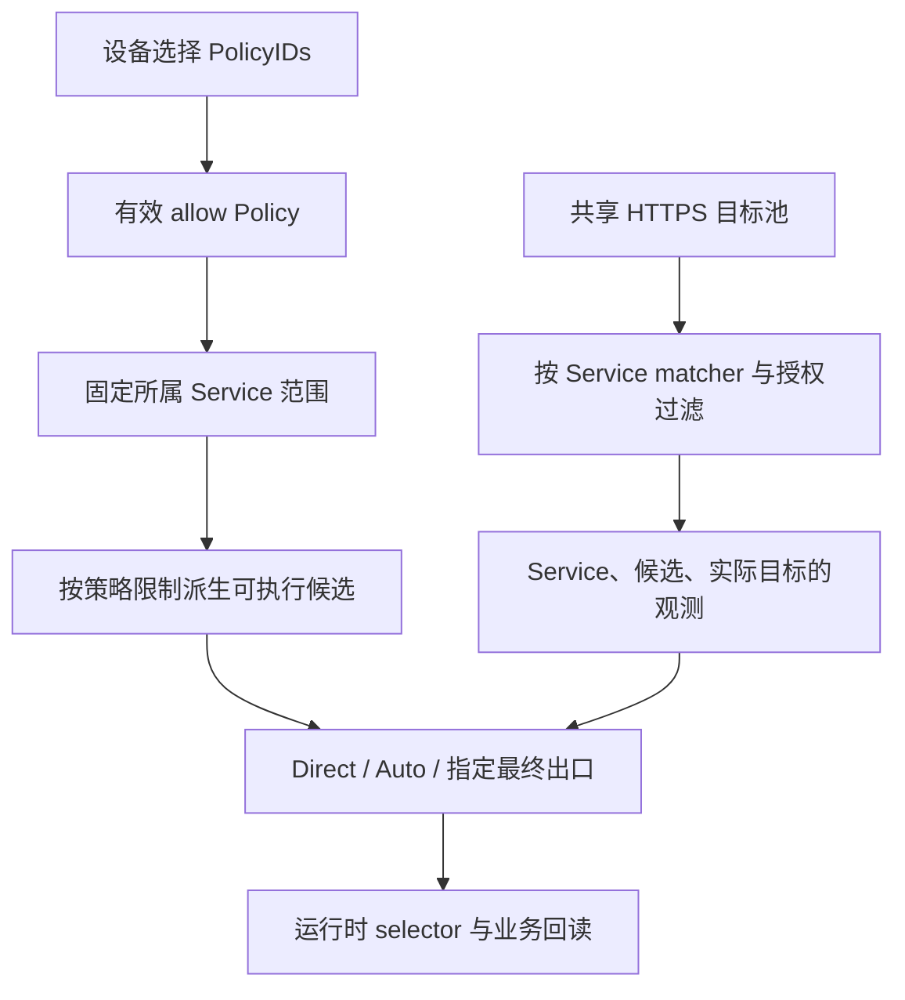
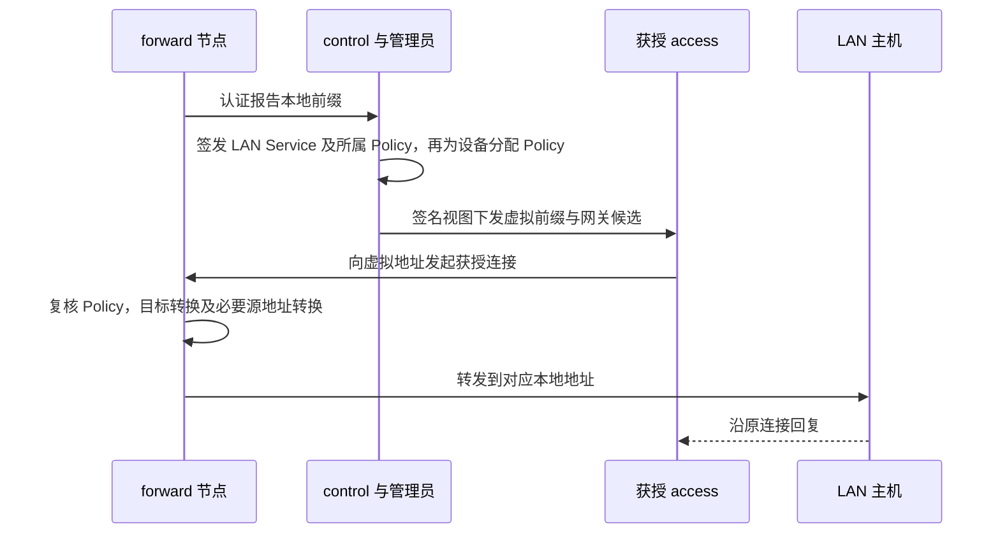

# 控制权威模型

[设计入口](../README.md) · [唯一现行契约](current-contract.md) · [实施状态](../progress.md)

本文定义 Loom 的唯一现行控制模型。一个或多个 control 使用同一套规则。普通治理由有效 control 签发不可变事实并最终一致；只有 control 资格变化需要当前成员多数签名。领域概念只有 `Material`、`ControlConfig`、`Projection`。Invite、`NetworkIntent`、`DeviceView`、连接资源与探测样本是其中的值、交付形式或运行观测，不建立平行权威；[Enrollment 与 Endpoint 模型](enrollment-endpoint-model.md)的概念同样是控制事实的类型或 `Projection` 的派生值，发布制品由独立的发布签名负责（见[唯一现行契约](current-contract.md)）。

## 1. 必须结果与边界

1. 任一有效 control 可加入、修改和删除普通节点；以后管理该节点的 control 不必是最初签发者。普通写入在接收 control 本地校验并持久化后返回**本地接受**，再增量同步；它不承诺全网即时完成或不可撤回。
2. `control` 只由成员表决定。成员数是数据，`majority(S) = floor(|S| / 2) + 1`，不保存冗余 quorum 字段。N=1、N=2、N=3 分别需要 1、2、2 票，没有单节点专用模式。
3. 节点职责为可组合的 `access`（原 use）、`forward`、`internet_egress`、`control`。`server` 不是第五项职责；转发不自动授予互联网出网。
4. 私有认证服务承载管理、Enrollment、配置和报告；公网伪装网站与公开通用制品不是写入入口。传输握手、DNS 解析和网络可达均不赋予成员资格或业务授权。
5. 普通事实以集合并集及因果依赖最终同步，没有 leader、Raft 排序、普通写入 QC 或全局 head。control 成员表多数签名是唯一需要协调的治理门禁。
6. 唯一现行 decoder 只接受 schema 3（见[现行编号](current-contract.md#现行编号)），拒绝 1、2 号历史 Material、旧 `runtime_contract`、未知或非规范输入；不靠第二 DTO/store、双读双写或再次升级协议号处理错误。

## 2. 三个领域概念

### 2.1 Material：规范签名事实

`Material` 是不可变、内容寻址的控制事实。首份 genesis 固定网络 ID、首个 `ControlConfig`、初始 `NetworkIntent`、首批管理员证书与信任锚。其余普通事实固定网络 ID、签发 control 及其验证键、签发时引用的成员表摘要、该验证键下连续递增的序列与前一事实哈希（序列跨成员表连续，换届不重新起算）、规范排序的因果依赖 ID、稳定目标 ID、操作、内容及签名。为避免签名和内容 ID 循环，`UnsignedMaterial` 只指上述业务字段，不含签名或自身 ID；`Material` 是这些业务字段与签名组成的完整事实：

```text
signature   = Sign(issuer_private_key, "loom-material-v3\0" || CanonicalEncode(UnsignedMaterial))
material_id = Hash(material_id_domain || CanonicalEncode(Material))
```

`material_id` 不写入被哈希的完整事实，签名也不覆盖自己；签名使用本机签发私钥，载荷绑定对应验证键，
覆盖全部无签名业务字段。`material_id_domain` 已由[现行字段契约](current-contract.md#规范编码标量与内容摘要)
固定为 `loom-material-id-v3\0`，算法为 SHA-256，文本为 `sha256:` 加小写十六进制；不能把签名域直接用于 ID。
普通授权链与 genesis 使用该契约规定的精确字段和规范 JSON；其他仍缺字段的操作须先补齐同一契约，
不能根据这个公式猜测载荷。相同规范事实字节必有相同 ID，文档固定字节不表示源码或现网已经完成替换。
普通事实的操作只有以下几类，每类按稳定目标 ID 创建、修改或撤销：

- 设备：加入（身份、显示名、平台、职责与所选 PolicyIDs）、职责与授权修改、撤销或删除（留下防复活墓碑）；组合申请 `control` 时还有绑定 Invite、设备公钥和普通职责的条件授权事实，成员证书形成前不投影；
- 网络意图：Service、Policy、`TransportResource`、`NetworkLink`、共享 HTTPS 探测目标、`.loom` DNS 记录、局域网映射、公开信任材料与各节点期望组件；
- 管理员证书：受信 admin 客户端证书叶子的加入与撤销；
- 私有入口：`EndpointGeneration` 的新代及阶段推进，只由承载该入口 listener 的 control 签发；
- Invite 生命周期：签发、首次 claim 绑定、取消与到期；普通加入由设备授权事实、control 加入由成员证书投影为完成；
- 冲突解决：显式引用全部冲突事实 ID，给出受影响目标的新值或撤销。

删除是新事实，不抹掉旧字节。普通操作不再用整份 `network.update` 或全局 `base_head` 覆盖另一 control 的写入。

设备授权携带签发者生成的 `RuntimeKey`，它是按设备、Service、Policy 和用途派生数据面凭据的根密钥，因此 Material 含秘密：只在 control 之间经端到端加密认证的通道同步，静态存储受保护，中继只转送密文。`RuntimeKey` 不下发给任何设备或节点；DeviceView 只携带由它派生的本设备凭据，forward/出网节点的 View 只携带派生出的、仅对本节点有效的入站凭据；Web、事件、日志与报告只显示脱敏投影。
派生必须把设备 ID、获授 Service ID、该 Service 的 Policy ID 和用途纳入输入；数据面凭据还须绑定所服务资源和接收节点，
两个不同接收方不得因同一设备/Service/Policy 获得可互用的凭据。凭据只对当前有效授权及相应资源/服务节点有效：授权撤销、
设备所选 Policy 移除或替换、`RuntimeKey` 轮换或资源认证身份变化时，相关客户端和服务节点执行投影须移除旧凭据，
并在真实入站认证回读中拒绝旧值。分区中尚未收到撤权的节点可能暂时仍接受旧值，不能把签名撤权描述为
立即全网断开。现行源码的旧派生域及其隐式用途字符串不是 schema 3 规范；[现行字段契约](current-contract.md#资源与用途隔离凭据)
已固定本业务链的 32 字节根密钥、HKDF-SHA256、用途及最小绑定集、规范输入/输出和应用失败时的收口规则。
改名或新增另一 Service 授权不改变本服务凭据；相关撤权仍须移除客户端与接收节点权限并真实拒绝旧值。
实际凭据/ACL 替换、其他未定资源认证值及生产旧凭据前向映射仍未完成，不能因 KDF 字段已定就称撤权闭环成立。

接收只判定这条事实本身能否成立：网络、规范编码、内容 ID、签名、签发者是否属于其引用的成员表、序列与前一事实哈希是否衔接；目标存在与权限只在**该事实声明的因果依赖闭包及同一验证键的此前事实**内判定。声明的因果依赖或前一序列事实**尚未到达**时暂存为待补齐，不得投影。上述任一项不成立，或输入未知、非规范，即拒绝且不进入权威集合；这些判定只取决于事实自身及其因果历史，所有 control 对同一事实得出相同结论。在自身因果历史内就不成立的事实说明签发者有缺陷或已被攻破，其后续序列在所有 control 上同样停止，按成员问题处理（强制撤销或换键）。依赖闭包之外的并发事实——例如并发撤销了它引用的对象——不影响接收：事实照常保存，是否生效由 `Projection` 按 §2.3 计算，因此到达顺序不改变有效事实集合，签发链也不会因此中断。同 ID 不同内容、同一验证键在同一序列下签出不同内容都不得择一覆盖。事实已知、已同步并不等于事实有效或生效。

### 2.2 ControlConfig：多数签名成员表链

#### 成员表载荷

`ControlConfig` 记录成员 ID、同一稳定节点 ID、验证键、前一成员表摘要、后继操作及目标节点 ID、被封存验证键的封存序列、该序列的事实摘要及首次提案所用的多数签名前缀报告，以及旧成员在同一轮次对**包含全部这些字段**的同一提案摘要的多数签名。首表由 genesis 固定。

后继操作只表达成员增员、卸任、强制撤销、节点整体删除、换键，或成员不变地作废一个已绑定的 control 加入事务（固定 Invite/事务 ID 与取消或到期原因，即使尚未发出成员提案）；它不承载普通设备授权。

control 增员提案还固定该 Invite/事务 ID、目标设备 ID、首次 claim 已持久绑定的设备公钥，以及所请求非 control 职责对应的条件授权事实 ID（纯 control 则为空）。签署者验证该事实已由有效 control 签发、与 Invite 和绑定精确一致；证书使该事实与 control 资格一起进入投影，事务由证书直接完成，不依赖事后再签完成事实。

成员与节点身份、传输对端身份分别校验；地址、WG/hy2、listener、邻接、在线状态不写进成员表。新成员加入前验证其设备身份与自有公钥，同步到所需事实前不签普通事实（见 §5）；换键也通过后继表完成，不在同 ID 下静默改变验证键。

#### 签发资格与封存

后继表只封存**失去签发资格的验证键**：被卸任、强制撤销或整体删除的成员的键，以及换键中被替换的旧键。证书为每把被封存的键写入封存序列；该键超过封存序列的事实不能形成新的授权或配置。留任且验证键不变的成员不被封存：它在旧表下签发的事实持续有效，序列跨表连续，换届本身不使留任成员的任何事实失效。

自愿卸任或计划换键的目标在提交请求前先持久停止旧键普通签发；其随后对自己键的前缀报告就是最终序列。未作此封笔的目标只能按强制撤销处理，不能在不可变提案已投票后再抬高封存点。

首次提出封存提案时，发起者使用同轮 `prepare` 旧表多数签名回复中各待封存键的已验证前缀报告 `(seq, tip_hash)`；封存序列取这些可取得原始连续事实链的报告最大值，提案固定对应 tip 摘要和报告。`tip_hash` 是该序列的 Material ID，序列 0 使用固定空链摘要；相同序列的不同 tip 是双签证据，不能择一。签署者须可取得最大前缀的完整原始事实链；设备只需验证报告和成员多数签名，不接收全网原始事实。

以后安全规则要求继承该提案时，封存点及证据保持原值，晚到事实按下段处理。未参与报告的成员或设备可能已见更高序列，证书不证明它们不存在。

#### 超限事实与前沿

超过封存序列的事实仍可作为因果证据：control 在它被已收到的事实声明为依赖时请求、验签并保存它及其签发链前序，使留任成员的签发链不中断。验签存证不赋予失格键新权限；这类事实不能形成新的授权或配置。因果依赖本身也不赋予业务权限；留任成员的事实只有在目标或业务引用确实依靠已被封存的值时才不生效。独立的撤权即使声明该事实作为因果水位也继续生效。

control 与设备永久保存已认证的按键高水位及不可回退 latch，不静默清零；设备成功验收后仍只保留一份当前 LKG，失败则保留原 LKG。连续多数成员证书仅对其中明确封存的验证键建立验收例外：该键新 View 的最低事实前沿可由原已见高水位降至证书封存序列；其他键的前沿、成员证明及既有全局认证 floor 不因它回退。

留任成员须将自己在证书验收前已持久接受、且有可验证原始事实及前序的超限撤权或删除用留任键自动重签，显式引用原事实；在本机应用新证书引起的授权/ACL 放宽或交付新 View 前，必须验证替代事实已生效，否则受影响目标的运行配置保持收口。证书验收后才收到的失格键事实只作证据，不自动重签；管理员可核对并签发新的撤权。此运行切换门禁不改变 `Project(G,C,M)` 的确定性规则。

只保存 View 或高水位而没有原始事实时，不能凭空重签；证书仍允许设备接受按封存点构成的新 View，可能恢复仅由遗漏撤权收缩过的权限。设备在替换 LKG 前对比可见授权差异；UI 根据保留的高水位与证书标明可能复权，诊断事件可记录已发现的差异及待管理员重做的撤权，但不形成第二份 LKG 或授权来源。无法发现的遗漏不能声称已审计完毕。

防复活删除若已进入有效事实仍要求新身份入网，普通撤权后的重新授予须由后继事实明确引用该撤权。验收例外不改变原始证据，也不能用本机曾见事实对同一有效事实集合额外收缩 `Projection`。

#### 成员操作

成员增员、主动卸任、强制撤销、成员节点整体删除及换键都经旧表多数签署；普通设备撤销不能绕过此门禁。卸任或强制撤销 control 仅移除其成员资格及它承载的私有入口（见 [EndpointGeneration](enrollment-endpoint-model.md#endpointgeneration)），原有非 control 职责须由普通事实另行管理；**节点整体删除**的后继证书则在移出该成员的同一多数签名载荷中写入该节点 ID 的不可复活墓碑。`Projection` 原子移除该节点的全部职责、授权、私有入口、资源参与资格、链路、DNS、局域网映射和候选；普通事实不能重新启用该 ID，重入网必须换身份和密钥。

#### 后继表投票

同一基础表只决出一个后继值，包括成员不变、按事务 ID 作废 control 加入的后继。成员遵守持久承诺和投票规则时，轮次保证至多形成一张后继证书：

1. **轮次、承诺与回复。**

   - 轮次号是 `(计数, 发起者 ID)`，按无符号计数、再按规范 ID 字节字典序全序比较；同一基础表下发起者 ID 唯一。发起者取高于已见最大计数的计数并持久递增，在发送 `prepare(r)` 前落盘，崩溃后只用更高轮次。
   - 成员收到 `prepare(r)` 时，`r` 高于已承诺轮次才先持久提高承诺再回复；相同轮次可幂等回复，更低轮次拒绝。
   - 成员签名的回复绑定基础表、轮次与回复成员，并包含该基础表下**完整的已投票历史**（每票的轮次、规范提案字节和签名），以及每把旧成员验证键的签名已验证连续前缀 `(seq, tip_hash)`。提案中的封存点还须能以原始事实链证明，不能只信 View 自报前沿或只报最近一票。

2. **选择后继值。** 发起者收齐旧表多数成员对同一 `r` 的承诺后，对每个精确的
   “投票轮次、提案摘要”分别计算：回复成员中签过该票的人数，加上未回复成员人数。
   达到旧表多数才表示该提案在**该轮**可能已被选定；不同轮次即使提案相同也不得合并计票。
   先核验完整历史：同一成员在同轮对不同提案双签，或出现冲突多数证书时，立即停止成员写入并保留证据人工处置。
   若完整历史已给出某一同轮同提案的旧表多数签名，先组成并采用该后继证书；
   其余情况按下列规则选择。

   - 没有可能已选定的提案：本轮可提出新后继。
   - 有可能项，且最高轮只有一个提案：本轮必须沿用它；更低轮的分叉不阻止继承。
   - 最高轮仍有多个不同提案可能已选定：暂停该基础表的新投票，继续补取成员的完整签名回复并重算；
     缺席者永久失联时不能任意选边。
   - 同轮不同提案说明发起者违背单轮单值承诺，须保存两份提案和投票证据；只要上述选择可决，
     不因此永久封停基础表。

   发起者一旦开始收票，本轮提案不可改变。

3. **签票与安全继承。** 成员收到本轮提案及可验证的多数承诺回复后，复核第 2 条的选择规则和提案业务约束。

   - 首次合法投票须验证封存点恰为提案所引多数前缀报告的最大值、tip 与完整原始链一致。
   - 已合法投过的提案被安全规则强制沿用时，沿用原固定封存点及当时已验证的业务资格。后来见到的更高序列、设备 ID 冲突、取消或到期请求不能否决安全继承；超限撤权按上段重签，ID 冲突按 §2.3 收口。
   - 轮次低于本机承诺，或同一轮次已有不同提案投票时拒绝。签字前原子地把承诺提高到该轮次并持久追加投票，签名覆盖基础表摘要、轮次与完整提案摘要；绝不因较高轮次已投票而补签较低轮次。同一轮次、同一提案收齐旧表多数签名才形成后继证书。

4. 分票或成员失联时旧表继续有效、普通治理继续；发起者在更高轮次重试，多个发起者相互抢占时退避。成员遵守单轮单值规则且发起者最终取得不被抢占的更高轮次时，多数在线可形成某个后继证书；同轮分叉的最高轮若仍有不同可能项，须按第 2 条等待证据。最高轮可能项是原加入提案时，当前取消请求不能直接形成作废证书。

5. **取消或到期。**

   - 已绑定 control 加入须以其 Invite/事务 ID 和终结原因提出“成员不变、作废该事务”的后继；到期原因由签署者对 Invite 的签名期限独立核验。即使原成员提案尚未发送，仍用同一规则取得旧表多数证书。
   - 证书形成后该基础表已有后继，原加入提案不能再取得证书；作废事务 ID 留在成员链中，后续基础表也不得再用该事务增员。作废证书形成前终结保持待决，不释放目标 ID。
   - 若第 2 条有唯一最高轮可能项，本轮沿用它，不能为满足取消请求改投作废值；最高轮仍有不同可能项时先补证据。如果沿用并形成原加入证书，或已证实原加入证书形成，只能在其生效后另行按既有**节点整体删除**规则移除全部职责；仅卸任 control 会保留其他职责，不能代替取消整次加入。已经成立的加入仍为 completed，不倒写为 cancelled。
   - N=2 中仅一成员曾投原提案、两成员随后均承诺更高轮且可证明该轮未获多数时，可以签成作废后继；跨轮各一票不得伪装成已选定。

更高轮承诺先阻止较低轮的新票；若较低轮已形成多数证书，它与本轮承诺多数必有交集，交集成员的完整历史使该轮提案保持“可能已选定”；若某轮已选定，此后所有合法更高轮投票都继承同一值，故最高轮可能项也只能是该值，新轮不能签成冲突后继。只保存最高票或跨轮合计会破坏这个论证。

#### 故障与交接

若故障或恶意双签仍形成两张冲突多数证书，停止新权威写入并保留证据，由管理员依据证据人工处置；模型不定义自动恢复，也不声称拜占庭容错。

最后一个 control 不得签成空表。交接须在仍能签名时纳入已验证的继任者，再签退出。全体 control 故障不会使普通节点超时晋升；只恢复原身份或启用**已经属于有效成员表**的受保护冷备。全部成员密钥丢失时，原网络信任不能凭存活设备自动重建。

### 2.3 Projection：事实的确定性结果

`Projection = Project(Genesis, ValidControlConfigChain, EffectiveMaterials)`。它包含 `NetworkIntent`、节点身份与非 control 职责、授权、Service 和 Policy 等当前有效值，没有独立写入口或不可删除的权威 store。设备视图、转发/出网 ACL、路由、DNS、Web 页面及发布输入由它单向生成；运行观测与期望状态分开展示，不能反写事实。

不同目标的有效事实以集合并集合并，重复、乱序与重传不改变结果。同目标操作只在因果上衔接时共同生效；唯一可交换的同目标并发是多次撤销或删除，结果相同。并发撤权、删除优先于并发授权或修改；其他不兼容的同目标并发修改使**受影响目标**暂停投影，其授权、ACL、路由与候选随之收口，不能恢复可能比某次并发修改更宽的共同祖先值。并发创建同一 ID 没有共同值，目标不投影。唯一性约束还按值检查：不同未终结事务或已完成设备身份重复占用同一设备 ID、同名 `.loom` 记录或重叠虚拟前缀均属冲突，相关设备授权或网络值都不投影；已签的 control 成员证书仍留在成员链，但冲突设备 ID 的设备服务认证与数据面授权失败关闭。成员签名仍按证书绑定的验证键核验，晚到普通事实不得回滚成员链；错误成员须经成员门禁移除后以新 ID 修复。以上都不靠时间戳或 control ID 选赢家；普通冲突恢复须由有效 control 签发显式引用全部冲突 ID 的解决事实，但普通解决事实不能终结、释放或覆盖已绑定的 control 事务，须先以成员证书作废或移除错误成员。无关目标继续收敛；例如修改一个 Policy 的名称和新增另一稳定 ID 的 Service 是不同目标，可同时投影。同一 Policy 的真正并发冲突仍整体暂停，直至显式解决。

普通节点删除保留防复活撤权事实，设备授权、资源引用、链路、局域网映射、DNS 与候选随之退出投影；同一身份/密钥不能借旧 Invite 复活，重入网使用新身份和密钥。


```mermaid
flowchart LR
    G["固定 genesis"] --> C["ControlConfig<br/>多数签名链"]
    G --> M["Material<br/>普通签名事实集合"]
    C --> V["验证成员资格与封存序列"]
    M --> V
    V --> P["Projection<br/>可删除重建"]
    P --> D["设备专属 DeviceView"]
    P --> R["连接、ACL、DNS、路由"]
    P --> W["Web 期望状态"]
    O["真实运行观测"] --> W
```

没有 Material 就失去操作与撤权证据；没有 ControlConfig 就无法验证签发权和成员变化；没有 Projection 这条计算关系，各消费者会各自形成矛盾状态。其他值不新增领域权威。

## 3. 编码、持久化与恢复

每个权威领域值满足[唯一现行契约的往返等式](current-contract.md#往返与拒绝)。本模型另要求合并与传输顺序无关：

```text
Project(G,C,M) = Project(G,C,PermuteOrDeduplicate(M))
```

该式只针对**同一有效事实集合**及任意传输顺序。签名只覆盖规范字节；未知字段、重复项、错误排序、错误领域分隔、在声明依赖闭包内仍悬空的权威引用和歧义字段组合必须拒绝，不能先归一化再验签。尚未收到但已由事实 ID 明确声明的依赖按前述规则待补齐。Projection、缓存、运行时和 UI 均无反向写入权威的映射。

持久权威为受保护 genesis 与本机信任锚、以 ID 为键的原始规范 Material 字节、连续成员证书，以及每个成员对每张基础表承诺过的最高轮次、**完整投票历史**及自愿封笔的本机不可回退标记（每票轮次、规范提案字节与签名）。事实存储 put-if-absent；回复承诺和签字前都先原子持久化，投票时同时提高承诺，避免重启后补签较低轮次或丢失早期可能已选定的票。成员证书保留离线设备验证所需完整链，不假定退役成员的签名可重新取得。投影缓存须可通过事实集合摘要验证、可删除重建；游标、索引与连接退避不是业务权威。

权威存储不得回滚。备份须在每次签名、承诺和投票持久化之后同步更新；从不能证明为最新的备份恢复的成员，视同该成员密钥丢失，不得再用该键签名、承诺或投票，由其余成员按成员变更（强制撤销或换键）处理。其余成员不足旧表多数时成员变更停滞；N=1 时等同全部成员密钥丢失。

首次创建仅允许本机管理员在全部权威为空时显式写入唯一 genesis，固定网络 ID、genesis 摘要和首成员键。非空、部分损坏或出现另一 genesis 时失败关闭，不自动重建空链。重启先核对固定信任锚、成员链与规范事实，再补依赖、重算投影；缺必要字节时仅保留最后可验证的本机视图，不签新事实。缓存不匹配直接丢弃，不修改权威迎合缓存。

| 层 | Material | ControlConfig | Projection |
|---|---|---|---|
| Domain | 不可变签名操作、因果关系与稳定目标 | 成员、验证键、旧表同轮次多数签署的后继、失格键封存序列、tip 与签名前缀报告 | 有效事实的确定性业务结果 |
| Wire | 唯一规范事实字节、签名和内容 ID | 唯一规范成员证书、签名前缀报告及规范排序签名 | 设备和管理读取的规范派生值，不是写协议 |
| Persistent | ID 索引的原始字节，撤权不删除旧事实 | genesis、成员证书、最高承诺轮次、完整投票历史与自愿封笔标记 | 默认不持久；缓存可删可重建 |
| Runtime | 验签、因果补齐、去重和按签发者同步 | 验证签发资格及后继多数 | 生成 DeviceView、ACL、连接、DNS、路由与服务配置 |
| UI | 正常管理动作生成事实，区分本地接受与传播 | 展示成员及多数门禁，提交同一提案 | 展示同一投影，另列真实运行观测 |

`NetworkIntent` 内 Service、Policy、资源、链路、DNS 和局域网值随 Material 规范编码并可往返，随投影重建。本机资源私钥、listener 细节与平台路由只单向投影，不进入公开 wire、根 `.env` 或 Web。

## 4. 普通写入与大规模增量同步


```mermaid
sequenceDiagram
    participant U as 管理员
    participant A as control A
    participant B as control B
    participant D as 受影响设备
    U->>A: 私有认证操作
    A->>A: 校验并持久化签名 Material
    A-->>U: 本地接受，返回事实 ID
    A->>B: 按签发者前沿补缺失差量
    B->>B: 验签、补依赖、重建投影
    A->>D: 仅下发该设备的签名 DeviceView
```

control 按签发验证键、连续序列和前哈希交换事实摘要与缺口，只发送缺失范围及稀疏冲突 ID。游标可丢弃，丢失后重新反熵对账；前沿是同步优化，不是全网完成凭据。成员不要求全互联，中继只转送端到端加密认证的字节。设备领取自身 DeviceView，不接收全网事实，也不广播完整事实集到所有节点。若有重建成本证据，可增加由权威验证的缓存，不另设快照/journal/receipt 权威。

私有连接的输入是本机配置的直达与中继坐标，以及当前成员表中的目标身份。可用路径并行尝试，
只有完成目标成员端到端 TLS 验证的连接才能承载请求；一个失联中继不能耗尽其他路径的机会。
整次连接共用调用方的取消与超时，覆盖 TCP、外层 TLS、中继应答及内层 TLS；选中连接后关闭
其他尝试。所有路径失败则本次请求失败，下一轮仍按持久事实前沿补差量，不新增路径健康或同步完成权威。
例如第一个中继不应答而第二个可达时，必须能通过第二个同步；中继本身通过 TLS 不能代替目标成员认证。
这一变化只调整 runtime 拨号，domain、签名 wire、持久事实及 UI 投影保持原映射，没有新增操作输入。

签发者须属于有效成员表且本地依赖已满足。分区中不同 control 可本地接受普通事实；恢复后并集收敛并执行冲突规则。其他 control 失联不阻止有效 control 的普通写入。成员表变化仍要求旧表多数，少数分区不能给自己增补 control 资格。

## 5. control 成员生命周期


```mermaid
stateDiagram-v2
    state "当前有效成员表 C" as Current
    state "某一轮次收票中，C 仍有效" as Voting
    state "C' 获同一轮次旧表多数" as Next
    state "双多数冲突，停止新权威写入" as Fork
    [*] --> Current
    Current --> Voting: 增员、卸任、强制撤销、整体删除、换键或作废事务
    Voting --> Voting: 分票或失联时以更高轮次重试
    Voting --> Next: 持久化同轮次多数签名证书
    Next --> Current: C' 成为当前表
    Voting --> Fork: 检出冲突多数证书
    Fork --> [*]: 模型内无自动出口，依证据人工处置
```

后继提案引用当前表摘要、完整新成员集合，以及首次合法投票所引多数签名前缀报告、每把被封存键报告最大值的封存序列和该点 tip 摘要；control 增员还固定 Invite/事务 ID、目标设备 ID、首次绑定的设备公钥及所需条件授权事实 ID，作废 control 加入的后继固定被作废的 Invite/事务 ID 与终结原因。签署者核验节点和键、Invite、绑定与条件授权事实、提案、首次投票时的封存序列与完整前序证据（须等于报告最大值，且自己被封存时不低于自己的报告；安全继承旧提案时不按后来见到的高水位重算）、本机轮次承诺及本轮多数承诺回复证明；首次投新提案前检查本机已知设备 ID 冲突；安全继承既有合法投票时，后见冲突只收口设备投影，不撤销成员证书。签署者按 §2.2 的选择规则签署，不另设人工确认。发起者收齐同一轮次、同一提案的旧表多数签名并持久化后传播证书。新成员在验证完整成员链、所需事实和自有私钥绑定前不签普通事实。新表由旧表授权，不能自签证明自己已是成员；离线设备逐份验证从固定信任锚到当前表的链。

N=2 一人失联时成员变化停住，在线者仍可签普通事实；任何一台永久丢失后，成员表再也无法变更。需要单故障后仍保有成员多数时使用奇数成员（3 或 5）；旧轮可能项仍可能先决定其他后继，不能保证立刻完成指定移除。第三名可以是平时离线、已属于有效成员表的受保护冷备，只在成员变更时上线投票；成员数仍只是数据，模型不禁止任何 N。局部故障、卸任请求和强制撤销不能按在线人数改多数，也不能通过普通 device revoke 绕过此门禁。

持久承诺、完整投票历史和多数门禁在成员遵守协议时保证同一基础表至多一张后继证书；它们**不防御单个有效 control 被攻破**：签署者对核验通过的提案自动签署，被攻破的 control 可以签发申请 control 的 Invite 或提出强制撤销，由其他成员自动签署，逐步取得多数后移除其余成员，此后原网络不能凭剩余 control 收回。当前模型接受这一风险；control 主机、成员签名密钥与可发起管理操作的 admin 凭据均须按其权限保护。

## 6. Invite、首次信任与 DeviceView

SSH 直接添加、bootstrap 脚本和扫码是同一 Invite/claim 协议的三种交付媒介。Invite 的完整字段由 [Enrollment 与 Endpoint 模型的 `BootstrapCapability`](enrollment-endpoint-model.md#bootstrapcapability) 定义，本模型只要求它固定网络信任锚、签发者及成员证明、签发者受限入口、事务 ID、目标设备稳定 ID、准确职责与所选 PolicyIDs、媒介、一次性约束和到期时间。签发 Invite 即批准，无第二次人工批准或站点签发规则。角色先于交付方式：纯 access 使用二维码，包含其他职责使用 SSH 或 sh 脚本；签发端、客户端解码和首次 claim 三处都拒绝不匹配的职责/媒介组合；其他媒介的 Invite 重新编码成二维码后，签名媒介字段仍不是扫码，扫码客户端拒绝解码。媒介字段只约束诚实客户端的交付方式，Invite 本身是持有即可使用的能力，须按其职责范围保护。

设备在本机生成私钥，用 Invite 仅向**签发它的 control**完成首次 claim。签发者失联时等待恢复，或按事务终结规则取消或到期；换签发者须另签 Invite。claim 原子绑定设备公钥、身份、目标端识别的平台和一次性约束；重试只恢复同一绑定。平台不由管理员预选，也不授予职责，识别与能力拒绝规则见 Enrollment 模型。普通加入事实由签发者本地持久化后传播；加入本身不建 WG 接口、NetworkLink 或全互联拓扑。

申请 control 的 Invite 在 claim 时先绑定设备密钥与待纳入资格；若还申请非 control 职责，签发者或持有已验证绑定的其他有效 control 在提案前签一份按该 Invite 和设备公钥限定的条件授权事实，明确依赖绑定事实（并经其依赖 Invite），内含所需 `RuntimeKey`，证书前不投影。后继 ControlConfig 引用该事实 ID，按 §2.2 自动收集当前成员多数签名。完整证书形成后，各验收方验证该证书及所引授权事实，control 与所请求普通职责才在该方投影中一同生效；证书形成前不赋予任何职责、不交付 View。交付只决定设备是否已获知证明，不决定控制权威是否生效；响应丢失不撤销已成立的加入，也不要求再签完成事实。设备本机仍须取得并验证成员证明、自有密钥绑定及所需事实，才能运行职责、签治理事实或投票。这仍是一次入网操作，无第二次人工审批。取消已绑定的 control 加入须按 §2.2 第 5 条取得作废该事务的成员证书；证明不足时保持待决，原加入证书已成立时则以节点整体删除证书终止整次加入的全部权限。

首份与后续 DeviceView 由当前有效 control 针对该设备及本机已知有效事实签名，附成员证明、视图摘要和事实前沿；它不是 QC 或全网已收齐证明。设备验证网络锚、签发资格、设备绑定、授权及规范摘要，原子保存可信视图、成员链和按签发验证键单调的已见高水位。缺链或未经证书限定的前沿回退时拒绝提升 LKG；成员封存只为该验证键开放 §2.2 的验收例外，已认证高水位与 latch 不回退，已知超限撤权须由留任键重签。签名视图不能证明没有尚未传播的撤权；晚到撤权可能收回先前显示的权限。UI 区分“本地接受”和“本节点已见”，不声称全网已确认。


```mermaid
sequenceDiagram
    participant D as 加入设备
    participant I as Invite 签发 control
    participant C as 其他 control
    D->>D: 本机生成密钥
    D->>I: 经受限入口 claim
    I->>I: 原子绑定身份并签绑定事实
    alt 普通职责
        I->>I: 签发绑定该事务的设备授权事实
        I-->>D: 签名 DeviceView
        I->>C: 后台差量传播
    else 申请 control
        I->>I: 先签非 control 职责的条件授权事实（如需）
        I->>C: 对绑定该事实的同一后继表请求旧成员签名
        C-->>I: 验证后签署
        I-->>D: 收齐多数后交付成员证明与 View
    end
```

新设备先凭 Invite 指定的签发者 `EndpointGeneration` 受限入口完成 claim/resume；事务完成后，该签发者的设备认证入口成为首个管理、配置和报告入口，设备自动尝试连接，无须先创建 NetworkLink。其他 control 同步到该设备的绑定、授权事实（如需）及成员证书（如需）后也可提供相同的端到端认证服务。端点代际细节见[Enrollment 与 Endpoint 模型](enrollment-endpoint-model.md)。

genesis 中已有的初始成员取得同 NodeID 的首次设备身份时，也沿同一 Invite/claim/设备事实链：由该成员
自己经私有管理入口签发含已有 control 及所需普通职责的 SSH/sh Invite，核对目标无设备授权、已绑定
身份、其他未终结事务或墓碑，再接受本机独立设备密钥的 claim。成员自签 Invite、绑定和 device.join
建立身份关联；既有 control 资格不重新增员，不改变成员表，普通职责从授权事实生效。纯 control 的
普通职责数组可为空。已绑定后只恢复同一事务或修改普通授权，不能借重邀覆盖身份；撤销或删除成员仍按
成员门禁。这里补齐的是初始节点在既有模型内的转换，不是另一种加入模式；前文条件授权与多数增员针对
尚未取得 control 资格的目标。精确谓词及旧入口替换见[初始成员绑定](current-contract.md#genesis-与初始成员表)。

## 7. NetworkIntent、传输资源和显式中继

节点公开分发地址 distribution_urls 保存在同一 DeviceAuthorization，经现有 device.put 修改，初次
device.join 取空集合；纯 control 初始节点先按上文取得设备绑定，不需为此授予其他职责。
NetworkIntent.nodes 与 PublisherInput 从有效设备事实单向投影该列表，空列表不阻止 Service/Policy
和普通 access 加入。完整字段、规范 URL 和撤销规则见[设备授权](current-contract.md#servicepolicy-与设备授权)。
不增加 node.put、属性 store 或旧 network.import 来源，也不把发布定位当业务权限、KDF 输入或发布签名。

`NetworkIntent` 是 Projection 中的规范值，保存节点、Service、Policy、TransportResource、NetworkLink、共享 HTTPS 探测目标、overlay DNS、局域网映射、公开信任材料（数据面 TLS 身份与网站证书信任根的公开证书）及各节点期望组件（按发布记录摘要引用，不复制制品内容）。每项按稳定 ID 签发修改或撤销事实，先整体验证该目标规范值和引用，再投影；不得以网络全量替换覆盖并发写入。`Projection` 另含设备授权、管理员证书名单和 `EndpointGeneration`，它们与 NetworkIntent 一样只由签名事实确定。

期望组件使用[精确发布引用](current-contract.md#节点期望组件的精确发布引用)：普通签名只指定节点与
组件应引用哪份 catalog/manifest，程序坐标仍从独立验签的发布记录纯投影。期望引用的同步不搬运制品，
某 control 缺少相应发布材料时该引用不可执行，不能以下载 current、上次缓存或空期望代替。
原本只有实际运行报告，无法表达管理员想要的程序；最小变化是接入已有 ExpectedComponent 普通事实及
节点页面选择入口。新增操作成本是选择节点、已验证组件与平台，不增加发布阶段或审批状态机。

`TransportResource` 有稳定 ID、种类、固定承载节点及 interface/listener 身份、拨号坐标和公开认证参数。当前接受已定义的 `wireguard`、`hysteria2` 和 `tls_tunnel`；新加密隧道需在同一模型写清身份、用途和回读规则。多个 access 首跳和中继 LinkID 可复用同一 WG interface 或 hy2 listener。普通设备参与资格由其身份、授权和实际数据面 ACL 投影，**不追加到共享资源的规范参与者列表**；新增 WG peer 只改变该设备对应的受保护执行投影，不改变其他设备的资源身份或观测摘要。资源自身规范参数变化只使引用它的观测失效。私钥、凭据、证书私有部分及本机 listener 参数只在节点受保护执行输入中保存；不为每设备建立新接口。

三种资源的最小业务边界如下；表中的字段是必须表达的**语义**，不是尚未定义的 schema 3 字节名。
所有拨号地址仅用于到达，不能替代签名资源中的节点与认证身份；每个资源必须由承载节点的实际执行
回读其 listener/interface 与当前公开认证参数，失败即不可报告 `running`。

| 种类 | 稳定身份和必须公开的认证/拨号值 | 真正能证明的动作与 report 范围 | 留在节点本机的秘密 |
|---|---|---|---|
| `wireguard` | 资源 ID、承载 NodeID、interface 身份、承载端 UDP 拨号坐标、WG 公钥及资源自身的公开地址/路由参数；设备 peer/AllowedIPs 从该设备的授权和本机执行投影生成，不成为共享资源的参与者表。 | 先核对当前 peer/接口执行回读；显式中继 LinkID 的成功须通过隧道向该 Link 的精确探测目标发起并收到返回数据，普通首跳则按自身实际连接或业务结果报告。最近握手时间或计数器只能作为诊断，不能单独宣布 Service 业务成功。 | WG 私钥及本机 peer 安装材料 |
| `hysteria2` | 资源 ID、承载 NodeID、listener 身份、UDP 拨号坐标、必须校验的服务端证书身份/公开信任材料及该用途的授权身份。拨号可使用认证的 IP 地址；不要求公网域名或 Gandi token。 | 验证服务端证书和 Hy2 身份；显式中继 LinkID 通过该资源向其精确目标完成有返回的传输动作，普通首跳按自身实际连接或业务结果报告。报告 Hy2 的认证、建连和真实返回结果，不填 WG 握手/peer 字段。完整 Service HTTPS 探测仍另按 Service 报告。 | 服务端证书私钥与设备/Service/Policy 派生的服务凭据 |
| `tls_tunnel` | 资源 ID、承载 NodeID、listener 身份、TCP 拨号坐标、固定服务端 SPKI、服务 ALPN，以及需要时附加的 TLS 名称和成员或设备端到端身份。 | 引导和设备私有隧道必须验 SPKI 与专用 ALPN，再完成对应私有服务的认证请求和响应；握手只证明该入口，不证明治理、设备授权或任何 Service 已可用。 | TLS 私钥、成员/设备私钥及本机 listener 输入 |

没有域名或 `GANDI_PAT_TOKEN` 不得自动禁用 Hy2；但没有可验证的服务端身份、有效证书/信任材料或
设备可执行的 Hy2 凭据时，Hy2 候选必须失败关闭，不能以关闭证书校验换取可达。
Hy2 的唯一规范认证形状为公开 CA DER 集合和 server_name，见[现行资源契约](current-contract.md#资源与用途隔离凭据)。
接入端与接收端使用同一 RuntimeKey 派生结果；接收端只获得其资源所需的设备/Service/Policy 凭据及
允许、排除目标，不获得根密钥或来源设备的 access 分配。另一已选 Service 的重叠目标必须排除，
即使该 Service 选择的是 deny 策略。接收端以请求实际 FQDN/IP 执行 ACL，不用 TLS SNI 为任意 IP 扩权。
撤权和 ACL 改变必须关闭旧认证会话；固定传输实现不能撤销缓存会话时，终止旧 generation 后再应用新值。
同一共享 listener 的合法连接因而可能短暂重连，但失败不能恢复已接受的新授权之前的进程。

`NetworkLink` 有独立 LinkID，记录需显式固定的**中继邻接**两端、资源引用、发起方向、用途和真实探测动作。同一节点对可并存 WG 与 hy2 LinkID，各自观测。首次引导、加入后的认证管理/配置/报告、control 事实同步可以使用已有认证连接及共享资源，无须先为每对节点建 NetworkLink。删除 LinkID 只撤销引用它的候选，不连带删除共享资源；撤销资源时所有引用它的首跳与中继候选都立即退出投影，残留 Link 不再生效并须清理。节点、control 资格或公钥出现都不自动创建中继链路。

本次部署补齐既有 WG 中继的必要映射，不创建新的权威实体。WG Link 的 `from_resource_id` 和
`resource_id` 分别引用两端已有 WG 资源，解决单个接收资源无法表达发起端公钥和本机地址的问题；
`initiator_node_id` 决定 UDP 建连方向，From/To 决定业务方向，两者分离。双向业务由两个有向 Link
表达，端点资源相同的反向 Link 复用同一接口和 peer。资源保存单个 /32 或 /128 地址；执行只安装
对端的精确地址路由，不获得默认路由、LAN 或宿主 DNS 权限。现有本机 WG 私钥继续由文件引用提供。

Hy2 的 `link_only=true` 表示该 listener 只能经显式 Link 使用，不能被投影为普通公开首跳。
省略该字段维持现行公开首跳字节。Policy 可用正整数 `max_hops` 保留已有受管节点链长度限制；
省略表示不额外限制，但候选永不重复节点。新增字段均在 schema 3 内修订；已有未包含字段的规范字节不变。

数据转发采用已有 Hy2 的认证 UDP 能力：access 为每条候选建立按 Link 顺序连接的 Hy2 outbound，
前一跳只允许该 Link 对端 WG 地址上的后续 Hy2 UDP 端口，最后一跳才执行 Service 目标 ACL。
中间接收凭据的 `relay_target` 固定 LinkID 与下一资源；KDF 的 `relay-auth` 用途另外绑定这两项，
不能与最终出口的 `service-auth` 互换。中继收到的仅是本 listener 的入站凭据，不能得到根密钥或下一跳凭据。
hybrid 从本机 Link 起步时不生成回环入站用户，并绑定该 WG 接口。一次普通 HTTPS 请求须经完整候选
返回后才能报告 Service 成功；WG 接口、握手及 Hy2 TLS 回读均不代替业务结果。

Link 的精确动作 `hysteria2_tls` 检查对端 WG 地址上指定的 Hy2 listener，按对端资源的 CA 和名称完成
真实 QUIC/TLS 请求返回，仅证明该 Link 的传输可用。未执行或无可验证返回时保持 unknown。
正常停止和更新先终止旧数据进程，再 compare-and-delete 本 generation 的 WG 对象；失败时不自动反复重施。
最小验证覆盖双向 Link 共用接口、同出口一跳与中继并存、本机起点、端口 ACL、不同用途凭据隔离、
资源或 Link 撤销、Service 分别探测、停止/异常退出后的所有权清理，以及正式服务重启恢复。


```mermaid
flowchart LR
    A["新 access"] --> B["Invite 受限引导入口"]
    A --> C["设备认证管理入口"]
    A --> R1["共享 WG 数据入口 R1"]
    A --> R2["共享 hy2 数据入口 R2"]
    R1 --> L1["中继 L1"]
    R1 --> L2["中继 L2"]
    R2 --> L3["中继 L3，与 L1 同节点对"]
    L1 --> O1["L1 真实观测"]
    L2 --> O2["L2 真实观测"]
    L3 --> O3["L3 真实观测"]
```

资源握手、首跳与中继连通仅证明被实测层级。链路观测绑定 `link_spec_digest = Hash(CanonicalEncode(NetworkLink, TransportResource))`；资源或链路参数变化使旧观测回到 unknown。WG/hy2/TLS 分别用自身真实认证连接测试，不伪造 WG 地址或接口。新链路未验证成功前不能因声明存在而删除旧可信连接。即便 control 流经非 control 中继，也逐请求验证成员身份和签名；设备服务验证设备授权，数据面验证 ACL。中继不投票、不自动取得管理权。

## 8. Service、Policy、偏好与业务探测

Service 定义“访问什么”：一组域名/目标地址范围，或者由一个固定网关共享的 LAN。
NetworkPolicy 定义“对这个服务允许怎样访问”：**每条 Policy 固定属于一个 Service**，保存访问
允许/禁止、Direct 许可、业务入口、互联网出口与中间转发限制。一个 Service 可有多条 Policy，
一条 Policy 可被多台设备复用。Service 本身不保存全局唯一 Policy 引用。
`DeviceAuthorization.PolicyIDs` 只保存该设备选择的 Policy ID 集合；Service 范围通过每条 Policy
的固定 `ServiceID` 推导，不再要求设备保存或编辑一组独立的 Service → Policy 配对。

例如 `demo-media-free` 和 `demo-media-exit` 都属于 `demo-media`；前者允许不限路径访问，后者只允许
经选定出口。手机选择前者，电脑选择后者，其他设备可直接复用其中一条。`demo-office-access`
属于 `demo-office`，目标始终是该局域网 Service 的固定网关。新增 Service 或仅创建 Policy
都不扩大设备权限；只有设备授权选择该 Policy 后，它才参与该设备的业务投影。

### 策略身份与访问规则

ServiceID、PolicyID 和 DeviceID 都是稳定身份。Policy 创建时必须选定有效 Service；**已有 Policy
不能更换所属 Service**，改目标服务须创建新 Policy，再显式替换设备选择。允许修改 Policy 的名称、
访问动作及路径限制，修改作用于所有引用该策略的设备，包括仍有效但尚未 claim 的邀请所引用的规则。
删除 Service 会失去目标边界，删除 Policy 会失去可复用的服务访问规则，删除设备的 PolicyIDs 会
失去设备间权限差异；三者满足独立需求，不新增 Binding、grant store 或第二份授权表。

| Policy 值 | 含义及默认草稿 |
|---|---|
| 所属 ServiceID | 必填且创建后不可修改；目标集合或固定 LAN 网关从 Service 读取 |
| 访问动作 `allow / deny` | 新建草稿默认 allow；deny 保留策略分配关系，但不生成该服务的业务授权、路由、ACL 凭据或探测目标 |
| 业务入口范围 | 约束经网络接入的第一台受管节点；默认 any，按当前职责和已认证首跳资源过滤 |
| 中间转发范围 | 约束路径中使用的中间转发节点；默认 any，仍要求具有 forward 职责及显式中继 LinkID |
| 互联网出口范围 | 仅互联网 Service 使用，默认 any；只接受具有 internet_egress 职责的节点 |
| 互联网 Direct 许可 | 仅互联网 Service 使用，新建草稿默认允许；Direct 不经过受管入口、中继或出口 |
| 设备限定本地出口许可 | 保留既有 `local_egress_devices` 的显式设备 ID 集合，默认空；只能给相应 hybrid access/出网设备启用其自身出口，不能变成其他设备的 Direct 许可 |

设备限定的本地出网仍以本机稳定 NodeID 作为逻辑最终出口；空跳链只表示在本机执行，不能将
`final_exit` 写成 `direct`。该设备须同时具有 access 与 internet_egress 职责，位于
`local_egress_devices` 中且符合 Policy 的出口范围。本地出网没有网络入口，不受入口范围限制，
也不需要回拨本机或提供入站资源。Auto 和“指定本机出口”可选择该候选；普通
Direct 偏好只选择 `final_exit=direct` 的获授权路径，不取得本地出口许可。撤销任一必要条件即移除该候选。

节点范围是 Policy 内的有限值，只有 `any`（不限）、`only`（仅指定集合）、`none`（明确不允许）。
`any` 与 `none` 的 ID 集合必须为空；`only` 必须携带非空、无重复、按规范字节排序的稳定 NodeID。
缺少模式、only 的空集合、未知 ID、模式与内容矛盾均拒绝。UI 未设置限制时使用明确的“不限”，
提交前规范化为 any；规范签名值不靠字段缺失、null 或裸空数组猜默认值。none 是显式操作，
例如没有本地出口许可时，“仅 Direct”以允许 Direct、入口 none 表达；中间转发 none 允许没有中间节点的一跳路径。
这些范围只是现有 Policy 的值，不拥有新的身份或生命周期。

any 包含当前及以后符合资格的节点，但不会赋予节点新职责、制造资源、NetworkLink 或健康观测。
only 引用的节点后来被删除或失去职责时，保留原引用及失效原因，移除不合格候选；**不能删除失效 ID
后把范围改成 any**。例如策略仅许 `demo-exit-a`，该节点删除后没有符合规则的出口，不自动借
`demo-exit-b` 出网。编辑并提交只含已失效节点的新限制仍须拒绝；已有策略的无候选结果如实回读。

“不限”只作用于已经分配的策略内部。设备未选择某服务的 Policy，就没有该服务的业务访问授权；
空 PolicyIDs 表示“仅加入，无业务权限”，不影响设备认证管理、配置和报告通道。无 access 职责
不能分配这些访问策略；纯 forward/出网节点转发其他设备流量的 ACL，仍从来源设备的有效策略投影。

Direct 与受管路径是两个允许项：允许 Direct 且出口范围 only 表示“可直连，或经所列出口”。
“只能经指定出口”必须禁止普通 Direct；页面摘要不能把两者混为一谈。一跳直达出网节点仍是受管
路径，该节点须同时满足入口和出口范围。入口是业务首跳，不是 Invite 引导入口或 SSH 安装目标。
`local_egress_devices` 仍只匹配当前同时具备 access 与 internet_egress、且获准为最终出口的设备本身。

LAN Policy 只设置 allow/deny、业务入口和中间转发范围，终点固定为所属 Service 的网关。
LAN 规范值不携带互联网出口、普通 Direct 或本地互联网出口许可字段，出现即拒绝；未设入口/转发
限制表示到固定网关的所有合格路径，不会改换网关或授予公网访问。none 或资源定义可能使策略当前
没有候选；这表示权限条件下无路可走，不自动放宽。真实可用性另由运行观测确定。

### 节点选择策略与跨层对应

设备可选择多个 Policy，但按这些策略的所属 Service 检查，**同一设备对同一 Service 最多选择一条**。
替换同服务策略时，在一次设备授权变更中移除旧 PolicyID、加入新 PolicyID；不合并两条规则，也不
引入“允许优先/拒绝优先”排序。不同设备可以为同一 Service 选择不同策略。两个 Service 的目标
重叠而不能唯一确定请求所属服务时，拒绝该设备的歧义授权组合，不按列表顺序选择较宽规则。
目标后继修改导致原分配出现歧义时，相应请求也须拒绝，不能自行选择一个较宽服务。

| 层 | 唯一表达与读写边界 |
|---|---|
| domain | Service 定义目标；Policy 以固定 ServiceID 保存 allow/deny 和路径限制；设备授权保存规范 PolicyIDs |
| wire | Policy 事实签名覆盖所属 Service 与全部规则；Invite 和设备授权固定 PolicyIDs，因果依赖绑定引用对象；View 携带所需 Policy、Service 及认证证明 |
| persistent | 原始签名策略/设备事实、Invite 与完整 LKG 规范往返；不另存可写 ServicePolicies 或关联表 |
| runtime | 从 PolicyIDs 解析有效 Policy，再解析固定 Service；通过下述筛选生成 View、候选、ACL、凭据及探测目标 |
| UI | Services 管目标并只读列相关策略；Policies 创建/编辑完整服务访问规则；节点页面只选 Policy，服务及规则摘要只读派生 |

PolicyIDs 中每项必须是非空稳定 ID，集合无重复并按规范字节排序，引用现有、无冲突的 Policy；分配时其所属 Service
也必须有效。合法空集合只有一个编码。已经分配的 Policy 或 Service 后来被删除、撤销或冲突时，
相应权限退出投影，不自动换策略、恢复旧值或变成不限。deny 是合法可分配策略，不等同于对象删除。
从 deny 改回 allow 须有效的后继策略事实；设备会按既有分配重新获得符合规则的权限。
Loom 管理范围内命中未授权或 deny 服务的请求须拒绝，不能回退为 Direct 或借另一服务绕过；
不生成允许的业务路由不等于从捕获范围删掉目标后交给宿主默认出网。

候选筛选顺序为：读取设备当前有效身份、职责及 PolicyIDs → 解析 Policy 和唯一 Service →
检查 allow/deny → 匹配 Service 目标 → 应用入口、中间转发、终点及 Direct 规则 → 验证资源、
LinkID 方向和节点资格 → 交给平台能力与真实观测选路。任一权威引用未知或冲突则相关权限收口；
观测 unknown 不能被当成已授权之外的候选。遍历规范排序，输入相同就产生同样候选集合。

候选身份仍包含 Service 范围、首跳资源、有序 LinkID 与最终出口，规范摘要覆盖当前 Policy 内容及
实际依赖。策略替换或规则变化使依赖旧摘要的观测失效；无关策略变化不影响其他范围。普通 access、
forward 和 internet_egress 都核验设备选择的 Policy、该 Policy 固定的 Service 及当前路径条件。
数据面凭据仍按设备、Service、Policy 与用途派生，不能因设备仅选 Policy 就省略 Service 绑定。

DeviceAuthorization 的 PolicyIDs 更新仅改变该设备；Policy 规则更新影响所有引用设备。
它们使用各自对象的因果基线，陈旧提交拒绝并保留草稿；并发不兼容授权修改按设备目标冲突收口，
共享策略冲突只收口其引用范围。撤权从客户端、网关及入口 ACL 移除相应权限；分区或离线未收到
撤权的设备可能暂时保留旧配置，不能将本地接受描述为全网即时生效。重启从签名事实与 LKG 恢复，
草稿与反向索引可删除重建，不能反写授权。

普通设备 `revoke` 撤回当前权限但保留原身份绑定；管理员可审阅后以同一 `device.put` 显式重新授予。
永久 `delete` 的墓碑不可恢复。为了让页面完成这条既有业务链，`Projection.targets[].device_for_review`
仅在设备已撤权、目标无冲突且没有任何有效永久删除事实时，投影一份既有 `DevicePut` 公开值。
输入是当前撤权事实因果历史中的设备授权事实：去掉被另一授权事实因果覆盖的项，只有唯一剩余值时
才供审阅；不同分支、未知历史或永久墓碑不猜测前值。并发但未被撤权方见过的授权不能成为默认恢复值。
该值不含身份私钥、RuntimeKey 或加入能力，不进入 DeviceView、运行授权或持久 store；重建 Projection
即可删除重算。设备公开历史、页面草稿和当前有效权限分别显示，不能仅凭审阅值令设备恢复运行。

正式入口仍为设备详情的同一授权表单，重新授权时明确显示其撤权状态和所审阅的公开配置；提交固定
已审阅的全部当前目标事实及所选 Policy/Service 依赖。daemon 从已验证原加入事实保留身份、公钥、
平台、RuntimeKey 和事务，仅签发新的公开权限值。陈旧草稿拒绝并保留，永久删除后拒绝重新授予；
重启后先重建同一撤权及审阅投影。最小验证覆盖加入后的改名、DNS/策略变化不会退回 Invite 初值，
普通撤权、同身份显式重新授权、真实运行拒绝与恢复，以及永久删除和歧义历史不能产生恢复入口。

### 策略创建、分配与复用

正常链是：创建 Service → 在 Policies 为它创建 Policy → 添加节点选择 Policy → 签发固定 PolicyIDs
的 Invite → claim 与设备授权 → 下发 View → 客户端和服务节点消费 → 节点详情回读所选策略及业务结果。
已有节点通过同一节点授权入口增加、移除或替换策略，无需重新扫码。添加页或节点详情中的“新建策略”
进入同一个 Policies 创建表单；返回后选中该策略，不在节点页嵌入第二套服务或策略编辑器。

共享编辑先列出使用节点和仍有效邀请的引用。只改一个节点时选择另一条同服务策略，或复制当前策略
为新 Policy、保存后替换该节点的 PolicyID；其他节点保留原引用。Policy 的 ServiceID 保持不变，
Service 目标内容修改也须展示所有经 Policy 引用的节点范围。创建、复制、修改都走普通签名事实，
不新增策略模板、隐式私有策略或有独立生命周期的草稿 store。

先保存新 Policy，再签发 Invite 或更新节点 PolicyIDs。若第二步失败，策略仍是可回读的已保存对象，
节点/邀请尚未改变；按原请求及对象 ID 只重试未完成步骤，不能重复创建策略或把草稿显示为有效权限。
陈旧依赖回到审阅；取消分配不自动删除已保存策略。丢失身份后重新添加若需创建策略，先完成策略保存，
再执行旧身份删除 → 新 Invite 的替换链；策略失败不删除旧身份，已删除后的邀请失败不回滚墓碑。

复制与返回分配的 Web 投影不增加权威实体：复制仍提交一个使用新 ID 的 `policy.put`，保留所审阅
源策略的 Service 与规则；已知有效、冲突或历史删除的 ID 均不能作为“新策略”覆盖。未知直达链接
原位显示不可用，不跳到第一条策略。源策略与其他设备的事实不因复制改变。

有效邀请引用仅由已验证 Invite、当前目标、绑定及设备加入事实派生。未绑定且未到签名期限的邀请计入；
已绑定未完成的事务在期限后仍按既有恢复语义计入；已完成、取消、终结、冲突或对应设备已撤权/删除的
事务不计入。调用方注入当前时间，投影只含事务 ID、设备 ID、PolicyIDs、期限及 open/bound 提示，
不含邀请能力或密钥。已加入的有效设备从现有授权投影计数，不与邀请重复；服务引用取其全部策略的并集。
该列表表示当前 control 已验证的范围，不能宣称已经知道离线分区中的全部引用。

进入策略页时只保留当前浏览器中的节点/邀请表单及其已审阅依赖；它可随页面关闭而丢弃。取消回到原
字段与选择。保存新策略后，仅用已接受结果补入新策略及所属服务的依赖，替换草稿中同服务的选择；
设备基线、其他策略依赖、邀请事务 ID 和未改变请求的重试字节仍保留。返回不会提交设备或邀请。
若其间设备被其他操作者修改，下一步必须陈旧拒绝，不能悄悄采用较新的设备基线；新策略仍可单独回读。
最小测试覆盖源策略与另一台设备不变、复制 ID 碰撞、取消/成功返回保留字段、第二步陈旧拒绝及未改
重试不重复建策略，以及邀请未绑定过期、绑定续办、完成和终结的引用边界。

最小反例及验证：同 Service 的两条 Policy 可分配给不同设备，同一设备同时选择两条须拒绝；
共享规则修改影响全部引用，单节点替换不改共享规则；新 Service/Policy 不自动授权；Policy 不可改属
其他 Service；any、only、none 及规范往返互不混淆；only 的唯一出口删除不变成 any；deny、空分配、
引用删除/冲突都无业务授权；仅出口策略不能经 Direct 绕过；LAN 不能经其他网关出网；部分成功按原请求
恢复；重启及撤权保持相同范围。UI、runtime 是单向投影，不能据“空标签”或设备报告改写规范值。

本节取代设备单独保存 ServicePolicies 配对的旧目标；旧 `Service.policy`、`DestinationGrants`、
已签 Invite 和任何既存空数组字节不能通过改名或默认值重解释。仍在 schema 3 内修订目标契约，
实施前完成[现行契约的前向切换与拒绝边界](current-contract.md#设备服务授权修订的切换边界)。

### 偏好与探测

- **Direct**：只选 Policy 允许且不经过受管节点的目标路径。
- **Auto**：在当前 Service 范围内选全部获授权、平台可执行的候选，以真实观测决定当前路径。无探测的 unknown 候选可尝试，已知失败暂不新选。
- **指定最终出口**：只保留通往该出口的路径；一跳直达与经 forward 中继抵达同一出口可以并存，一条失败不伪造另一条失败。

NetworkIntent 保存**一份**规范 HTTPS 业务探测目标池，按设备显式获授的 Service matcher 和对应 Policy 派生每个 Service 的目标集合；不新增独立权威 ProbeGroup，也不因探测扩大 ACL。同一 Service 的不同设备/Policy 范围分别探测和选路。业务观测绑定 Service、候选、底层网络代、该候选及实际目标的规范摘要、实际目标和有效期，只证明实测范围；不相关网络意图事实不会使全网观测失效。入口/中继成功不等于业务成功。无匹配目标仍可入网，主动完整业务健康为 unknown；真实业务结果可按实际范围形成观测。按当前业务需要做最少真实探测，复用首跳和链路观测，不做 Service×候选全量扫描；ICMP、接口 UP 和 UI 颜色不能制造健康事实。


```mermaid
flowchart TD
    D["设备选择 PolicyIDs"] --> P["有效 allow Policy"]
    P --> S["固定所属 Service 范围"]
    S --> C["按策略限制派生可执行候选"]
    T["共享 HTTPS 目标池"] --> F["按 Service matcher 与授权过滤"]
    F --> O["Service、候选、实际目标的观测"]
    C --> X["Direct / Auto / 指定最终出口"]
    O --> X
    X --> R["运行时 selector 与业务回读"]
```

运行时 capture 仅接受正向声明的业务源；SSH、LAN、默认网关、已有 WG、宿主 DNS/代理、control/bootstrap/report/tunnel endpoint 和 Loom underlay 不因默认路由或补集规则进入 TUN。开发机 Linux access/hybrid 的 TUN、DNS、策略路由和测试 workload 全在专用 network namespace；宿主安全回读与回滚遵守[事故记录](../incidents/2026-09-21-host-network-takeover.md)。候选及 Observation 细节见[客户端运行时模型](../clients/client-runtime-model.md)。

## 9. DNS overlay

解析器地址沿现有设备授权配置：管理员在设备详情设置规范 IP 集合，`device.put` 将其作为可选
`dns_servers` 签名保存；各设备可保留原部署中不同的解析器。它是 DeviceAuthorization 的配置值，
没有额外身份、store 或完成状态；删除此值会使具名传输和入网后的具名控制入口缺少可信解析位置。
wire/持久采用现行契约的可选非空集合，DeviceView 投影为既有 `dns_servers` 数组，runtime 只作
DNS 拨号和本机配置，设备管理页面回读同一值。省略表示未配置，更新与冲突复用设备事实规则；
不静默改用宿主 DNS。认证配置变更先持久化，再重建运行；重启不复活旧解析器配置。

control 只签发精确 `.loom` 名称的 A/AAAA 地址记录；拒绝通配符、其他域名、同名冲突、显式占用保留名 `control.loom` 和覆盖公网 DNS。DNS resolver 地址是运行配置，和 overlay 权威记录不同。记录从有效 NetworkIntent 投影到设备；解析结果不授予 Service 或 Policy 权限。引导及 underlay/control 端点不能依赖尚未取得的 overlay DNS，避免自举循环；不能接管开发宿主初始 namespace 的 DNS。

`control.loom` 是保留的私有 HTTPS 别名，解析为处于 serving、允许 `web` 模式的 `EndpointGeneration` 的客户端地址，即有效 control 的私有 Web 入口。同一浏览器 URL 使用的全部地址须在该 URL 的客户端端口提供服务；使用非默认 HTTPS 端口时 URL 显式带端口，A/AAAA 本身不携带端口。

它不是可签发的普通 DNS 记录。网站证书受信名称覆盖该域名；信任根的公开证书属于 NetworkIntent 并随 DeviceView 交付，网站根证书带 critical NameConstraints，允许 dNSName 仅限 `.loom`，并以 excluded IP 子树 `0.0.0.0/0` 和 `::/0` 排除所有 IP SAN；不满足者禁止导入浏览器；根私钥不得进入任何 control，须由独立受保护的签发输入保管。control 的正式 Web 入口仅持有 SAN 精确为 `control.loom`、不含其他 DNS/IP/URI/email 名称的网站叶证书及对应私钥，不能持有网站 CA 签发能力。网站信任根与可能签发其他名称/IP 的成员或传输 TLS CA 分离；信任锚上的约束可能不被浏览器执行，导入前必须独立校验证书约束并验证目标浏览器的信任行为。可返回多个入口地址，设备按真实连接选择可达端点，不能以 DNS 回答认定治理同步。普通 access 可打开无敏感管理数据的入口页；管理数据读取及操作必须验证 admin 客户端证书和操作授权，受信 admin 叶子名单是 `Projection` 中由普通事实维护的值，所有 control 使用同一份。正式管理认证只需网站证书与 admin 证书，reader 证书属于应删除的漂移；入口页不能匿名暴露管理信息。

这里的 `control.loom` 是**入网后的正常入口**：客户端先取得认证网络意图，使用 Loom DNS 解析它，
再按 serving 入口及 TLS 名称访问。离网笔记本现有的开发调试入口是 SSH 到指定 control，转发
Web 端口到笔记本后以 `https://127.0.0.1:<本地端口>/` 访问，并使用已取回的 `admin.p12`；
这是旧部署文档记载、用户确定用于开发调试的路径。SSH 不提供 `control.loom` 解析，回环 URL 的 TLS 校验名仍是
`127.0.0.1`。上述受 `.loom` 限定的网站根和只含 `control.loom` 的叶证书不能为该回环 URL 验证。
回环调试入口必须保持与该 IP 匹配的独立受信 TLS 材料；在迁移网站根、清理旧浏览器信任之前，
须只读核验现有回环证书链及浏览器行为，再验证替代材料的实际调试登录。原回环入口的服务器材料与
浏览器登录已回读；独立替代材料及用户笔记本本轮信任读回仍未完成，见[实施状态](../progress.md)。
不能把 `.loom` 叶、SSH 端口转发或 admin 客户端证书当成已解决的回环网站 TLS 方案。

网站根私钥由操作者保管在与所有 control 隔离的离线签发介质中；它与发布签名私钥、成员验证键及传输 TLS CA 分开，不进入仓库根 `.env`、部署制品或 control 的运行输入。每台 control 在本机受保护输入中生成网站叶私钥和 CSR，仅将经成员身份认证、绑定节点及入口的 CSR 交给操作者。操作者核对 CSR 签名、当前成员证明、公钥与目标 web 入口后，以离线根手工签发仅含 `control.loom` SAN、`serverAuth` 用途且 `CA=false` 的叶证书；只把证书链经受保护渠道交回该 control。叶私钥不离开该 control。到期前由操作者发起续签，并按[入口代生命周期](enrollment-endpoint-model.md#endpointgeneration)预检、切换；旧根不变时公开信任根无需重导入，换根须另行完成受保护的信任锚迁移。续签失败或证书过期时，新 TLS 连接失败关闭，不能改用自签、无约束根或旧证书绕过校验。

## 10. 共享局域网映射

有 forward 职责的节点可认证报告本机实际可达的 LAN IPv4 前缀；报告本身不开放路由。管理员在 `control.loom` 的该节点详情或 Services 选择网关及已报告前缀，由有效 control 签发稳定 ID 的 `local_network` Service 值，包含网关 ID、本地前缀和**等长**虚拟 IPv4 前缀。它归入 NetworkIntent，不设映射 store，也不绑定全局 Policy。管理员先创建该 Service，再为它创建允许到固定网关的 Policy；在新设备 Invite 或现有 access 详情中只选择该 Policy。复用策略授权的始终是它固定所属的 Service，access 无法自填或扩大 CIDR。

**一个 LAN mapping 就是一个局域网 Service 的地址映射配置**，不是与 Service 并列管理的第二个对象。
映射使用所属 Service 的稳定身份；网关、本地前缀、虚拟前缀均在同一个 `local_network` Service
值内签名、持久保存并回读。Services 目录统一列出互联网与局域网服务；节点详情的“提供的局域网服务”
只是按网关 ID 过滤同一份服务投影。在节点详情创建时预选该网关，在 Services 创建时先选具有 forward
职责且有有效 LAN 报告的网关，两处提交同一种 Service 创建操作。网关报告变化不能自行修改已签的映射。
局域网服务的目标是该映射的虚拟地址范围，路径终点固定为其网关；它不提供任意互联网出口选择。

control 从私有 IPv4 候选空间按网络 ID、Service ID、尝试序数确定性选择同长度前缀，排除已认证 overlay、已知 LAN 和已有虚拟前缀；不要求手工地址池。签名事实保存**精确分配结果**，设备不得各自重算。分区并发分配冲突时受影响映射停止投影；最多三次签名重分配尝试，仍冲突则禁用并等待明确人工处理，不按时间戳或先见者择胜。未知外部网络冲突由运行回读发现并进入相同禁用/重分配流程。

DeviceView 只向选择了该服务 allow Policy 的 access 下发虚拟前缀、固定网关和到网关的获授权候选。客户端仅在平台隔离业务边界安装精确路由；网关再次验证设备、该局域网 Service 与该设备获授的 Policy，按主机位一对一转换目标地址，LAN 缺回程路由时按需转换源地址。首阶段仅允许 **overlay 设备主动访问 LAN 主机**；LAN 主机可回复该连接，不能仅凭映射主动新建到 overlay 设备的连接。不登录或修改路由器。局域网是独立 Service 范围，候选终点始终是该 Service 的固定网关，只保留所选 Policy 允许的路径；无匹配路径时不产生候选，不能用互联网 Direct 或另一出口绕过。可在到固定网关的获授路径中自动选路；网关不因此成为互联网出口。用户互联网 Direct、Auto、指定出口仍按原语义工作。无适用 HTTPS 目标时局域网业务状态是 unknown。删除、禁用映射或撤销网关身份时，相关路由、DNS、ACL 与候选退出投影。


```mermaid
sequenceDiagram
    participant F as forward 节点
    participant C as control 与管理员
    participant A as 获授 access
    participant L as LAN 主机
    F->>C: 认证报告本地前缀
    C->>C: 签发 LAN Service 及所属 Policy，再为设备分配 Policy
    C->>A: 签名视图下发虚拟前缀与网关候选
    A->>F: 向虚拟地址发起获授连接
    F->>F: 复核 Policy，目标转换及必要源地址转换
    F->>L: 转发到对应本地地址
    L-->>A: 沿原连接回复
```

## 11. 失败与恢复

| 事件 | 行为 |
|---|---|
| Material 非规范、错误网络、无效签名或未知操作 | 拒绝，不进入权威集合 |
| 事实在自身声明依赖内不成立 | 所有 control 同样拒收；该验证键后续序列停止，按成员问题处理 |
| 缺前项、依赖或成员证书 | 待补齐且不投影；重连按前沿补差量 |
| 同一验证键同序列双签 | 保留双方证据，分叉点起该键的事实都不生效，按成员问题处理；不按时钟择胜 |
| 同目标不兼容并发修改 | 修改都不生效，受影响目标及其依赖授权暂停投影；待解决事实 |
| 并发撤权或节点删除 | 双方事实都保存，撤权优先，留下防复活事实；原已见高水位保全 |
| 普通写入时其他 control 失联 | 可返回本地接受并标明传播未知；恢复后按并集和冲突规则收敛 |
| 成员提案分票、失联或提案作废 | 旧表继续有效、普通治理继续；按完整投票历史在更高轮次推进，证据不足时不得选新提案 |
| 两个冲突多数成员证书 | 停止新权威写入，保留证据，人工处置 |
| 被封存键的事实晚到 | 不形成新授权或配置，可验签存证以补依赖；留任 control 在证书验收前已持久接受且有原始证据的超限撤权自动重签，之后才到的事实待管理员核对；证据缺失时可能复权，原高水位保全 |
| control 从不能证明为最新的备份恢复 | 视同该成员密钥丢失，不再签名、承诺或投票，由其余成员按成员变更处理 |
| Linux control 强制退出遗留本机管理 socket | 保留原身份、事实、报告与高水位，沿原启动入口按[本机入口恢复规则](../operations/configuration-model.md#linux-本机管理入口的异常退出恢复)核对并重建失效监听；活跃或归属不明的对象保留并拒绝启动，不自动回退或改变重启策略 |
| 某个资源或 LinkID 不可达 | 本路径 unavailable/unknown；不改权威或别的链路观测 |
| 无获授权业务目标 | 仍可入网；主动业务健康 unknown，不扩大 ACL |
| DNS 同名或虚拟前缀重叠 | 相关值都不投影；映射最多三次签名重分配 |

## 12. 最小必要测试与完成判定

1. schema 3 的 domain/wire/persistent 往返，1、2 号及未知/非规范输入拒绝；乱序、重复、缺依赖事实同步与重启得到同一投影；`RuntimeKey` 只在 control 间加密同步，不出现在 DeviceView、Web、事件、日志与报告中。
2. 任一 control 加入、修改和删除普通节点，另一个 control 后续管理；并发撤权先后到达不同 control 时有效集合相同、签发链不中断；并发修改同一 Policy 时授权暂停而不恢复较宽旧值，不同目标的 Policy 改名与新增 Service 可并行投影；分区本地接受和已见高水位保全。
3. N=1/2/3 成员多数、N=2 一人失联、分票后以更高轮次推进；乱序 `prepare` 与延迟旧轮投票不产生双证书，恢复后完整投票历史不丢；N=2 单人已投及跨轮各一票均能在全员回复且各轮未获多数时作废，按同轮同提案计票；N=3 多个不同轮可能项且一人永久失联时选最高轮推进，不能直接签较低轮作废请求；同轮 A/B 各投不同值、C 失联时仅最高轮歧义才暂停，C 回应无票或投其中一个值后重算或形成证书；较低轮分叉但更高轮唯一可能项时可继承；同成员双签与冲突多数证书失败关闭；虚报极大封存序列、tip 与原始链不符及安全继承旧提案时后见高序列或设备 ID 冲突的处理；失格键封存低于已见高水位时只对该键按证书验收，原高水位保全，证书验收前已持久接受的超限撤权由留任键自动重签并在放宽运行授权前验证，未知遗漏标记可能复权；留任成员的独立撤权跨换届有效；从陈旧备份恢复的成员不再签名；最后 control 交接及全员故障不自动晋升。
4. SSH、脚本、扫码共用 claim；扫码夹带非 access 在发行、客户端解码和 claim 校验三处拒绝；首次 claim 只找签发者；不同事务占用同一设备 ID 时授权失败关闭；申请 control 的条件普通授权在多数证书形成前不生效，证书绑定事实 ID 后无需第二份完成事实；设备验证签名视图和成员链。
5. 新 access 无独立 WG 仍领取配置；WG/hy2 资源复用、同节点对多 LinkID 独立建连及回读、删链只影响引用候选；control 经任一承载仍核验成员。
6. Direct、Auto、指定出口同一候选模型；指定出口一跳失败可走同出口中继；不同设备/Policy 的 Service 范围分别探测和选路，空目标为 unknown。
7. 精确 `.loom` A/AAAA；`control.loom` 只解析到 web 模式 serving 入口，网站根带 critical `.loom` DNS 约束及全 IPv4/IPv6 IP 排除、私钥不在 control、叶证书仅含 `control.loom`，错误根拒绝导入且浏览器真实验链；admin 名单经普通事实增删后各 control 一致生效；reader 路径消失；重叠 LAN 获不同虚拟前缀、Policy 授权、地址冲突三次重分配、删除映射后路由/DNS/ACL 撤销。

代码完成还须经正式 UI/CLI、daemon 认证处理、权威持久化和重启恢复、真实连接与运行时消费、正常入口回读及本任务授权部署验收；文档或单元测试不能代替业务完成。DNS 和局域网路由验收遵守专用 network namespace、宿主安全回读和精确回滚，不修改开发宿主初始 netns 或 LAN 路由器。

## 13. 版本冻结与生产切换

本模型中按[唯一现行契约](current-contract.md#现行编号)列出的规范对象使用 schema 3；现行编号、往返等式、遇错修订与现网字节保全以该契约为准。现网与本文目标不相容，相关生产写入停止、生产切换保持阻碍，直到用户明确决定并验证前向切换方案。目标运行路径不接收历史材料，也不以历史重放作为恢复算法。
