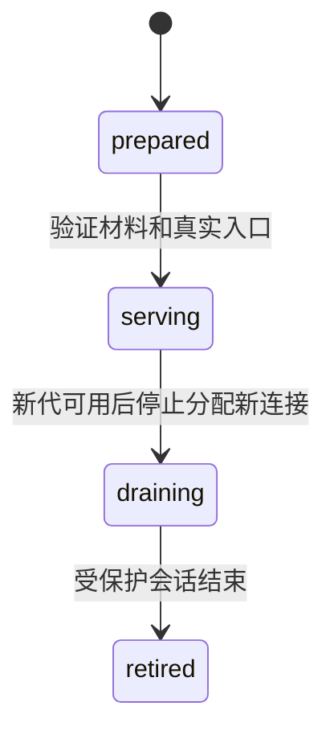
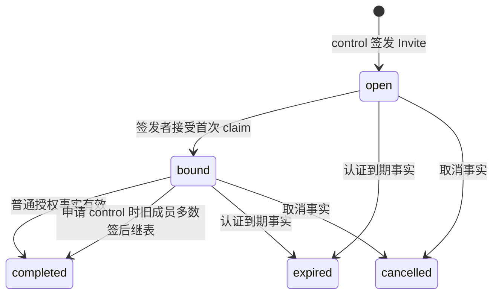
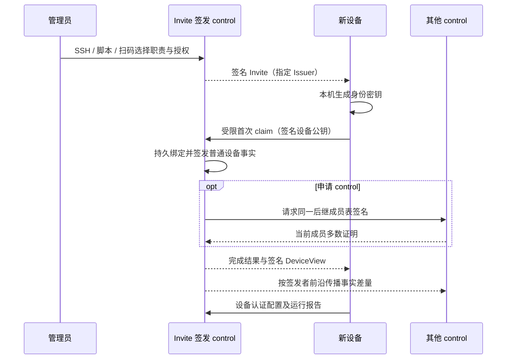

# Enrollment 与 Endpoint 核心模型

本文定义设备取得一次受限加入资格、绑定本机密钥、领取私有配置及使用服务入口的现行语义。
控制权威来自[控制权威模型](control-model.md)的签名 `Material`、`ControlConfig` 成员表链及确定性
`Projection`；本模型不另建共识、成员或设备授权的权威。具体实现状态与生产切换阻碍见
[实施状态](../progress.md)。

## 边界与不变量

1. 公网 Nginx 只提供伪装网站和明确认证为通用公开的不可变 `Artifact`；Invite、claim、resume、
   设备配置、报告和管理 API 均不在公网网站上暴露。
2. 只有当前有效的 `control` 能签发 Invite。签发本身就是加入批准，不再等待第二次管理员批准。
   普通设备加入、非 control 职责与授权变更和删除，由任一有效 control 签发；后来管理该设备的
   control 不必是 Invite 签发者。
3. SSH 直接添加、bootstrap 脚本和扫码只改变 Invite 的交付及安装方式，复用同一 claim、身份、
   授权、配置与报告协议。扫码发行、扫码客户端解码及签发者首次 claim 校验均要求签名 Invite 的职责恰好为 `access`；
   扫码不能夹带 `forward`、`internet_egress` 或 `control`。其他媒介只可授予目标平台实际支持的职责。
4. 首次 claim 只能交给签发该 Invite 的 control；转发到其他 control 不构成首次绑定。签发者失联时
   这张 Invite 不可用于首次加入，须等待其恢复，或由有效 control 取消、到期后重新签发。
完成加入后可从已同步该设备事实的其他有效 control 领取配置，设备也可由其他 control 管理。
5. `access`、`forward`、`internet_egress`、`control` 是可组合的职责；不存在 `server` 业务角色。
   `control` 资格只由多数签名的成员表决定，Invite 中的意向本身不赋予 control 权限。
6. `EndpointGeneration` 和签名 `DeviceView` 决定设备可使用什么；`Observation` 只说明在相应网络代
   最近实际发生了什么。授权不等于可达，暂时不可达也不修改授权。
7. 设备稳定 ID 在当前有效事实中唯一，与已有节点、设备或 control 成员 ID 冲突时拒绝，不以显示名、
   平台或职责覆盖旧身份。删除留下防复活事实；重新加入使用新的稳定身份和密钥。
8. 设备本机生成并保护私钥。现有身份、密钥、数据、认证 floor 与不可回退 latch 的前向切换未验证前，
   不把新文档语义静默解释为已部署字节的语义；正式入口拒绝旧格式和旧协议。

## 控制输入与五个核心概念

控制输入是已验证的成员表链和签名事实集合。`Projection` 从有效事实确定性重建，包含
`NetworkIntent`、设备授权、入口代和发布声明。仅看见 `Material` 字节、网络握手或报告，不代表该事实
已通过签发者资格、因果依赖和冲突规则校验。无多数连接时，有效 control 仍可签发普通加入与授权；
变更 `control` 资格才需要旧成员多数签名。单个 control 的本地接受不是全网即时一致的证明。

本模型自有概念为 `EndpointGeneration`、`Artifact`、`BootstrapCapability`、
`EnrollmentTransaction` 和 `DeviceView`；运行观测复用客户端模型的 `Observation`。
`Invite`、claim、resume、证书证明及响应包是这些概念的交付值或操作，不另有生命周期。

### `EndpointGeneration`

一个逻辑私有入口在某一代上的完整配置，以稳定入口 ID 和单调 generation 标识。规范值包括
承载 TLS listener 的 control 节点、客户端地址、校验名与 SPKI、已受保护的证书引用、允许的
bootstrap/device 模式、阶段及 serving 期间的偏好；可选 edge 只转发字节，不终止认证或处理 claim。
地址和入口声明表示可尝试，不能构造 `available`。



`prepared` 不供客户端使用，`serving` 可分配新连接，`draining` 仅允许已存在会话在明确期限内结束，
`retired` 不得再启动。轮换时可短暂有两个 serving 代；偏好来自签名事实，不建立额外状态机。
新代未通过证书、端到端访问和回读时，旧代不提前退休。轮换失败保持最后经验证的阶段和安全 floor。
公网映射落在非 control 节点时，edge 只做已有端口上的 TCP 转发；它不持有 control 或设备签名密钥，
不会因转发而获得 control 资格。外部 DNS provider、DNS-01 与 ACME 自动签发或续期不属于本模型。

### `Artifact`

`Artifact` 是内容摘要寻址的不可变通用制品，具有规范摘要、长度、媒体类型、签名引用和受众。
同一摘要的字节不可覆盖。只有签名事实明确标为通用公开的 Artifact 能经公网 Nginx 只读分发；
设备专属配置、token、身份材料、报告和含秘密的归档永远不能借名称伪装成 Artifact。

### `BootstrapCapability`

`BootstrapCapability` 是由签发 control 签名的 Invite 规范值，绑定网络身份及初始信任锚、
签发者稳定 ID 与验证键、签发时有效的成员表链证明、只允许访问签发者的引导入口、事务 ID、
精确的职责与 policy grants、交付媒介、到期界限和一次性防重放约束。设备通过操作者可信的
SSH、脚本或扫码交付固定网络锚，不相信 Invite 自称的新网络或新成员表。签名与成员证明均验证后，
才可向所列入口发起首次 claim。签发者首次绑定前还须确认自己在当前有效成员表中；已被撤销的
control 不能沿旧 Invite 新授予权限。

扫码的签名媒介字段必须是扫码，职责必须恰好是 `access`；二维码解码器、签发入口及
签发者首次 claim 服务端都校验，
不能仅靠 UI 隐藏其他选项。capability 可达性属于 Observation，网络失败不扩大其范围。
首次有效 claim 固定设备本机生成的公钥及稳定 request ID；同一请求重试只得到同一绑定结果，
其他密钥、职责或授权不可接管。同一 Invite 不能登记第二个身份。

### `EnrollmentTransaction`

`EnrollmentTransaction` 将一次 Invite 的签发、claim 绑定、完成或终止投影为同一个稳定事务 ID。
其可恢复状态由签名 Invite、签发者持久接受的绑定事实、完成/取消/到期事实以及必要的
`ControlConfig` 成员证书确定；不建立与这些事实并行的可写事务权威或第二份审批记录。
签发者在回答 claim 之前持久化精确的规范事实及一次性秘密引用；请求或响应丢失后继续同一事务。



`open` 尚无设备密钥绑定；`bound` 已绑定且不再重新生成身份。若申请 control，多数签名尚未齐备
时保持 `bound`，UI 从该请求和签名进度显示“等待成员签名”，不是临时成员。`completed` 表示所需授权事实有效，不表示设备运行
`ready`。终态 `expired`、`cancelled`、`rejected` 不产生新权限。若 expiry 已到，先形成可验证的
到期事实，再允许针对占用 ID 进行新操作；本机时钟或 UI 隐藏不能清除权威阻塞。

普通加入在签发者验证 claim 后，由它签发设备加入事实，并将设备授权和同一事务完成结果
一起持久接受，不再请求管理员二次批准。已有 `RuntimeKey` 仅是与该授权一次性绑定、受保护保存的
数据面凭据材料，**不是设备身份私钥**，不能替代设备本机 Ed25519 签名；它只经设备认证配置
交付，用于按设备、policy 和用途派生数据面凭据，不进入 Web、公开 Artifact、事件或错误日志。

若 SSH 或脚本 Invite 意向含 `control`，claim 先绑定精确设备公钥，然后向旧成员请求对**同一**
后继 `ControlConfig` 签名。签署者验证设备身份、Invite 意向、当前基础成员表和事实前沿，
自动签署或拒绝，不增加第二次人工审批。多数证书形成前，该设备只有已单独有效的非 control
职责，不能投票、签发 Invite 或管理网络；加入完成条件包含多数证书。分票时保持旧成员表，
事务可等待或取消。普通 `device.revoke` 不能绕过成员门禁删除 control 节点；整体删除必须由
同一多数证书携带节点墓碑，使非 control 职责及其依赖同时退出投影。

### `DeviceView`

`DeviceView` 是面向**一个**已认证设备的私有投影，包含设备身份、职责、授权的 Service/Policy、
Endpoint generation、可见的共享 `TransportResource` 与显式中继 `NetworkLink`、首跳资源、
业务探测目标、DNS overlay 与获授权的局域网虚拟前缀。它不包含其他设备的秘密或全网事件集，
也不成为独立治理权威。首跳不要求 `NetworkLink`；只有显式中继路径携带有序 LinkID。
同一 LinkID 当前链路和资源的规范字节派生 `link_spec_digest`；规范改变使旧观测回到 `unknown`。

交付 envelope 由当前有效 control 对完整 View 签名，附网络锚、从设备已固定成员表到当前成员表的
连续多数签名证明、签发者事实前沿和 View 摘要。客户端验证签发者在相应成员表中的资格、签名、
因果依赖、设备绑定、范围及本机已见事实的单调 floor；它拒绝遗漏已见撤权或倒退成员证明的视图。
首次固定的锚不能由响应包自称的新锚取代。验证通过后，设备原子保存信任绑定、完整 last-known-good
View、已见事实 floor、身份私钥引用及不可回退 latch。Linux 用受保护的本机存储，Windows 每个
profile 使用其 DPAPI 边界；错误新值不能覆盖旧 LKG。

签名 View 仅证明签发 control 当时已知的事实，**不能证明不存在尚未传来的撤权**。分区期间
另一 control 的撤权传播后，当前权限可能收缩；客户端收到后立刻提升本机 floor 并撤销对应运行投影。
离线 LKG 不会被远程改写，服务端仍应拒绝已知撤权身份的新配置、报告和连接。

具有 `forward` 或 `internet_egress` 职责的节点从同一 View 投影数据面连接、入站用户、ACL 与
下一跳；共享资源握手不能代替业务授权。仅获 `forward` 不得执行最终公网出网，仅获
`internet_egress` 不自动共享本地 LAN。私钥与服务端 secret 留在节点受保护本机配置，不进入 View。
运行时对资源、listener、ACL、实际进程及回程路径逐项回读后，才报告 `running`。

### `Observation`

`Observation` 的完整语义见[客户端运行时模型](../clients/client-runtime-model.md#observation-与可用性)。
本文只规定它由实际传输/业务动作产生并经设备认证私有通道报告，按设备、网络代、Service、
候选及有效期约束；状态为 `available`、`unavailable`、`unknown`。链路报告包含 LinkID 和当前
`link_spec_digest`，不同 WG/hy2 链路分别观测。共享资源握手或一个 HTTPS 目标成功，不证明另一条
链路或另一 Service 可用。缺失、过期和摘要不匹配回到 `unknown`，ICMP 不能填充业务成功。

## 私有入口与运行时

首次加入使用 Invite 指向签发者的受限 bootstrap tunnel。私有 TLS tunnel 校验证书 SPKI 与
独立 ALPN，bootstrap 模式验证完整 capability；已绑定设备使用设备 Ed25519 挑战签名及当前授权。
claim、resume、DeviceView 与 report 仅在这些认证后的私有连接内承载。加入后设备自动尝试签发者的
设备认证入口作首次管理、配置和报告入口；授权事实传播到其他有效 control 后，也可以使用它们的
相同认证服务。连接可以使用已有共享 WG、hy2 或私有 TLS 资源；没有专属 WG 接口或显式 `NetworkLink` 仍可领配置。
连接资源只提供承载，服务分别验证设备、control 成员和业务权限。所有已知数据入口失效时，
已加入设备仍可经当前 `EndpointGeneration` 的设备认证模式领取修复 View 并报告 `unknown`；
它不再次使用 Invite，也不开放新权限。该入口不可达时保持经验证 LKG 并记录本机不可达。

普通 access 的共享首跳、Direct/Auto/指定最终出口候选由 View 和客户端模型投影；有序中继
LinkID 只用于确实配置的中继邻接。forward 节点共享 LAN 时，View 仅向获授对应 Policy 的 access
下发虚拟前缀及固定网关候选；设备不能自行提交任意 CIDR。Linux 的 TUN、策略路由和 DNS 只在
[宿主网络安全记录](../incidents/2026-09-21-host-network-takeover.md)规定的隔离边界内运行，
不修改开发宿主初始 network namespace 或 LAN 路由器。

设备报告携带当前 View 摘要、所选候选、实际组件、节点职责对应的数据面运行回读、各链路真实结果
和 deployment readback。服务端逐项验证签名、设备授权、事实前沿、LinkID 与规范摘要；旧摘要的
报告不能将新连接标绿。观测记录可过期，不写入控制 `Material`。签名 release floor、实际快照和
rollout 记录不一致时只报告真实坐标，不补造 `rollout_verified`。

## 跨层同构

| 概念 | Domain | Wire | Persistent | Runtime / UI |
|---|---|---|---|---|
| 控制输入 | 成员链、有效 `Material`、`Projection` | 规范签名事实与证明 | 控制模型唯一权威 | 只读投影；Web 显示本地已见前沿与冲突 |
| `EndpointGeneration` | 稳定入口与生命周期 | 规范 generation 声明 | 签名事实；缓存可重建 | listener、入口候选；UI 分列期望与观测 |
| `Artifact` | 内容摘要与受众 | manifest、摘要寻址字节 | 不可变内容与签名声明 | 校验后下载；UI 显示签名和发布位置 |
| `BootstrapCapability` | 签发者限定的单次加入权限 | 唯一规范签名 Invite | 规范签发事实及事务约束 | 首次 claim 校验；UI 只显示摘要与期限 |
| `EnrollmentTransaction` | 同一事务的状态投影 | claim/resume 及签名响应 | 可重建的签发、绑定与终结事实 | 一行状态，不另存审批权威 |
| `DeviceView` | 一个设备的可消费配置 | 完整签名 View 与成员证明 | 服务端可重建；客户端原子保存 LKG/floor | 候选和运行输入；UI 仅显示脱敏摘要 |
| `Observation` | 限时实际结果 | 设备签名 report | 独立可过期记录 | 选路与 `available/unavailable/unknown` |

权威领域值 `D` 的规范 wire `W` 及持久值 `P` 满足：

```text
decode(encode(D)) = D
load(save(D))      = D
decode(W)          = error，若 W 未知、歧义或非规范
```

`DeviceView = Project(ValidMaterial, ControlConfig, DeviceIdentity)`；
`AuthorizedCandidates = Project(DeviceView)`；
`SelectedCandidate = Select(AuthorizedCandidates, FreshObservations, Preference)`；
`UI = Present(Projection, Transactions, DeviceViews, Observations)`。
这些箭头均为单向投影；UI 颜色、运行时连接或本机缓存不能写回控制事实。

## 正常业务链



1. control 签发固定职责、policy 和首次入口的 Invite；扫码仅签 `access`。
2. 设备验证可信网络锚、签发者及 Invite，生成密钥并只向签发者 claim；issuer 在响应前持久绑定。
3. 普通加入由 issuer 单签并本地接受；申请 `control` 时自动收集旧成员多数证书，形成前不完成
   control 加入。其他 control 后续按事实差量同步，并可独立管理该普通设备。
4. 设备验证签名 View、成员链及已见前沿，原子保存信任和 LKG；运行时按授权范围建立首跳与
   中继候选，进行最少真实探测并报告。无匹配业务探测目标仍可加入，业务状态为 `unknown`。
5. 响应丢失时从签发者 resume 同一事务；完成后可从任一有效 control 读取当前设备配置。

## 失败与恢复

- **签发者失联**：尚未首次 claim 的 Invite 等待签发者恢复，或取消/到期后由另一有效 control 重签；
  不转移首次绑定。已加入设备可使用其他有效 control 的认证配置入口。
- **control 多数暂缺**：普通加入与授权仍可由有效签发者本地接受；申请 `control` 的事务保持
  `bound`，不得提前赋权。已加入设备可使用经验证 LKG。
- **签发者后来被撤销**：未完成的 Invite 不再赋予首次加入权；已有效事实按成员链截止前沿验证，
  客户端拒绝用自称的新成员表绕过证明。
- **请求丢失或重复**：签发者从已持久事实恢复相同 request ID、密钥绑定与结果；不同公钥或扩大
  scope 拒绝，不重生随机材料或第二个身份。
- **成员证明不连续、View 签名错误、已见事实被遗漏或 floor 倒退**：拒绝新 View，保留完整旧 LKG，
  不从 UI、缓存或证书名称补造信任。
- **撤权晚到**：权限收缩并撤销相关连接、路由、DNS 和候选；离线旧 LKG 不能证明当前仍有权。
- **入口/资源/链路不可达**：只更新相应 Observation；一个资源成功不使全部引用链路变绿。
  设备可用其认证恢复入口领修复 View，入口自身不可达则仅保留本机 LKG。
- **轮换或证书验证失败**：新 generation 不进入 serving，旧代保持已验证状态；不自动启动外部
  DNS provider 或 ACME。

## 最小必要测试

1. 规范 Invite、事务事实、入口、Artifact 和 DeviceView 完成 wire/持久往返；未知、歧义及旧格式拒绝。
2. SSH、脚本、扫码走同一 claim 和 report；扫码夹带其他职责在发行和客户端解码处拒绝；首次 claim
   交非签发者失败，完成后其他 control 可管理并供给 View。
3. Invite → 本机生成密钥 → issuer 持久绑定 → 普通授权完成；无二次审批。响应丢失、重启、重复
   resume 得到同一身份和结果，换密钥接管失败。
4. 同一次 SSH/脚本加入申请 control，绑定后自动取得 N=1/2/3 所需多数签名；未形成证书时
   无临时 control 权限，分票保持旧成员表。
5. 首次尚无 `NetworkLink` 仍能取得配置和共享数据入口；同一节点对 WG/hy2 LinkID 独立回读，
   规范变化使旧观测失效；无业务目标为 `unknown`。
6. 轮换依次经历 prepared、并行 serving、draining、retired；公网 edge 只做字节转发，
   公网 Nginx 不出现设备专属路径。
7. 客户端验证连续成员证明、签名 View、设备绑定和 floor 后原子保存；证明缺失、晚到撤权或
   新值损坏不覆盖 LKG。forward/出网节点的实际进程与 ACL 回读不由握手成功代替。

## 禁止恢复

- 旧 `CertifiedHead`、Raft/QC、stable→joint→stable 或历史材料解码作为现行加入前提；
- 签发后再次要求管理员批准、由非签发者首次绑定或扫码授予超出 `access` 的职责；
- `server` 业务角色、每加入一节点就新建 WG 接口或强制生成 `NetworkLink`；
- capability、claim、receipt、approval、DeviceView 各自维护业务权威或第二个状态机；
- 公网设备配置/报告路由、旧协议 fallback、从传输握手或 UI 绿灯推断业务可用；
- 用外部 DNS provider、ACME、证书续期或宿主初始 netns 变更来“修复”加入失败。
