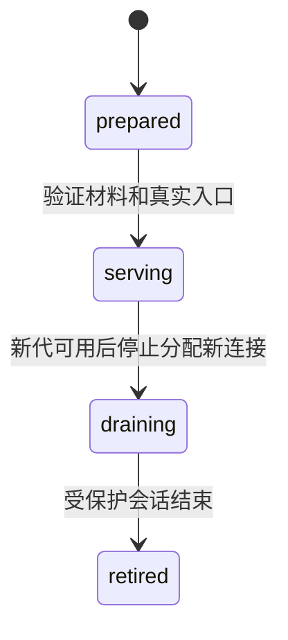
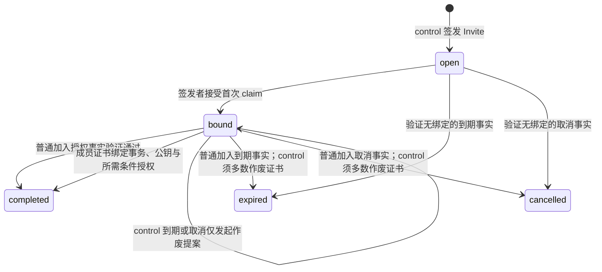
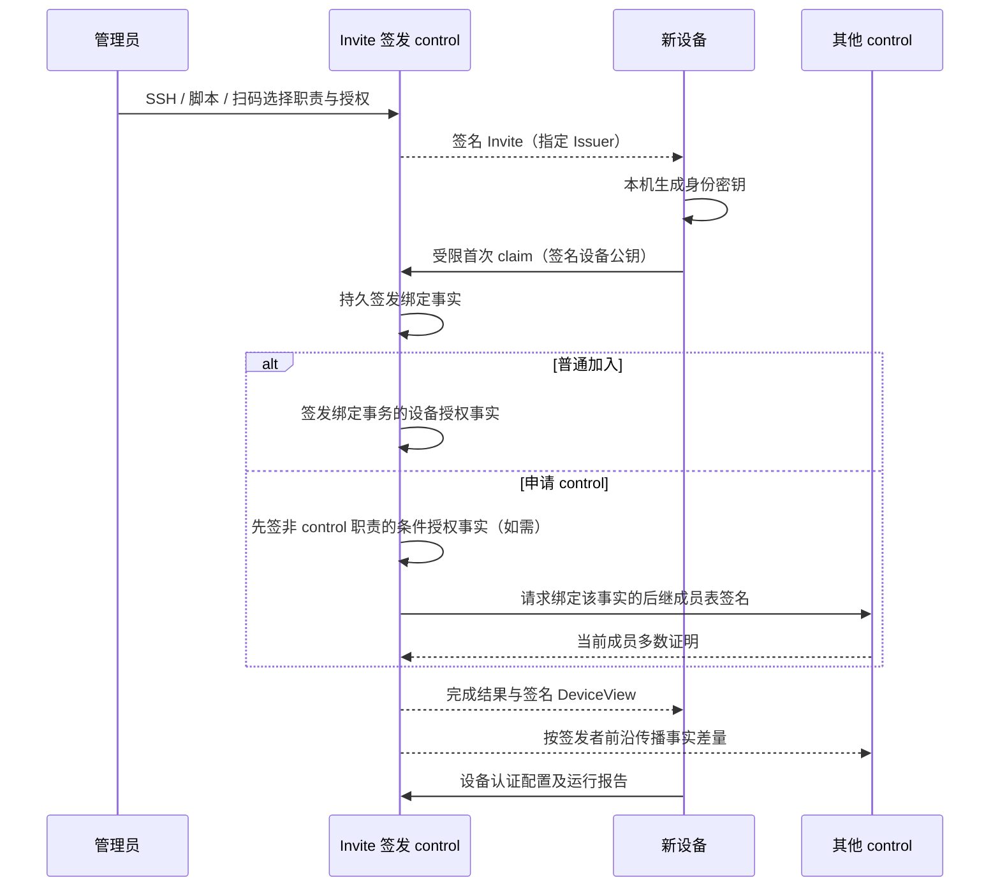

# Enrollment 与 Endpoint 核心模型

[设计入口](../README.md) · [控制权威模型](control-model.md) · [唯一现行契约](current-contract.md) · [实施状态](../progress.md)

本文定义设备取得一次受限加入资格、绑定本机密钥、领取私有配置及使用服务入口的现行语义。
控制权威来自[控制权威模型](control-model.md)的签名 `Material`、`ControlConfig` 成员表链及确定性
`Projection`；本模型不另建共识、成员或设备授权的权威。具体实现状态与生产切换阻碍见
[实施状态](../progress.md)。

## 边界与不变量

1. 公网 Nginx 只提供伪装网站和明确认证为通用公开的不可变 `Artifact`；Invite、claim、resume、
   设备配置、报告和管理 API 均不在公网网站上暴露。
2. 只有当前有效的 `control` 能签发 Invite。签发本身就是加入批准，不再等待第二次管理员批准。
   普通设备加入、非 control 职责与授权变更和删除，由任一有效 control 签发；后来管理该设备的
   control 不必是 Invite 签发者。
3. SSH 直接添加、bootstrap 脚本和扫码只改变 Invite 的交付及安装方式，复用同一 claim、身份、
   授权、配置与报告协议。扫码发行、扫码客户端解码及签发者首次 claim 校验均要求签名 Invite 的职责恰好为 `access`；
   扫码不能夹带 `forward`、`internet_egress` 或 `control`。其他媒介只可授予目标平台实际支持的职责。
4. 首次 claim 只能交给签发该 Invite 的 control；转发到其他 control 不构成首次绑定。签发者失联时
   这张 Invite 不可用于首次加入；可等待其恢复，或由有效 control 对新的稳定 ID 重签。
   原目标 ID 只有按下述事务终结规则释放后才可复用。
   完成加入后可从已同步该设备事实的其他有效 control 领取配置，设备也可由其他 control 管理。
5. `access`、`forward`、`internet_egress`、`control` 是可组合的职责；不存在 `server` 业务角色。
   `control` 资格只由多数签名的成员表决定，Invite 中的意向本身不赋予 control 权限。
6. `EndpointGeneration` 和签名 `DeviceView` 决定设备可使用什么；`Observation` 只说明在相应网络代
   最近实际发生了什么。授权不等于可达，暂时不可达也不修改授权。
7. 设备稳定 ID 由 Invite 指定，跨事务保持唯一：签发者拒绝与已知节点、设备或 control 成员 ID
   冲突的 Invite；不同 Invite/绑定即使各以事务 ID 为事实目标，仍按其占用的设备 ID 检查唯一性。
   未终结事务与已完成设备身份重复占用同一 ID 时，相关授权都不投影。
   分区中并发产生的同 ID 加入按此跨事务唯一性规则失败关闭；若已有 control 增员证书，该证书仍留在成员链，
   但冲突 ID 的设备认证和运行授权暂停，须经成员门禁处理错误成员。不以显示名、平台或职责覆盖旧身份。
   删除留下防复活事实；重新加入使用新的稳定身份和密钥。
8. 设备本机生成并保护私钥。现有身份、密钥、数据、认证 floor 与不可回退 latch 的前向切换未验证前，
   不把新文档语义静默解释为已部署字节的语义；正式入口拒绝旧格式和旧协议。

## 控制输入与五个核心概念

控制输入是已验证的成员表链和签名事实集合。`Projection` 从有效事实确定性重建，包含
`NetworkIntent`、设备授权、管理员证书名单和入口代；发布记录由发布签名密钥签署，不是控制事实，
`Projection` 只按摘要引用期望组件。仅看见 `Material` 字节、网络握手或报告，不代表该事实
已通过签发者资格、因果依赖和冲突规则校验。无多数连接时，有效 control 仍可签发普通加入与授权；
变更 `control` 资格才需要旧成员多数签名。单个 control 的本地接受不是全网即时一致的证明。

本模型自有概念为 `EndpointGeneration`、`Artifact`、`BootstrapCapability`、
`EnrollmentTransaction` 和 `DeviceView`；运行观测复用客户端模型的 `Observation`。
`Invite`、claim、resume、证书证明及响应包是这些概念的交付值或操作，不另有生命周期。

删除任何一个概念都会破坏明确需求：没有 `EndpointGeneration`，入口地址、证书与 SPKI 无法原子轮换，
设备也无法区分新旧入口；没有 `Artifact`，公网 Nginx 无法校验哪些制品可以公开分发；没有
`BootstrapCapability`，首次加入缺少限定签发者、职责与一次性的可验证授权，“扫码只许 access”无处表达；
没有 `EnrollmentTransaction`，claim 请求或响应丢失后无法恢复同一绑定，会产生第二身份；没有
`DeviceView`，设备只能拿全网事实或由各入口各自拼配置，无法做按设备签名的 LKG 与 floor 校验。
它们都不是新的治理权威：`EndpointGeneration` 与 Invite 生命周期是控制事实的类型，
`EnrollmentTransaction` 与 `DeviceView` 是 `Projection` 的派生值，`Artifact` 由发布签名负责。

### `EndpointGeneration`

一个逻辑私有入口在某一代上的完整配置，以稳定入口 ID 和单调 generation 标识。规范值包括
承载 TLS listener 的 control 节点、客户端地址、校验名与 SPKI、已受保护的证书引用、允许的
bootstrap、device 与 web 模式、阶段及 serving 期间的偏好；可选 edge 只转发字节，不终止认证或处理 claim。
同一入口 ID 固定承载 control，新代与阶段推进只由该 control 签发，代序号因此单调；换承载节点使用新入口 ID。
承载 control 失去 control 资格（卸任、强制撤销或整体删除）时，它承载的全部入口随该后继证书一并退出投影：
已验证该证书的设备不再把它们当作入口候选，`control.loom` 的新投影不再解析到它们，诚实运行时关闭
已有会话且承载节点停止相应 listener；证书不能强制失格节点实际停服，也不能终止尚未获知证书的会话。
不需要、也不接受它再为这些入口发布阶段变化。换键不影响入口。
处于 serving 的 web 模式代构成 `control.loom` 的解析结果。地址和入口声明表示可尝试，不能构造 `available`。


```mermaid
stateDiagram-v2
    [*] --> prepared
    prepared --> serving: 验证材料和真实入口
    serving --> draining: 新代可用后停止分配新连接
    draining --> retired: 受保护会话结束
```

`prepared` 不供普通客户端选择；仅允许操作者以候选地址和预定校验名定向预检，且不发布到设备候选或 `control.loom` DNS。`serving` 可分配新连接，`draining` 仅允许已存在会话在明确期限内结束，
`retired` 不得再启动。轮换时可短暂有两个 serving 代；偏好来自签名事实，不建立额外状态机。
新代未通过证书、端到端访问和回读时，旧代不提前退休。轮换失败保持最后经验证的阶段和安全 floor。
公网映射落在非 control 节点时，edge 只做已有端口上的 TCP 转发；它不持有 control 或设备签名密钥，
不会因转发而获得 control 资格。外部 DNS provider、DNS-01 与 ACME 自动签发或续期不属于本模型。

web 模式的网站叶证书到期前，操作者使用独立离线保管的网站根私钥手工续签。承载 control 在本机生成新叶私钥与 CSR，
以已认证的成员身份将 CSR 摘要、节点 ID、入口 ID 和当前成员链证明绑定交给操作者。离线签发时验证 CSR 签名、
公钥、成员资格及目标入口；签发器按固定模板生成扩展，不照抄 CSR 请求：SAN 仅含 `control.loom`、
EKU 仅 `serverAuth`、`CA=false`，KeyUsage 不含 `keyCertSign`。叶私钥留在承载 control，
只有证书链经受保护渠道返回。

承载者核对链、名称、用途、有效期与本地私钥匹配后，以新证书引用建立下一 `EndpointGeneration`。
在 prepared 阶段用候选地址及 SNI `control.loom` 定向预检 TLS 与 Web；通过后才签发 serving 阶段，
再用目标浏览器从正式入口回读，成功后旧代转为 draining、retired。正式回读失败则让新代退出服务，
旧代证书尚未过期时继续 serving；证书到期后，已有 serving 声明也不能使新连接通过 TLS，
须失败关闭并在运行观测、本机 CLI 中显示到期故障，不按本机时钟改写签名阶段或 DNS 投影。
根证书不变则浏览器无需重导入；根轮换另需受保护信任锚迁移。

对每个 serving web 叶证书，用已验证的 `NotAfter` 和调用方注入的 UTC 时间计算剩余有效期。
剩余时间进入固定 30 天窗口时，admin 页面与本机 `control inspect` 显示入口、到期 UTC 时间和剩余时间并提醒续签；
过期显示故障，证书缺失或无法验证显示 `unknown`。该诊断不写控制事实，也不按时钟改变签名阶段或 DNS 投影。

同一入口若还承担 bootstrap 或 device 模式，新代须对这些模式分别预检，且不能悄悄改变旧代的校验名或 SPKI。
新 Invite 不得绑定会在 Invite 有效期内到期的旧代证书；已发的 Invite 仍固定旧代，计划轮换时旧代在证书有效期内
保留至这些事务完成或终结。若旧代先过期，剩余 Invite 失败关闭，须按原事务终结规则处理后重新签发，
不能把旧 Invite 静默指向新代。

### `Artifact`

`Artifact` 是内容摘要寻址的不可变通用制品，具有规范摘要、长度、媒体类型、签名引用和受众，
由发布签名密钥签署的发布记录声明，不是控制事实。同一摘要的字节不可覆盖。只有发布签名明确标为通用
公开受众的 Artifact 能经公网 Nginx 只读分发；设备专属配置、token、身份材料、报告和含秘密的归档永远
不能借名称伪装成 Artifact。

### `BootstrapCapability`

`BootstrapCapability` 是由签发 control 签名的 Invite 规范值，字段为：网络 ID 与 genesis 摘要
（初始信任锚）、签发者稳定 ID 与验证键、签发时有效的成员表链证明、只允许访问签发者的引导入口
（其 `EndpointGeneration` 身份）、事务 ID（即邀请 ID，`EnrollmentTransaction` 以它为稳定 ID）、
目标设备稳定 ID、显示名与目标平台、精确的职责与 policy grants、交付媒介、到期时间和一次性防重放约束。
职责必须是目标平台实际支持的子集，签发与 claim 时都校验，claim 声明的平台必须与 Invite 一致。
设备通过操作者可信的 SSH、脚本或扫码交付固定网络锚，不相信 Invite 自称的新网络或新成员表。
签名与成员证明均验证后，才可向所列入口发起首次 claim。签发者首次绑定前还须确认自己在当前有效
成员表中；已被撤销的 control 不能沿旧 Invite 新授予权限。

扫码的签名媒介字段必须是扫码，职责必须恰好是 `access`；二维码解码器、签发入口及
签发者首次 claim 服务端都校验，不能仅靠 UI 隐藏其他选项。其他媒介的 Invite 重新编码成二维码时，
签名媒介字段不是扫码，解码器拒绝；媒介字段只约束诚实客户端，Invite 本身须按其职责范围保护。
首次加入前的入口连接结果只是本机引导诊断，不是经设备认证的 `Observation`，网络失败不扩大 capability
范围。首次有效 claim 固定设备本机生成的公钥及稳定 request ID，同一事务只接受一个 request ID；
同一请求重试只得到同一绑定结果，
其他密钥、职责或授权不可接管。同一 Invite 不能登记第二个身份。

### `EnrollmentTransaction`

`EnrollmentTransaction` 将一次 Invite 的签发、claim 绑定、完成或终止投影为同一个稳定事务 ID。
其可恢复状态由签名 Invite、签发者持久接受的绑定事实、普通加入的设备授权事实、取消/到期事实及申请
`control` 时的 `ControlConfig` 成员证书确定；不建立与这些事实并行的可写事务权威或第二份审批记录。
claim 绑定事实只能由 Invite 签发者签发，须在因果依赖中引用该 Invite 事实 ID，并固定请求 ID、设备
公钥与一次性约束；普通加入的设备授权事实也只能由同一签发者签发，须依赖绑定事实，并固定事务 ID、
设备 ID、公钥、准确职责与 grants。普通事务在该授权事实通过验证后直接投影为 `completed`，没有独立
完成事实。申请 control 且包含其他职责时，签发者或已验证绑定的其他有效 control 先签对应的条件授权
事实（含所需 `RuntimeKey`），其因果依赖必须直接包含绑定事实 ID，因而可追溯到 Invite；该事实在成员证书形成前不赋权；证书须绑定 Invite/事务 ID、设备 ID、绑定
公钥与条件授权事实 ID，签署者验证它与 Invite 和绑定精确一致。纯 control 的条件授权 ID 为空。
control 完成状态直接由已验证的旧成员多数后继证书与被引用的授权事实投影，不等待事后单签完成事实。
缺少引用、引用不符或由其他 control 签发的绑定/普通加入授权事实一律拒绝；普通事实不能伪造 control 完成。
签发者在回答 claim 之前持久化精确的规范事实及一次性秘密引用；请求或响应丢失后继续同一事务。


```mermaid
stateDiagram-v2
    [*] --> open: control 签发 Invite
    open --> bound: 签发者接受首次 claim
    bound --> completed: 普通加入授权事实验证通过
    bound --> completed: 成员证书绑定事务、公钥与所需条件授权
    open --> expired: 验证无绑定的到期事实
    open --> cancelled: 验证无绑定的取消事实
    bound --> bound: control 到期或取消仅发起作废提案
    bound --> expired: 普通加入到期事实；control 须多数作废证书
    bound --> cancelled: 普通加入取消事实；control 须多数作废证书
```

`open` 尚无设备密钥绑定；`bound` 已绑定且不再重新生成身份。若申请 control，多数签名尚未齐备
时保持 `bound`，UI 从该请求和签名进度显示“等待成员签名”，不是临时成员。`completed` 表示加入所需的授权事实与成员证书（如需）已经验证；当前运行授权仍受撤权和冲突投影约束，不表示设备运行
`ready`。后续撤权或冲突收缩当前授权，不倒写完成证据。终态 `expired`、`cancelled` 不产生新权限。未绑定的 control 意向 Invite 只接受签发者在自身连续
事实序列中签发、引用该 Invite 且先于任何绑定的取消/到期事实作为终结；此后同一事务的绑定无效。
普通 Invite 只在完成前按签发者引用该 Invite 的有效终结事实处理。已绑定的 control 意向 Invite
可由任一有效 control 提出取消或到期作废提案，签发者失联不阻止请求；单签取消/到期事实若存在也只算请求。
必须由旧成员多数证书固定该 Invite/事务 ID 与取消或到期原因，才可进入 `cancelled`/`expired` 并释放
目标设备 ID；到期提案由签署者核对 Invite 的签名期限。即使绑定后尚未发出成员提案，
仍须按同一规则作废。较高轮若必须继承原加入提案，即使取消请求或期限已到，仍可先形成加入证书；原事务由证书完成，
随后另行发起成员移除。作废证书形成前保持待决，不释放 ID。Invite 的签名期限约束首次 claim
及首次合法投票，不否决按轮次规则继承的既有投票；后续新加入事务仍须重新验证期限。
Invite 在可验证的取消/到期终态前持续占用目标设备 ID；完成后由设备身份继续占用该 ID。
本机时钟、普通取消/到期请求或 UI 隐藏都不能清除已绑定 control 加入的阻塞。

普通加入在签发者验证 claim 后，由它签发并持久接受一份绑定该事务的设备授权事实；完成状态由该事实
投影，不再请求管理员二次批准。设备授权携带签发者生成的 `RuntimeKey`：它是按设备、policy
和用途派生数据面凭据的根密钥，**不是设备身份私钥**，不能替代设备本机 Ed25519 签名。`RuntimeKey`
只保存在控制事实中并在 control 间加密同步，不下发给任何设备或节点；DeviceView 只携带由它派生的凭据，
它也不进入 Web、公开 Artifact、事件或错误日志。

若 SSH 或脚本 Invite 意向含 `control`，claim 先绑定精确设备公钥；组合职责在提案前再签条件授权事实，
仅在成员证书形成后投影。然后按[控制模型](control-model.md) §2.2 的轮次规则请求旧成员对绑定该 Invite/
事务 ID、设备 ID、公钥与所需条件授权事实 ID 的后继 `ControlConfig` 签名。签署者验证
设备身份、Invite 意向、条件授权事实、当前基础成员表与本机轮次承诺，自动签署或拒绝，不增加第二次人工审批；
因此多数门禁不防御单个被攻破的 control，见[控制模型](control-model.md#5-control-成员生命周期)。
多数证书形成前，该设备的任何职责
都不生效，不交付 View，不能投票、签发 Invite 或管理网络；多数证书形成后事务直接完成，其他有效
control 可交付证书与 View。分票或成员失联时旧成员表保持有效，发起者在更高轮次继续。绑定后的
取消或到期只请求按同一轮次规则安全作废该 Invite/事务 ID，
同样需要旧表多数在线；作废证书形成前事务保持待决。若最高轮可能项是原加入，须继承并可完成该加入，
然后另行发起成员移除；请求不能让失联者阻塞所有后继。
普通 `device.revoke` 不能绕过成员门禁删除 control 节点；整体删除必须由同一多数证书携带节点墓碑，
使非 control 职责及其依赖同时退出投影。

### `DeviceView`

`DeviceView` 是面向**一个**已认证设备的私有投影，包含设备身份、职责、授权的 Service/Policy、
Endpoint generation、可见的共享 `TransportResource` 与显式中继 `NetworkLink`、首跳资源、
业务探测目标、DNS overlay 与获授权的局域网虚拟前缀。它不包含其他设备的秘密或全网事件集，
也不成为独立治理权威。首跳不要求 `NetworkLink`；只有显式中继路径携带有序 LinkID。
同一 LinkID 当前链路和资源的规范字节派生 `link_spec_digest`；规范改变使旧观测回到 `unknown`。

交付 envelope 由当前有效 control 对完整 View 签名，附网络锚、从设备已固定成员表到当前成员表的
连续多数签名证明、签发者事实前沿和 View 摘要。客户端验证签发者在相应成员表中的资格、签名、
因果依赖、设备绑定、范围及本机已见事实的验收前沿；除连续多数证书明确封存的验证键外，前沿
不得回退，成员证明也不得倒退。封存证书只允许将**该键**的新 View 验收前沿降至证书封存序列；
原已认证高水位与不可回退 latch 仍保存；验收失败时保留旧 LKG，成功时原子替换唯一 LKG，其他键与现网全局认证 floor 不回退。
留任 control 对自身证书验收前已持久接受、可取得原始事实及前序的超限撤权自动重签为引用原事实的
后继事实，并在本机运行授权放宽或交付新 View 前验证其效果。若原始事实全失，不能由 View 或高水位重建；设备仍可凭证书接受按封存点计算的新 View，
已发现的授权差异标记待管理员复核，未知遗漏可能导致复权，不能宣称已完整保全所有撤权。
首次固定的锚不能由响应包自称的新锚取代。验证通过后，设备原子保存信任绑定、完整 last-known-good
View、原已见事实高水位、身份私钥引用及不可回退 latch。Linux 用受保护的本机存储，Android 每个 profile
使用按本机 ID 隔离的应用私有存储，Windows 每个 profile 使用其 DPAPI 边界；错误新值不能覆盖旧 LKG。

签名 View 仅证明签发 control 当时已知的事实，**不能证明不存在尚未传来的撤权**。分区期间
另一 control 的撤权传播后，当前权限可能收缩；客户端收到后立刻提升本机 floor 并撤销对应运行投影。
离线 LKG 不会被远程改写，服务端仍应拒绝已知撤权身份的新配置、报告和连接。

具有 `forward` 或 `internet_egress` 职责的节点从同一 View 投影数据面连接、入站用户（仅对本节点
有效的派生凭据）、ACL 与下一跳；共享资源握手不能代替业务授权。仅获 `forward` 不得执行最终公网出网，仅获
`internet_egress` 不自动共享本地 LAN。私钥与服务端 secret 留在节点受保护本机配置，不进入 View。
运行时对资源、listener、ACL、实际进程及回程路径逐项回读后，才报告 `running`。

### `Observation`

`Observation` 的完整语义见[客户端运行时模型](../clients/client-runtime-model.md#observation-与可用性)。
本文只规定它由实际传输/业务动作产生并经设备认证私有通道报告，按设备、网络代、Service、
候选及有效期约束；状态为 `available`、`unavailable`、`unknown`。链路报告包含 LinkID 和当前
`link_spec_digest`，不同 WG/hy2 链路分别观测。共享资源握手或一个 HTTPS 目标成功，不证明另一条
链路或另一 Service 可用。缺失、过期和摘要不匹配回到 `unknown`，ICMP 不能填充业务成功。首次绑定前
的引导连接诊断不作为设备签名 report 进入 `Observation`。

## 私有入口与运行时

首次加入使用 Invite 指向签发者的受限 bootstrap tunnel。私有 TLS tunnel 校验证书 SPKI 与
独立 ALPN，bootstrap 模式验证完整 capability；已绑定设备使用设备 Ed25519 挑战签名及当前授权。
claim、resume、DeviceView 与 report 仅在这些认证后的私有连接内承载。加入后设备自动尝试签发者的
设备认证入口作首次管理、配置和报告入口；绑定、授权事实（如需）及成员证书（如需）传播到其他有效 control 后，也可以使用它们的
相同认证服务。连接可以使用已有共享 WG、hy2 或私有 TLS 资源；没有专属 WG 接口或显式 `NetworkLink` 仍可领配置。
连接资源只提供承载，服务分别验证设备、control 成员和业务权限。所有已知数据入口失效时，
已加入设备仍可经当前 `EndpointGeneration` 的设备认证模式领取修复 View 并报告 `unknown`；
它不再次使用 Invite，也不开放新权限。该入口不可达时保持经验证 LKG 并记录本机不可达。

普通 access 的共享首跳、Direct/Auto/指定最终出口候选由 View 和客户端模型投影；有序中继
LinkID 只用于确实配置的中继邻接。forward 节点共享 LAN 时，View 仅向获授对应 Policy 的 access
下发虚拟前缀及固定网关候选；设备不能自行提交任意 CIDR。Linux 的 TUN、策略路由和 DNS 只在
[宿主网络安全记录](../incidents/2026-09-21-host-network-takeover.md)规定的隔离边界内运行，
不修改开发宿主初始 network namespace 或 LAN 路由器。

设备报告携带当前 View 摘要、所选候选、实际运行组件的发布坐标（制品摘要与版本）、节点职责对应的
数据面运行回读和各链路真实结果。服务端逐项验证签名、设备授权、事实前沿、LinkID 与规范摘要；旧摘要的
报告不能将新连接标绿。观测记录可过期，不写入控制 `Material`。实际组件与 `Projection` 引用的期望组件
或发布记录规定的最低版本不一致时，只如实报告实际坐标与不一致，不能标记为已完成部署。

## 跨层同构

| 概念 | Domain | Wire | Persistent | Runtime / UI |
|---|---|---|---|---|
| 控制输入 | 成员链、有效 `Material`、`Projection` | 规范签名事实与证明 | 控制模型唯一权威 | 只读投影；Web 显示本地已见前沿与冲突 |
| `EndpointGeneration` | 稳定入口与生命周期 | 规范 generation 声明 | 签名事实；缓存可重建 | listener、入口候选与 `control.loom` 解析；UI 分列期望与观测 |
| `Artifact` | 内容摘要与受众 | manifest、摘要寻址字节 | 不可变内容与发布签名，不是控制事实 | 校验后下载；UI 显示签名和发布位置 |
| `BootstrapCapability` | 签发者限定的单次加入权限 | 唯一规范签名 Invite | 规范签发事实及事务约束 | 首次 claim 校验；UI 只显示摘要与期限 |
| `EnrollmentTransaction` | 同一事务的状态投影 | claim/resume、签名响应及成员证明 | 可重建的签发、签发者绑定/普通授权、终结事实与 control 成员证书 | 一行状态，不另存审批权威 |
| `DeviceView` | 一个设备的可消费配置 | 完整签名 View 与成员证明 | 服务端可重建；客户端原子保存 LKG/floor | 候选和运行输入；UI 仅显示脱敏摘要 |
| `Observation` | 限时实际结果 | 设备签名 report | 独立可过期记录 | 选路与 `available/unavailable/unknown` |

`EndpointGeneration`、`BootstrapCapability`、`Artifact` 与 `DeviceView` 的 wire 与持久字节按
[唯一现行契约](current-contract.md#往返与拒绝)可逆往返；`EnrollmentTransaction` 状态、运行时与 UI
只是单向投影：

```text
DeviceView           = ProjectDevice(Projection, DeviceIdentity)
AuthorizedCandidates = Project(DeviceView)
SelectedCandidate    = Select(AuthorizedCandidates, FreshObservations, Preference)
```

其中 `Projection` 按[控制模型](control-model.md)计算，DeviceView 由某个有效 control 签名交付；Web 页面按
[控制面 Web 投影](../clients/web-ui-projection.md)生成。这些箭头均为单向投影；UI 颜色、运行时连接或本机
缓存不能写回控制事实。

## 正常业务链


```mermaid
sequenceDiagram
    participant Admin as 管理员
    participant Issuer as Invite 签发 control
    participant Device as 新设备
    participant Peers as 其他 control
    Admin->>Issuer: SSH / 脚本 / 扫码选择职责与授权
    Issuer-->>Device: 签名 Invite（指定 Issuer）
    Device->>Device: 本机生成身份密钥
    Device->>Issuer: 受限首次 claim（签名设备公钥）
    Issuer->>Issuer: 持久签发绑定事实
    alt 普通加入
        Issuer->>Issuer: 签发绑定事务的设备授权事实
    else 申请 control
        Issuer->>Issuer: 先签非 control 职责的条件授权事实（如需）
        Issuer->>Peers: 请求绑定该事实的后继成员表签名
        Peers-->>Issuer: 当前成员多数证明
    end
    Issuer-->>Device: 完成结果与签名 DeviceView
    Issuer-->>Peers: 按签发者前沿传播事实差量
    Device->>Issuer: 设备认证配置及运行报告
```

1. control 签发固定职责、policy 和首次入口的 Invite；扫码仅签 `access`。
2. 设备验证可信网络锚、签发者及 Invite，生成密钥并只向签发者 claim；issuer 在响应前持久绑定。
3. 普通加入由 issuer 单签设备授权事实并本地接受；申请 `control` 时先签所需条件授权事实，再按轮次
   自动收集旧成员多数证书。证书形成前该设备任何职责都不生效，形成后由证书与所引事实直接完成事务。
   其他 control 后续按事实差量同步，并可独立
   管理该普通设备。
4. 设备验证签名 View、成员链及已见前沿，原子保存信任和 LKG；运行时按授权范围建立首跳与
   中继候选，进行最少真实探测并报告。无匹配业务探测目标仍可加入，业务状态为 `unknown`。
5. 响应丢失时从签发者 resume 同一事务；完成后可从任一有效 control 读取当前设备配置。

## 失败与恢复

- **签发者失联**：尚未首次 claim 的 Invite 等待签发者恢复；其他有效 control 可使用新稳定 ID 重签；
  原 ID 只有按事务终结规则释放后才可复用，不转移首次绑定。已加入设备可使用其他有效 control 的
  认证配置入口；申请 control 的绑定已成立且成员证书已形成时，其他有效 control 可交付该证明与 View。
- **control 多数暂缺**：普通加入与授权仍可由有效签发者本地接受；申请 `control` 的事务保持
  `bound`，不得提前赋权。已加入设备可使用经验证 LKG。
- **签发者后来被撤销**：尚未 claim 的 Invite 不再赋予首次加入权；已有效事实按其签发键的封存序列
  验证，已形成的 control 加入证书直接决定事务完成，其他有效 control 可交付证明与 View。客户端
  拒绝用自称的新成员表绕过证明。
- **承载 control 失去 control 资格**：验证后继证书的设备将其入口移出候选并关闭会话，诚实承载节点
  停止 listener；不能由证书保证失格节点停服或未获证书的会话终止。设备改用其他有效 control 的入口；
  以它为签发者、尚未 claim 的 Invite 按上一条处理。
- **请求丢失或重复**：签发者从已持久事实恢复相同 request ID、密钥绑定与结果；不同公钥或扩大
  scope 拒绝，不重生随机材料或第二个身份。
- **成员证明不连续、View 签名错误或未经证书限定的前沿回退**：拒绝新 View，保留旧 LKG。
  仅被连续多数证书明确封存的键可按封存序列验收；原高水位和 latch 不回退。证书验收前已持久接受且可验证的超限撤权
  须由留任键自动重签；无法取得原始证据时记录可能复权，不从 UI、缓存或高水位补造撤权。
- **撤权晚到**：权限收缩并撤销相关连接、路由、DNS 和候选；离线旧 LKG 不能证明当前仍有权。
- **入口/资源/链路不可达**：只更新相应 Observation；一个资源成功不使全部引用链路变绿。
  设备可用其认证恢复入口领修复 View，入口自身不可达则仅保留本机 LKG。
- **轮换或证书验证失败**：新 generation 不进入 serving，旧代保持已验证状态；不自动启动外部
  DNS provider 或 ACME。

## 最小必要测试

1. schema 3 的 Invite、事务事实、入口、Artifact 和 DeviceView 完成 wire/持久往返；1、2 号、未知及歧义输入拒绝。
2. SSH、脚本、扫码走同一 claim 和 report；扫码夹带其他职责在发行、客户端解码和签发者 claim 校验三处
   拒绝；目标平台不支持的职责在签发和 claim 时拒绝；首次 claim 交非签发者失败，完成后其他 control
   可管理并供给 View；非签发者签发或缺少 Invite/绑定因果引用的绑定、普通加入授权事实被拒。
3. Invite → 本机生成密钥 → issuer 持久绑定 → 普通授权完成；无二次审批。响应丢失、重启、重复
   resume 得到同一身份和结果，换密钥接管失败；分区中不同事务 ID 的两张 Invite 占用同一设备 ID
   时两者授权都不投影，已签成员证书保留但冲突 ID 的认证失败关闭。
4. 同一次 SSH/脚本加入申请 control 与普通职责，绑定后先签条件授权，证书引用其事实 ID、公钥和设备 ID，
   自动取得 N=1/2/3 所需多数签名；未形成证书时任何职责都不生效，证书形成后不依赖签发者再签完成事实；
   分票后以更高轮次继续；绑定后取消或到期在安全作废证书前不释放 ID，若最高轮可能项为原加入，
   须先继承并可形成原成员证书，再由其他有效 control 交付证明与 View 后另行移除；
   后继证书必须绑定 Invite/事务 ID 与设备公钥，未绑定的 control Invite 只以签发者连续事实序列中的
   终结事实释放 ID。
5. 首次尚无 `NetworkLink` 仍能取得配置和共享数据入口；同一节点对 WG/hy2 LinkID 独立回读，
   规范变化使旧观测失效；无业务目标为 `unknown`。
6. 轮换依次经历 prepared、并行 serving、draining、retired；公网 edge 只做字节转发，
   公网 Nginx 不出现设备专属路径；非承载 control 签发的入口事实被拒，`control.loom` 只解析到
   web 模式 serving 代；承载 control 卸任后，已获证书的投影排除其入口与 `control.loom` 地址，
   诚实运行时关闭会话与 listener；失格节点继续监听或客户端未获证书时不声称全网会话已终止。
   网站叶续签需验 CSR 签名和当前成员/入口绑定，prepared 以候选地址及 `control.loom` SNI 预检，
   serving 后经真实浏览器回读才让旧代退出；以注入时间验证有效期 30 天边界、过期和未知证书的
   管理页及 `control inspect` 回读，过期证书使新 TLS 连接失败，不能按本机时钟改写签名入口或 DNS。
7. 客户端验证连续成员证明、签名 View、设备绑定和 floor 后原子保存；证明缺失、晚到撤权或
   新值损坏不覆盖 LKG；封存序列低于已见高水位时仅对该键允许证书限定的前沿例外，
   保留原高水位与 latch；验收失败保留旧 LKG，成功时只保存新 LKG；留任 control 在证书验收前已持久接受且可验证的超限撤权自动重签，
   原始证据全失时标记可能复权并接受证书限定的新 View，不把未知遗漏称为已解决。
   forward/出网节点的实际进程与 ACL 回读不由握手成功代替。
8. `RuntimeKey` 不出现在任何 DeviceView、Web、事件、日志与报告中；forward/出网节点只得到仅对本节点
   有效的派生凭据。

## 禁止恢复

- 旧 `CertifiedHead`、Raft/QC、stable→joint→stable 或历史材料解码作为现行加入前提；
- 签发后再次要求管理员批准、由非签发者首次绑定或扫码授予超出 `access` 的职责；
- `server` 业务角色、每加入一节点就新建 WG 接口或强制生成 `NetworkLink`；
- capability、claim、receipt、approval、DeviceView 各自维护业务权威或第二个状态机；
- 公网设备配置/报告路由、旧协议 fallback、从传输握手或 UI 绿灯推断业务可用；
- 用外部 DNS provider、ACME、证书续期或宿主初始 netns 变更来“修复”加入失败。
